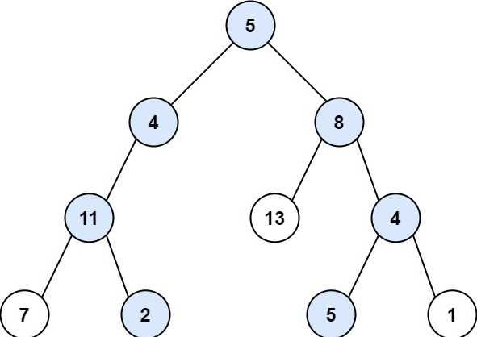

# 回溯算法

一般是结合递归函数使用，是一种纯暴力的搜索方法，回溯算法嵌套for循环，经常用来解决组合、排列和子集等问题

- 组合问题：将数组[1, 2, 3, 4]内的元素两两结合，没有顺序。结果输出：12, 13, 14, 23, 24, 34
- 全排列问题：将数组[1, 2, 3, 4]内的元素两两结合，有顺序。结果输出：12, 21, 13, 31, 14, 41, 23, 32, 24, 42, 34, 43
- 子集问题：返回数组[1, 2, 3, 4]的所有子级元素。结果输出：1, 2, 3, 4, 12, 13, 14, 23, 24, 34, 123, 234

## 回溯算法的模板

```javascript
// 回溯算法的模板，一般没有返回值
function barkTreeKing(多个参数，不确定){
  if(终止条件){
    // 收集结果;
    return 返回;
  }
  // for 循环遍历节点
  for(集合元素){
    处理节点;
    递归函数;
    回溯操作; // 撤销处理节点的操作
  }
}
```

## 为什么需要回溯

比如组合问题，把 1 放进去，再把 2 放进去得到 12 组合，这时候我们需要把 2 回溯撤销，把 3 放进去
得到 13 组合，继续把 3 回溯撤销，......  ，本质上递归来控制多少层for循环，每一次递归都相当于一层for循环。

用回溯法解决问题，我们都可以抽象为一个树形结构
第一步，首先确定递归函数的参数以及返回值，回溯就是靠递归实现的
第二步，确定递归函数的终止条件，这个是非常重要的！！！
第三部，单层递归的逻辑

## 回溯算法的例子

### 1、子集

给你一个整数数组 `nums` ，数组中的元素 **互不相同** 。返回该数组所有可能的子集，**不能** 包含重复的子集

```javascript
输入：nums = [1,2,3]
输出：[[],[1],[2],[1,2],[3],[1,3],[2,3],[1,2,3]]
```

#### 题解：

```javascript
var subsets = (nums) => {
  const res = [];
  const dfs = (start, path) => {
    if (start === nums.length) { // 指针越界
      res.push([...path]);   // 加入解集
      return;                // 结束当前的递归
    }
    path.push(nums[start]); // 选择这个数
    dfs(start + 1, path);   // 基于该选择，继续往下递归，考察下一个数
    path.pop();             // 上面的递归结束，撤销该选择
    dfs(start + 1, path);   // 不选这个数，继续往下递归，考察下一个数
  };
  dfs(0, []);
  return res;
};
```

### 2、全排列

给定一个不含重复数字的数组 `nums` ，返回其 所有可能的全排列 。

```javascript
输入：nums = [1,2,3]
输出：[[1,2,3],[1,3,2],[2,1,3],[2,3,1],[3,1,2],[3,2,1]]

输入：nums = [0,1]
输出：[[0,1],[1,0]]
```

#### 题解：

```javascript
var permute = function(nums) {
  let len = nums.length;
  // 结果集
  let res = [];
  // 路径
  let path = [];
  // 路径：记录在path中
  // 选择列表：nums中不存在于pah的那些元素
  // 结束条件：nums中的元素全都path中出现
  let dfs = (path) => {
    if (path.length == len) {
      res.push([...path]);
      return;
    }
    for (let i = 0; i < len; i++) {
      // 排除不合法的选择
      if (path.indexOf(nums[i]) > -1) {
        continue;
      }
      // 做选择
      path.push(nums[i]);
      // 进入下层决策树
      dfs(path);
      // 取消选择
      path.pop();
    }
  };
  dfs(path);
  return res;
};
```

### 3、路径总和

给你二叉树的根节点 `root` 和一个整数目标和 `targetSum` ，找出所有 **从根节点到叶子节点** 路径总和等于给定目标和的路径。



```javascript
输入：root = [5,4,8,11,null,13,4,7,2,null,null,5,1], targetSum = 22
输出：[[5,4,11,2],[5,8,4,5]]

输入：root = [1,2,3], targetSum = 5
输出：[]
```

#### 题解：

```javascript
var pathSum = function(root, targetSum) {
    // 1. 设置结果集
  const result = [];
  // 2. 深度优先搜索：root -> 树；path -> 路径；treeSum -> 当前路径和
  const recursion = (root, path, treeSum) => {
    // 2.1 终止条件
    if (!root) {
      return;
    }
    // 2.2 路径添加一个元素
    path.push(root.val);
    // 2.3 计算当前路径总和
    treeSum += root.val;
    // 2.4 如果没有左子树和右子树（叶子节点）
    if (!root.left && !root.right) {
      // 2.5 如果结果等于目标结果
      if (treeSum === targetSum) {
        result.push([...path]);  // path.slice()
      }
    } else {
      // 2.6 进一步递归左子树和右子树
      recursion(root.left, path, treeSum);
      recursion(root.right, path, treeSum);
    }
    // 2.7 回溯
    path.pop();
  };
  recursion(root, [], 0);
  // 3. 返回结果
  return result;
};
```

### 4、复原ip地址

有效 IP 地址 正好由四个整数（每个整数位于 0 到 255 之间组成，且不能含有前导 0），整数之间用 '.' 分隔。

例如："0.1.2.201" 和 "192.168.1.1" 是 有效 IP 地址，但是 "0.011.255.245"、"192.168.1.312" 和 "192.168@1.1" 是 无效 IP 地址。给定一个只包含数字的字符串 s ，用以表示一个 IP 地址，返回所有可能的有效 IP 地址，这些地址可以通过在 s 中插入 '.' 来形成。你 不能重新排序或删除 s 中的任何数字。

```javascript
输入：s = "25525511135"
输出：["255.255.11.135","255.255.111.35"]

输入：s = "101023"
输出：["1.0.10.23","1.0.102.3","10.1.0.23","10.10.2.3","101.0.2.3"]
```

#### 题解：

```javascript
//  思路
// 以 "25525511135" 为例，第一步时我们有几种选择？
// 选 "2" 作为第一个片段
// 选 "25" 作为第一个片段
// 选 "255" 作为第一个片段
// 能切三种不同的长度，切第二个片段时，又面临三种选择。
// 这会向下分支形成一棵树，我们用 DFS 去遍历所有选择，必要时提前回溯。
// 因为某一步的选择可能是错的，得不到正确的结果，不要往下做了。撤销最后一个选择，回到选择前的状态，去试另一个选择。
// 回溯的第一个要点：选择，它展开了一颗空间树。
// 回溯的要点二——约束
// 约束条件限制了当前的选项，这道题的约束条件是：
// 一个片段的长度是 1~3
// 片段的值范围是 0~255
// 不能是 "0x"、"0xx" 形式（测试用例告诉我们的）
// 用这些约束进行充分地剪枝，去掉一些选择，避免搜索「不会产生正确答案」的分支。
// 回溯的要点三——目标
// 目标决定了什么时候捕获答案，什么时候砍掉死支，回溯。
// 目标是生成 4 个有效片段，并且要耗尽 IP 的字符。
// 当满足该条件时，说明生成了一个有效组合，加入解集，结束当前递归，继续探索别的分支。
// 如果满4个有效片段，但没耗尽字符，不是想要的解，不继续往下递归，提前回溯。
//复原ip地址 输入：s = "25525511135"
// 输出：["255.255.11.135","255.255.111.35"]
var restoreIpAddresses = function(s) {
    const res = [];
  // 复原从start开始的子串
  const dfs = (subRes, start) => {   
    if (subRes.length == 4 && start == s.length) { // 片段满4段，且耗尽所有字符
      res.push(subRes.join('.'));                  // 拼成字符串，加入解集
      return;                     // 返不返回都行，指针已经到头了，严谨的说还是返回
    }
    if (subRes.length == 4 && start < s.length) {  // 满4段，字符未耗尽，不用往下选了
      return;
    }
    for (let len = 1; len <= 3; len++) {           // 枚举出选择，三种切割长度
      if (start + len - 1 >= s.length) return;     // 加上要切的长度就越界，不能切这个长度
      if (len != 1 && s[start] == '0') return;     // 不能切出'0x'、'0xx'

      const str = s.substring(start, start + len); // 当前选择切出的片段
      if (len == 3 && +str > 255) return;          // 不能超过255

      subRes.push(str);                            // 作出选择，将片段加入subRes
      dfs(subRes, start + len);                    // 基于当前选择，继续选择，注意更新指针
      subRes.pop(); // 上面一句的递归分支结束，撤销最后的选择，进入下一轮迭代，考察下一个切割长度
    }
  };
  dfs([], 0);       // dfs入口
  return res;
};
```

### 5、字符串的全排列

输入一个字符串，打印出该字符串中字符的所有排列。结果放在字符串数组中返回，但里面不能有重复元素。

```javascript
输入：s = "abc"
输出：["abc","acb","bac","bca","cab","cba"]
```

#### 题解：

```javascript
var permutation = function(s) {
  const n = s.length;
  const visited = {}; // 用来标记访问过的元素
  const res = new Set();  // 利用集合来避免重复
  const helper = (tmpPath) => {
    if (tmpPath.length === n) {
      res.add(tmpPath);
      return;
    }
    // i 从 0 开始
    for (let i = 0; i < n; i++) {
      if (visited[i]) {
          continue;
      }
      visited[i] = true;  // 用来标记访问过的元素
      // 直接在这里修改tmpPath，减少了增添和复原的两行代码。
      helper(tmpPath + s[i]);  
      visited[i] = false;
    }
  }
  helper('');
  return [...res];
};
```

### 6、组合问题

给定两个整数 `n` 和 `k`，返回范围 `[1, n]` 中所有可能的 `k` 个数的组合。

```javascript
输入：n = 4, k = 2
输出：
[[2,4], [3,4], [2,3], [1,2], [1,3], [1,4]]
```

#### 题解：

```javascript
var combine = (n, k) => {
  const res = [];

  const helper = (start, path) => { // start是枚举选择的起点 path是当前构建的路径（组合）
    if (path.length == k) {
      res.push([...path]);       // 拷贝一份path，推入res
      return;                       // 结束当前递归
    }
    for (let i = start; i <= n; i++) { // 枚举出所有选择
      path.push(i);                    // 选择
      helper(i + 1, path);             // 向下继续选择
      path.pop();                      // 撤销选择
    }
  };

  helper(1, []); // 递归的入口，从数字1开始选
  return res;
}
```

### 7、组合总和

给定两个整数 `n` 和 `k`，返回范围 `[1, n]` 中所有可能的 `k` 个数的组合。给你一个 无重复元素 的整数数组 candidates 和一个目标整数 target ，找出 candidates 中可以使数字和为目标数 target 的 所有 不同组合 ，并以列表形式返回。你可以按 任意顺序 返回这些组合。candidates 中的 同一个 数字可以 无限制重复被选取 。如果至少一个数字的被选数量不同，则两种组合是不同的。 

```javascript
输入：candidates = [2,3,6,7], target = 7, 输出：[[2,2,3],[7]]
解释：
2 和 3 可以形成一组候选，2 + 2 + 3 = 7 。注意 2 可以使用多次。
7 也是一个候选， 7 = 7 。仅有这两种组合。

输入: candidates = [2,3,5], target = 8, 输出: [[2,2,2,2],[2,3,3],[3,5]]
```

#### 题解：

```javascript
var combinationSum = (candidates, target) => {
  const res = [];
  const dfs = (start, temp, sum) => { // start是当前选择的起点索引 temp是当前的集合 sum是当前求和
    if (sum >= target) {
      if (sum == target) {
        res.push(temp.slice()); // temp的拷贝 加入解集
      }
      return;   // 结束当前递归
    }
    for (let i = start; i < candidates.length; i++) { // 枚举当前可选的数，从start开始
      temp.push(candidates[i]);          // 选这个数
      dfs(i, temp, sum + candidates[i]); // 基于此继续选择，传i，下一次就不会选到i左边的数
      temp.pop();   // 撤销选择，回到选择candidates[i]之前的状态，继续尝试选同层右边的数
    }
  };
  dfs(0, [], 0); // 最开始可选的数是从第0项开始的，传入一个空集合，sum也为0
  return res;
};
```

### 8、排列组合

```javascript
fn([['a', 'b'], ['n', 'm'], ['0', '1']]) => ['an0', 'am0', 'an1', 'am1', 'bn0', 'bm0', 'bn1', 'bm0'] 
```

#### 题解：

```javascript
function fn(matrix) {
  const result = [];
  const len = matrix.length;
  function dfs(res, curr) {
    if (res.length === len) {
      result.push(res.join(''));
      return;
    }
    for(let i = 0; i < matrix[curr].length; i++) {
      res.push(matrix[curr][i]);
      dfs(res, curr + 1);
      res.pop();
    }
  }
  dfs([], 0);
  return result;
}
```
