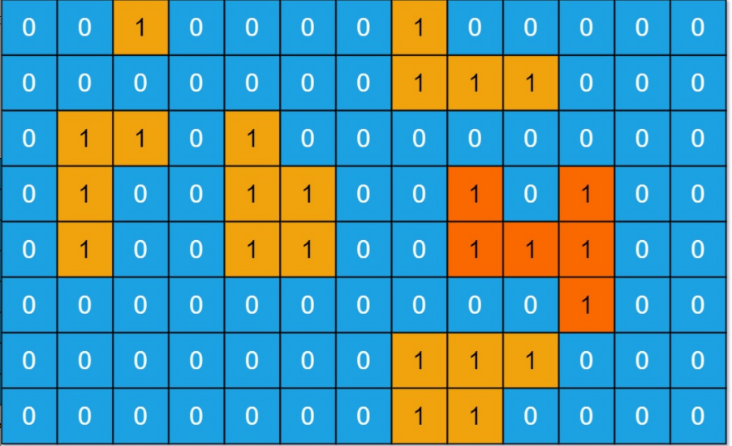
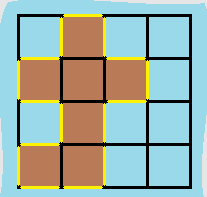

# 岛屿问题

## 1、岛屿数量

给你一个由 '1'（陆地）和 '0'（水）组成的的二维网格，计算网格中岛屿的数量。岛屿总是被水包围，并且每座岛屿只能由水平方向和/或竖直方向上相邻的陆地连接形成。

```javascript
输入：grid = [
  ["1","1","1","1","0"],
  ["1","1","0","1","0"],
  ["1","1","0","0","0"],
  ["0","0","0","0","0"]
]
输出：1

输入：grid = [
  ["1","1","0","0","0"],
  ["1","1","0","0","0"],
  ["0","0","1","0","0"],
  ["0","0","0","1","1"]
]
输出：3
```

### 题解：画图

```javascript
var numIslands = function(grid) {
    let count = 0;  // 记录岛屿数量
    const dfs = (row, col) => {
	// 出现越界情况、已经访问过的岛屿
        if(row < 0 || row >= grid.length || col < 0 || col >= grid[0].length || grid[row][col] === "0"){
            return false;
        }
	// 将当前岛屿设为0，已经访问过了
        grid[row][col] = "0";
	// dfs遍历岛屿的四周，若出现陆地，则置0
        dfs(row, col-1);
        dfs(row, col+1);
        dfs(row-1, col);
        dfs(row+1, col);
    }
    for(let row=0; row <  grid.length; row++){
        for(let col=0; col < grid[0].length; col++){
            if(grid[row][col] === '1'){
                count++;
                dfs(row, col);
            }
        }
    }
    return count;
};
```

## 2、岛屿最大面积

给你一个大小为 m x n 的二进制矩阵 grid 。岛屿 是由一些相邻的 1 (代表土地) 构成的组合，这里的「相邻」要求两个 1 必须在 水平或者竖直的四个方向上 相邻。你可以假设 grid 的四个边缘都被 0（代表水）包围着。岛屿的面积是岛上值为 1 的单元格的数目。计算并返回 grid 中最大的岛屿面积。如果没有岛屿，则返回面积为 0 。



```javascript
输入：grid = [
	[0,0,1,0,0,0,0,1,0,0,0,0,0],
	[0,0,0,0,0,0,0,1,1,1,0,0,0],
	[0,1,1,0,1,0,0,0,0,0,0,0,0],
	[0,1,0,0,1,1,0,0,1,0,1,0,0],
	[0,1,0,0,1,1,0,0,1,1,1,0,0],
	[0,0,0,0,0,0,0,0,0,0,1,0,0],
	[0,0,0,0,0,0,0,1,1,1,0,0,0],
	[0,0,0,0,0,0,0,1,1,0,0,0,0]
]
输出：6
解释：答案不应该是 11 ，因为岛屿只能包含水平或垂直这四个方向上的 1 。
```

### 题解：

```javascript
var maxAreaOfIsland = function(grid) {
  const row = grid.length, col = grid[0].length; // 获取边界
  let res = 0;
  const dfs = (i, j) => {
    // 下标越界返回0
    if (i < 0 || i >= row || j < 0 || j >= col) {
      return 0;
    }
    // 值为0返回0
    if(grid[i][j] == 0) { return 0; }
    // 访问过后置为0，防止重复访问
    grid[i][j] = 0;
    // 递归计算岛屿面积
    return 1 + dfs(i, j - 1) + dfs(i - 1, j) + dfs(i, j + 1) + dfs(i + 1, j);
  }
  // 遍历二维数组
  for(let i = 0; i < row; i++) {
    for(let j = 0; j < col; j++) {
      if (grid[i][j] === 1) {
        res = Math.max(res, dfs(i,j));
      }
    }
  }
  return res
};
```

## 3、岛屿周长

给定一个 row x col 的二维网格地图 grid ，其中：grid[i][j] = 1 表示陆地， grid[i][j] = 0 表示水域。网格中的格子 水平和垂直 方向相连（对角线方向不相连）。整个网格被水完全包围，但其中恰好有一个岛屿（或者说，一个或多个表示陆地的格子相连组成的岛屿）。岛屿中没有“湖”（“湖” 指水域在岛屿内部且不和岛屿周围的水相连）。格子是边长为 1 的正方形。网格为长方形，且宽度和高度均不超过 100 。计算这个岛屿的周长。



```javascript
输入：grid = [[0,1,0,0],[1,1,1,0],[0,1,0,0],[1,1,0,0]]
输出：16
解释：它的周长是上面图片中的 16 个黄色的边
```

### 题解：

岛就一个，我们从第一个遇到的土地开始深度变量搜索。 对于每个土地节点，基于它，递归上下左右四个点，

从土地到土地，之间不会产生周长，

但从土地迈入海洋，之间会产生 1 个周长，

从土地迈出矩阵边界，也会产生 1 个周长。

dfs 的过程中，对当前点的上下左右递归，下一个递归的点又对上下左右递归，就会造成重复访问，造成周长的重复计算。遍历过的土地节点，将值改为 2，区分于 1 和 0，代表访问过了。

总结：DFS 从一个点，向四周扩散，目标是遇到矩阵边界或海水，它们是答案已知的 base case，是位于递归树底部的 case，是递归的终止条件。从上而下递归调用，随着递归的出栈，子问题的解自下而上地返回，最后得出大问题的解。

```javascript
var islandPerimeter = function(grid) {
    const dfs = (i, j) => {
    if (i < 0 || i >= grid.length || j < 0 || j >= grid[0].length) {
      return 1; // 当前正好越界，说明穿过了一个边界，周长+1
    }
    if (grid[i][j] === 0) { // 从土地来到了海水，说明穿过了一个边界，周长+1
      return 1;
    }
    if (grid[i][j] === 2) { // 之前访问过，直接返回，返回0，无周长收益
      return 0;
    }
    // 到此，当前点为1，将它改为2，代表已访问
    grid[i][j] = 2; 
    // 继续往四个方向“扩散”，目标是遇到边界和海水，答案随着递归出栈向上返回，得出大的答案
    return dfs(i - 1, j) + dfs(i + 1, j) + dfs(i, j - 1) + dfs(i, j + 1);
  };

  for (let i = 0; i < grid.length; i++) {
    for (let j = 0; j < grid[0].length; j++) {
      if (grid[i][j] == 1) {
        return dfs(i, j);   // dfs的入口
      }
    }
  }
};
```
