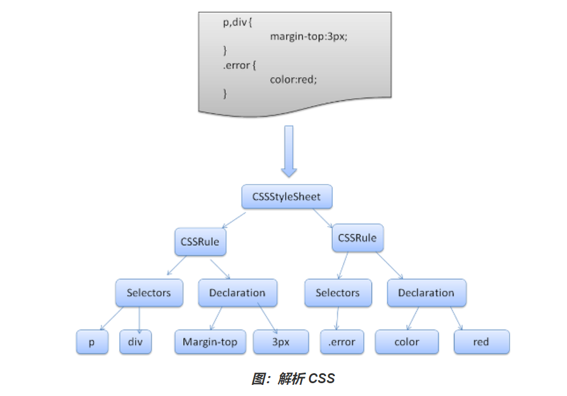
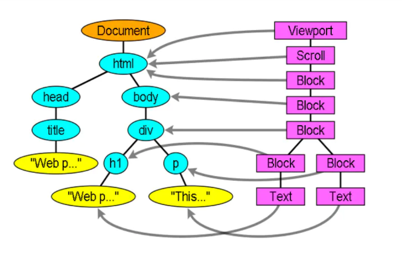

# 浏览器渲染
## 浏览器渲染的过程主要包括以下五步：
1. 浏览器将获取的HTML文档解析成DOM树。
2. 处理CSS标记，构成层叠样式表模型CSSOM(CSS Object Model)。
3. 将DOM和CSSOM合并为渲染树(rendering tree)，代表一系列将被渲染的对象。
4. 渲染树的每个元素包含的内容都是计算过的，它被称之为布局layout。浏览器使用一种流式处理的方法，只需要一次绘制操作就可以布局所有的元素。（重排）
5. 将渲染树的各个节点绘制到屏幕上，这一步被称为绘制painting（重绘）。

### 构建DOM
- DOM树在构建的过程中可能会被CSS和JS的加载而执行阻塞，HTML解析器若遇到了JavaScript，那么它会暂停构建DOM，将控制权移交给JavaScript引擎，等JavaScript引擎运行完毕，浏览器再从中断的地方恢复DOM构建。JavaScript中对css操作同理

- display:none的元素也会在DOM树中
- 注释也会在DOM树中
- script标签会在DOM树中

### 构建CSSOM
当浏览器接收到一段CSS，浏览器首先要做的是识别出Token，然后构建节点并生成CSSOM。CSS匹配HTML元素是一个相当复杂和有性能问题的事情。所以，DOM树要小，CSS尽量用id和class，千万不要过渡层叠下去。

### 构建渲染树（Render Tree）
通过DOM树和CSS规则树，浏览器就可以通过它两构建渲染树了。浏览器会先从DOM树的根节点开始遍历每个可见节点，然后对每个可见节点找到适配的CSS样式规则并应用。
有以下几点需要注意：

- Render Tree和DOM Tree不完全对应
- display: none的元素不在Render Tree中
- visibility: hidden的元素在Render Tree中

渲染树生成后，还是没有办法渲染到屏幕上，渲染到屏幕需要得到各个节点的位置信息，这就需要布局（Layout）的处理了。

### 渲染树布局(layout of the render tree)

布局阶段会从渲染树的根节点开始遍历，由于渲染树的每个节点都是一个Render Object对象，包含宽高，位置，背景色等样式信息。所以浏览器就可以通过这些样式信息来确定每个节点对象在页面上的确切大小和位置，布局阶段的输出就是我们常说的盒子模型，它会精确地捕获每个元素在屏幕内的确切位置与大小。需要注意的是：
- float元素，absoulte元素，fixed元素会发生位置偏移。
- 我们常说的脱离文档流，其实就是脱离Render Tree。

### 渲染树绘制（Painting the render tree）
在绘制阶段，浏览器会遍历渲染树，调用渲染器的paint()方法在屏幕上显示其内容。渲染树的绘制工作是由浏览器的UI后端组件完成的。

### 重排(reflow)
当DOM的变化影响了元素的几何信息(DOM对象的位置和尺寸大小)，浏览器需要重新计算元素的几何属性，将其安放在界面中的正确位置，这个过程叫做重排。

#### 常见引起重排属性和方法
1. 添加或者删除可见的DOM元素
2. 元素尺寸改变——边距(margin)、填充(padding)、边框(border)、宽度和高度(width/height)
3. 内容变化，比如用户在input框中输入文字
4. 浏览器窗口尺寸改变——resize事件发生时
5. 计算 offsetWidth 和 offsetHeight 属性
6. 设置 style 属性的值