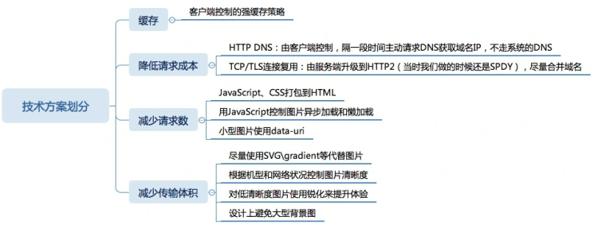

# 简述前端性能优化

前端性能优化主要是为了提高页面的加载速度，优化用户的访问体验。可以从这些方面来进行优化：

### 第一个方面是页面的内容方面

- 将小图片合并成一个大图，css 雪碧图、使用 base64 等方式来减少 HTTP 请求数，避免过多的请求造成等待的情况，可以使用svg、iconfont代替图片。
- 通过 DNS 缓存（预解析）等机制来减少 DNS 的查询次数。
- 通过设置浏览器缓存策略，对常用不变的资源进行缓存，缓存一切可缓存资源。
- 使用延迟加载的方式，来减少页面首屏加载时需要请求的资源。延迟加载的资源当用户需要访问时，再去请求加载。
- 通过用户行为，对某些资源使用预加载的方式，来提高用户需要访问资源时的响应速度。
- 资源懒加载、按需加载资源

### 第二个方面是服务器方面

- 使用 CDN 服务，来提高用户对于资源请求时的响应速度（在云服务器上配置CDN）。
- 服务器端启用 Gzip、Deflate 等方式对于传输的资源进行压缩，减小文件的体积。deflate是一种压缩算法，可以实现无损数据压缩，GZIP是基于deflate实现的另一个压缩库。
- 尽可能减小 cookie 的大小，并且通过将静态资源分配到其他域名下，来避免对静态资源请求时携带不必要的 cookie 。

### 第三个方面是 CSS 和 JavaScript 方面

- 把样式表放在页面的 head 标签中，减少页面的首次渲染的时间。
- 避免使用 @import标签。
- 尽量把 js 脚本放在页面底部或者使用 defer 或 async 属性，避免脚本的加载和执行阻塞页面的渲染。
- 通过对 JavaScript 和 CSS 的文件进行压缩，来减小文件的体积。
- 脚本优化：减少重回和回流操作
- 使用事件委托，避免批量绑定事件
- 适当使用防抖和节流函数减少性能消耗
