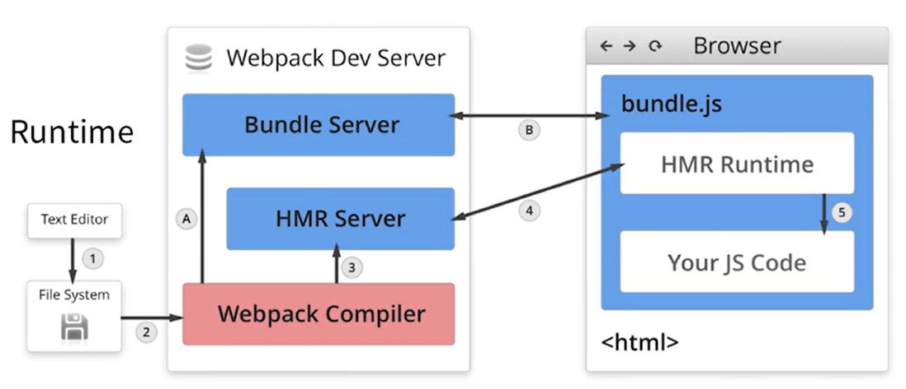

# webpack笔记（一)

参考 [webpack知识体系](https://juejin.cn/post/7023242274876162084)

[从v4升级到v5](https://webpack.docschina.org/migrate/5/#update-outdated-options)

## 为什么需要构建工具

- 本质上来讲，构建工具的作用是连接开发者使用高效率的语言语法、开发工具与实现浏览器高效可读代码的桥梁。
- **转换ES6语法**：ES6语法已经在前端开发领域普遍使用，然而很多浏览器依旧对ES6没有提供全面的兼容和支持。所以需要构建工具来进行编译。
- **转换JSX、vue指令**：前端三大框架里，例如React的JSX，VUE和Angular的指令都是浏览器无法识别的，需要编译转换。
- **CSS前缀补全，预处理器**：在CSS开发中，我们已经习惯使用less、sass等预编译工具，有了构建工具做编译转化，可以让我们开发效率更高，代码更好维护。
- **图片压缩**：前端必不可少要使用图片等多媒体资源，构建工具可以对它们进行压缩。
- **压缩混淆**：当前的前端开发都是模块开发，也引入了大量的依赖包，为了让浏览器对代码的加载更快，以及代码不会被轻易识别和可读，需要构建工具对代码进行压缩和混淆。

### 前端构建之路：grunt -> gulp -> rollup、webpack、parcel、vite

- webpack4版本以上，webpack和webpack-cli是分开的，需要同时安装
- 安装的局部开发依赖如果有命令，会在node_modules/.bin目录创建软连接，package.json是可以读取到依赖下.bin目录下的命令，可以在package.json直接使用该命令。
- webpack仅支持js和json文件，想对其他类型的文件打包需要使用loader，转化成为有效的模块。loader本身是一个函数，接受源文件作为参数，返回转换的结果。
- plugins是增强webpack功能，打包输出js文件（bundle）的一个优化，资源管理和环境变量的注入，作用于整个构建过程。可以理解为任何loader没办法做的事情，都可以用plugins去完成。比如构建之前需要手动删除目录，其实可以通过plugins很灵活的去完成。
- 简单理解：chunk是webpack打包过程中依赖，bundle是输出的产物。
- Loader 就是将 Webpack 不认识的内容转化为认识的内容

### webpack指令

- webpack默认配置文件：webpack.config.js
- 自定义使用其他配置文件打包：`webpack --config filename`
- 监听变动并自动打包：`webpack --watch`或者在webpack.config.js中设置 `watch: true`，文件监听是在发现源码发生变化时，自动重新构建出新的输出文件。
  [webpack文件监听的原理](###webpack文件监听的原理)
- 压缩混淆：`webpack -p`
- 方便出错时能查阅更详尽的信息：`webpack  --display-error-details`
- 让编译的输出内容带有进度和颜色：webpack --progress --colors
- 模块热替换，在前端代码变动的时候无需整个刷新页面，只把变化的部分替换掉：webpack-dev-server --hot
- inline选项会为入口页面添加热加载功能，即代码改变后重新加载页面（刷新浏览器）：webpack-dev-server --inline

## 常见的loaders有哪些

| 名称          | 描述                                                                  |
| ------------- | --------------------------------------------------------------------- |
| babel-loader  | 转换ES6、ES7等JS新特性语法                                            |
| css-loader    | 支持.css文件的加载和解析，不会将样式加载到页面上                       |
| style-loader   | 将处理好的 css 通过style标签的形式添加到页面上                       |
| postcss-loader | 添加 CSS3 部分属性的浏览器前缀（先添加前缀，再使用css-loader）        |
| less-loader   | 将less文件转换成css                                                   |
| ts-loader     | 将TS转换成JS                                                          |
| thread-loader | 正常情况下webpack开一个进程打包，thread-loader作用是多进程打包JS和CSS |
| file-loader   | 解决图片、字体、媒体等资源引入问题，并将资源copy到指定目录，默认为 dist |
| url-loader    | url-loader内部使用了file-loader，可以设置较小的资源自动base64，多了一个limit的配置|
| raw-loader    | raw-loader可以将文件转化成字符串的形式导入                            |

webpack5，内置了资源处理模块，file-loader、url-loader和raw-loader都可以不用安装。
[webpack5资源模块](https://webpack.docschina.org/guides/asset-modules/)
[webpack5资源模块的使用](https://juejin.cn/post/7023242274876162084#heading-15)

- style-loader核心实现：
```js
// 通过动态添加 style 标签的方式，将样式引入页面
const content = `${样式内容}`
const style = document.createElement('style');
style.innerHTML = content;
document.head.appendChild(style);
```


## 常见的plugins

| 名称 | 描述  |
| --- | --- |
| splitchunksplugin       | 将chunks相同的模块代码提取成公共js   |
| CleanWebpackPlugin      | 自动清空打包目录  |
| mini-css-extract-plugin | 将CSS从 bunlde文件里提取成一个独立的CSS文件(MiniCssExtractPlugin.loader) |
| copyWebpackPlugin       | 将文件或者文件夹拷贝到构建的输出目录   |
| HtmlWebpackPlugin       | 将打包好的bundle如js、css 文件可以自动引入到html中 |
| UglifyjsWebpackPlugin   | 压缩JS     |
| ZipWebpackPlugin        | 将打包出的资源生成一个zip包   |
| hard-source-webpack-plugin | 模块提供了中间缓存，重复构建时间大大减少，webpack5已经内置|

## mode内置功能

| 名称        | 描述                                                                                                                                                                                                                                                                                                                                                                                           |
| ----------- | ---------------------------------------------------------------------------------------------------------------------------------------------------------------------------------------------------------------------------------------------------------------------------------------------------------------------------------------------------------------------------------------------- |
| development | 设置process.env.NODE_ENV的值为development，打包更加快速                                                                                                                                                                                                                                                                                                                                        |
| production  | 生产模式，打包比较慢，会开启 tree-shaking 和 压缩代码设置、process.env.NODE_ENV的值为production、开启FlagDependencyUsagePlugin（删除无用代码）、FlagIncludedChunksPlugin（删除无用代码） 、ModuleConcatenationPlugin（作用域提升）、NoEmitOnErrorsPlugin（编译出现错误，跳过输出阶段）、OccurrenceorderPlugin（按照chunk引用次数来安排出现顺序）、TerserPlugin（压缩JS，支持ES6，清除console） |
| none        | 不开启任何优化选项                                                                                                                                                                                                                                                                                                                                                                             |

- development：更快的构建速度、热更新(hot)、快速定位问题(sourcemap )
- production: 构建体积小（代码压缩 + tree-shaking）、代码分割、压缩images

## Webpack 的整个生命周期
Webpack 的运行流程是一个串行的过程，从启动到结束会依次执行以下流程：
- `初始化参数` 从配置文件和 Shell 语句中读取与合并参数，得出最终的参数
- `开始编译` 用上一步得到的参数初始化 Compiler 对象，加载所有配置的插件，执行对象的 run 方法开始执行编译
- `确定入口` 根据配置中的 entry 找出所有的入口文件
- `编译模块` 从入口文件出发，调用所有配置的 Loader 对模块进行编译，再找出该模块被编译后的最终内容以及它们之间的依赖关系
- `完成模块编译` 在经过第4步使用 Loader 翻译完所有模块后，得到了每个模块被翻译后的最终内容以及它们之间的依赖关系
- `输出资源` 根据入口和模块之间的依赖关系，组装成一个个包含多个模块的 Chunk，再把每个 Chunk 转换成一个单独的文件加入到输出列表，这步是可以修改输出内容的最后机会
- `输出完成` 在确定好输出内容后，根据配置确定输出的路径和文件名，把文件内容写入到文件系统

在以上过程中，Webpack 会在特定的时间点广播出特定的事件，插件在监听到感兴趣的事件后会执行特定的逻辑，并且插件可以调用 Webpack 提供的 API 改变 Webpack 的运行结果。
## 解析ES6

- 解析ES6，需要在rules里面匹配js文件，并use: 'babel-loader'。babel-loader是依赖babel的，需要在根目录创建babel的配置文件.babelrc。
- 需要安装@babel/core、@babel/preset-env、babel-loader

- babel-loader 使用 Babel 加载 ES2015+ 代码并将其转换为 ES5
- @babel/core Babel 编译的核心包
- @babel/preset-env Babel 编译的预设，可以理解为 Babel 插件的超集

```json
// .babelrc
{
  // 一系列plugins的集合
  "presets": [
    "@babel/preset-env", // 增加ES6的babel preset配置，解析ES6
    "@babel/preset-react", // 安装该依赖，并增加react的babel preset配置，解析react相关的语法，jsx
    // @babel/preset-typescript
  ],
  // 一个plugins对应一个功能
  "plugins": [
    // 处理 装饰器的使用
    ["@babel/plugin-proposal-decorators", { legacy: true }],
    ["@babel/plugin-proposal-class-properties", { loose: true }],
  ]
}
```
### babel-plugin vs babel-preset（预设）
[Babel polyfill 常见配置对比](https://juejin.cn/post/6975556168752037919)

babel存在太多的plugin，实现某种功能，比如ES2015语法兼容时需要用到众多的插件。preset是plugin的集合，将多个plugin合并在一起（预设是插件的集合）

1. 插件plugin和预设preset的执行顺序
- plugin先执行，preset后执行
- plugin集从前往后执行
- preset集从后往前执行

@babel/preset-env（官方提供），作用是根据 targets 的配置引入对应插件来实现编译和 polyfill，自动根据 targets 来引入需要的插件

所谓Polyfill就是这样解决API的兼容问题的，抹平差异化

2. 官方给出了两种 polyfill 方案：
- babel-polyfill：会污染全局适合在业务项目中使用。（Babel7.4.0版本开始，babel/polyfill 已经被废弃，推荐直接使用core-js）
- babel-runtime：不污染全局适合在组件或类库项目中使用。

开启 polyfill 功能要指定它的引入方式，也就是 useBuiltIns。设置为 usage 是在每个模块引入用到的，设置为 entry 是统一在入口处引入 targets 需要的。

polyfill 的实现就是 core-js，需要再指定下 corejs 版本，一般是指定 3

@babel/preset-env 会导致多个模块重复注入同样的代码，会污染全局环境。解决这个问题就要使用 @babel/plugin-transform-runtime 插件

这样就不会多个模块重复注入同样的实现代码了，而且 core-js 的 api 也不是全局引入了，变成了模块化引入。

这样就解决了 corejs 的重复注入和全局引入 polyfill 的两个问题

@babel/plugin-transform-runtime 的功能，把注入的代码和 core-js 全局引入的代码转换成从 @babel/runtime-corejs3 中引入的形式

@babel/runtime-corejs3 就包含了 helpers、core-js、regenerator 这 3 部分
```js
{
    presets: [
        ['@babel/preset-env', {
            targets: 'chrome 30',
            debug: true,
            useBuiltIns: 'usage',
            corejs: 3
        }]
    ],
    plugins: [
        ['@babel/plugin-transform-runtime', {
            corejs: 3 // 插件也是处理 polyfill ，也就同样需要指定 corejs 的版本
        }]
    ]
}

```
### babel的原理
babel是一个JS、JSX、TS 的编译器，能把新语法写的代码转换成目标环境支持的语法的代码

#### babel工作的三个步骤
1. 解析：将源码解析为AST（词法解析和语法解析）
2. 转换：旧AST转换成为新的AST（应用插件/预设中，对AST节点增删改查的操作）
3. 生成：根据AST生成源码（深度优先遍历AST生成转译后的源码）


#### @bable/core
- 内核@bable/core类似一个调度器，并不直接实现功能细节，而是调度各模块插件去实现相关功能
- @babel/core的功能可以简单概况为 向外读取配置 => 向内调度插件模块协同工作 => 向外输出转译后的源码。详细版本如下：

加载配置文件，读取所需使用的插件、预处理器等等
- 调用@babel/parser进行词法分析、语法分析后转换为AST
- 调用@babel/traverse对AST进行遍历，并采用visitor模式应用配置项中的插件对AST进行转换
- 调用@babel/generator生成源码和源码对应的sourceMap

#### 解析（parse）
解析的核心是：词法分析将源码分词、语法分析将分词后的源码按照JS语法逻辑转换为AST（抽象语法树）。

- 词法分析：简单理解为：将源码分割为不同种类，保留关键词（如function）、条件判断词（if/else）、运算符、数字、字符串、空格等
- 语法分析：将词法分析生成的分词，组合为各类型的语法短语（抽象语法树AST）
#### 转换（Traverser）
转换器会遍历AST树，然后按照配置的插件对其中需要转换的节点进行操作

#### 生成（generator）
调度器调用generator插件将AST转译成源码

#### babel-cli
babel官方提供的脚手架，允许你以命令行的方式运行babel
```js
$ npm install babel-cli -g
​
# 将示例js输出到编译后的js中
$ babel example.js -o compiled.js

```

### 为 JSON 模块使用具名导出

```js
import pkg from './package.json';
console.log(pkg.version);
```

## 为什么需要了解 Webpack？

个人认为，每个前端开发者不一定要精通 Webpack，但有必要进行了解，至少要能看得懂一个 Webpack 的配置文件，以及遇到问题时能知道是 Webpack 的问题，还是自己代码的问题。

通常来说，我们都是通过脚手架工具创建一个应用，或者加入到一个已有的项目开发中。这个时候，我们并不需要知道该怎么配置 Webpack ，只要能开发业务逻辑就可以了。我们不太需要关注源代码是通过什么编译器如何打包成最后的应用程序的，因为IDE已经帮我们把这些事情做好了。

在 Webpack 里一切皆模块，一个模块对应着一个文件。Webpack 会从配置的 Entry 开始递归找出所有依赖的模块。Webpack 不仅是用于打包最终发布出去的应用程序，而且还能在开发时，为我们提供开发时服务器。它可以通过监测源代码的变化并实时编译，让我们能在代码发生变化时，及时看到运行的效果。webpack可以编译ES6语法、JSX语法，整合图片、css/less等资源，优化代码的体积。

Webpack 的配置会分为下面三个部分。

- 输入输出配置(entry/output)：定义你的应用程序的入口，以及打包结果输出的文件夹位置。
- 配置对于每一类资源文件的处理器(loader)：比如说，对 JavaScript 是用 babel-loader 去编译；对 less 文件则是用 less-loader 去编译；图片则用 file-loader 去处理。你在项目中能使用哪些技术或者资源，完全取决于配置了哪些 loader。Loader可以看成为一个转换器，它可以将某种格式的文件转换成Wwebpack支持打包的模块。webpack打包时是按照数组从后往前的顺序将资源交给loader处理的。
- 插件配置(plugin)：在webpack中插入某个功能，在特定的时机对某些资源做处理。在webpack运行的生命周期中会广播出许多事件，plugin可以监听这些事件，在合适的时机通过webpack提供的api改变输出结果。常见的有：打包优化，资源管理，注入环境变量。比如打包过程生成 index.html，源代码分析报表，提取 CSS 到独立文件，代码压缩等等。
- 模式(mode)：development和production

```js
// 获取当前环境：process.env.NODE_ENV
// package.json的 homepage 属性会告诉 webpack 项目的路径需要打包到哪个路径下，如github路径、CDN路径
const HtmlWebpackPlugin = require('html-webpack-plugin');
const path = require('path');

module.exports = {
  mode: 'development', // production or development or none
  /**
   * 单入口entry: '路径'
   * 多入口entry: { key: 'value' }
   * key可自定义，value是入口文件路径
  */
  entry: {
    // 定义应用的入口点 src/app.js，并命名为 main
    main: path.resolve(__dirname, './src/app.js'), 
  },
  /**
   * filename, path
   * [name].[hash:8].bundle.js、[name].[chunkhash:8].bundle.js
   * hash字段是根据每次编译compilation的内容计算所得、chunkhash是根据模块内容计算出的hash值
  */
  output: {
    // 打包输出的文件名，这里将生成 main.bundle.js
    // name是一个占位符，通过占位符确保文件名称的唯一，一般entry多入口使用占位符区分
    filename: '[name].bundle.js', 
    // 定义打包结果的输出位置build目录
    path: path.resolve(__dirname, 'build'),
    // publicPath表示的是打包生成的index.html文件里面引用资源的前缀
    // webpack5清除输出目录可用，无需安装clean-webpack-plugin
    clean: true
  },
  /**
   * test指定匹配规则
   * use指定使用的loader名称
  */
  module: {
    // 定义处理源文件的规则，rules 下会按顺序使用匹配的规则
    rules: [
      {
        // 遇到 .js 结尾的文件则使用这个规则
        test: /\.js$/,
        // 忽略 node_modules 目录下的 js 文件

        // 在配置 loader 的时候，我们需要更精确的去指定 loader 的作用目录或者需要排除的目录，
        // 通过使用 include 和 exclude 两个配置项
        include: path.join(__dirname, 'src'), // 符合条件的模块进行解析
        exclude: /node_modules/, // 排除符合条件的模块，不解析
        use: {
          // 使用 babel-loader 处理 js
          loader: 'babel-loader',
          // babel-loader 的一些选项
          options: {
            presets: ['@babel/preset-env'], // 确保 Babel 能够处理 JSX 语法
            // babel 在转译 js 过程中时间开销比价大，将 babel-loader 的执行结果缓存起来，重新打包的时候，直接读取缓存
            cacheDirectory: true // 启用缓存，缓存位置： node_modules/.cache/babel-loader
          },
        },
      },
      {
        test: /\.css$/,
        /**
         * css-loader用于处理加载.css文件，并且转换成commonjs对象
         * style-loader将样式通过<style>标签插入到head中
        */
        use: [
          // 'style-loader',
          MiniCssExtractPlugin.loader, // 一般是将css单独提取出来
          'css-loader'
        ]
      },
      {  
        // 检测 less 文件  
        test: /\.less$/,  
        // 使用了三个 loader，注意执行顺序是数组的倒序  
        // 也就是先执行 less-loader ，将less转换成css   
        use: [
          // 'style-loader', 
          MiniCssExtractPlugin.loader,
          // 缓存一些性能开销比较大的 loader 的处理结果，缓存位置：node_modules/.cache/cache-loader
          'cache-loader', 
          'css-loader', 
          // 'less-loader'
          {
            loader: 'less-loader',
            options: {
              sourceMap: true,
              modifyVars: {
                '@primary-color': '#13c2c2',　　// 修改antd主题色  入口文件样式引入@import '~antd/dist/antd.less';
              }
            }
        ],  
      },
      {
        // webpack 默认处理不了html中img图片
        // 匹配 图片资源
        test: /\.(jpg|png|gif|jpeg)$/,
        // 通过 url-loader 或者 file-loader 处理图片资源
        // url-loader内部使用了file-loader，可以设置较小的资源自动base64
        // base64格式的图片  可打包在js中直接使用
        loader: 'url-loader', 
        options: {
          // 图片大小小于8kb，就会被base64处理
          // 优点: 减少请求数量（减轻服务器压力）
          // 缺点：图片体积会更大（文件请求速度更慢）
          limit: 8 * 1024,
          // 问题：因为url-loader默认使用es6模块化解析，而html-loader引入图片是commonjs
          // 解析时会出问题：[object Module]
          // 解决：关闭url-loader的es6模块化，使用commonjs解析
          esModule: false,
          // 给图片进行重命名
          // [hash:10]取图片的hash的前10位
          // [ext]取文件原来扩展名
          name: '[contenthash:10].[ext]',
          outputPath: 'imgs',
        }
      },
      {
        test: /\.html$/,
        // 处理html文件的img图片（负责引入img，从而能被url-loader进行处理）
        loader: 'html-loader'
      },
      // 打包其他资源(除了html/js/css资源以外的资源)
      {
        // file-loader处理字体文件
        // 排除css/js/html资源
        test: /\.(woff|woff2|ttf|eot|otf)$/,
        exclude: /\.(css|js|html|less)$/,
        loader: 'file-loader',
        options: {
          name: '[contenthash:10].[ext]',
          outputPath: 'media'
        }
      },
    ],
  },
  plugins: [
    // 使用 HtmlWebpackPlugin 生成一个 index.html，其中自动引入 js
    // 并配置了页面的 title
    new HtmlWebpackPlugin({
      title: 'Webpack Output',
    }),
    new MiniCssExtractPlugin({ // 添加插件
      filename: '[name].[hash:8].css'
    }),
  ],
};
```

代码中其实已经很直观了，我们不仅定义了输入输出，还配置了 babel-loader，用于编译 JavaScript 文件到兼容主流浏览器的代码。同时，还为 babel-loader 设置了参数 presets，例子中这个参数的值 @babel/preset-env 可以确保 Babel 能够处理 JSX 等语法。最后，我们通过一个 HtmlWebpackPlugin，来自动生成 index.html。

### webpack文件监听的原理

轮询判断文件的最后编辑时间是否变化，
某个文件发生变化了，并不会立刻告诉监听者，而是先缓存起来，等aggregateTimeout.

[watch 和 watchOptions](https://www.webpackjs.com/configuration/watch/#watch)

```js
module.exports = {
  // 默认是false，不开起监听
  watch: true,
  watchOptions: {
    // 默认为空，不监听的文件或者文件夹，支持正则匹配
    ignored: /node_modules/,
    // 监听到变化发生后会等300ms再去执行，默认300ms
    aggregateTimeout: 300,
    // 判断文件是否发生变化是通过不停询问系统指定文件有没有变化实现的，默认每秒检查1次变化
    // 间隔xxx秒检查一次变化
    poll: 1000
  }
}
```

### 热更新（HMR）

1、使用 webpack-dev-server

- 自动编译并运行，不需要手动刷新浏览器，每次修改代码都需要重新执行 webpack 命令，可以使用 webpack-dev-server 自动打包运行
- 不输出文件，而是放在内存中，watch是放在磁盘里
- 与 HotModuleReplacementPlugin 插件配合使用

```bash
npm i webpack-dev-server -d
```

- webpack.config.js

```js
const path = require('path');
const webpack = require('webpack');
module.exports = {
    output: {
        path: path.join(__dirname, 'dist'),
        filename: '[name].js'
    },
    // 热更新一般只在开发模式使用
    mode: 'development',
    plugins: [
        new webpack.HotModuleReplacementPlugin()
    ],
    devServer: {
        // 告诉服务器从哪里提供静态资源（只有想提供静态文件时才需要）
        contentBase: path.resolve(__dirname, 'public'), // 静态资源所在的路径，默认为项目根目录
        hot: true // 开启热更新
	port: 8888, // 端口号
        // compress: true, //是否启动压缩 gzip
	// open:true  // 是否自动打开浏览器
        // devServer里面的publicPath表示的是打包生成的静态文件所在的位置
        //（若是devServer里面的publicPath没有设置，则会认为是output里面设置的publicPath的值）
    }
}

```

- package.json，--open打开浏览器

```json
{
  "scripts": {
    "dev": "webpack-dev-server --open"
  }
}
```

### 热更新原理分析



- 首次编译：① -> ② -> A -> B
- 修改代码后的热更新：① -> ② -> ③ -> ④
- HMR Server -> HMR Runtime 以json形式传递

| 概念                            | 描述                                                                                                 |
| ------------------------------- | ---------------------------------------------------------------------------------------------------- |
| Webpack Compiler(webpack编译器) | 将JS编译成 Bundle                                                                                    |
| HMR Server                      | 将热更新的文件传输给 HMR Runtime                                                                     |
| Bundle Server                   | 提供文件在浏览器的访问，提供类似的服务器环境访问，如localhost:3003/bundle.js，服务器和浏览器是ws链接 |
| HMR Runtime                     | 会被注入到浏览器，更新文件的变化                                                                     |
| bundle.js                       | 构建输出的文件                                                                                       |

### 文件指纹

打包后输出的文件名的后缀，如 `index_0a4dfa7c33787eec103e.chunk.js`中的0a4dfa7c33787eec103e

- hash：和整个项目的构建相关，只要项目文件有修改，整个项目构建的 hash 值就会更改
- chunkhash：对于 JS 文件，和 webpack 打包的 chunk 相关，不同的entry会生成不同的 chunkhash 值
- contenthash：将根据资源内容创建出唯一 hash。当资源内容发生变化时，[contenthash] 也会发生变化。

1. JS 的文件指纹设置，在output 的 filename，使用 [chunkhash]
2. CSS 的文件指纹设置，可以在MiniCssExtractPlugin使用[contenthash]

使用hash的场景还应该结合mode来考虑，如果mode是development的时候，在使用hmr的情况下，尽量避免使用chunkhash和contenthash，应该使用hash。而在mode是production的时候，就是不用hmr的情况下，这时候就适合使用chunkhash了。hmr只在development开发阶段使用。

js使用chunkhash是便于寻找资源，js的资源的关联度更高；而css采用contenthash是因为css一般是根据不同的页面书写的，css资源之前的关联度不高，也就不用在其他资源修改，而css部分没有修改的时候重新更新css。

MiniCssExtractPlugin作用

- 将 CSS 提取到单独的文件中
- 为每个包含 CSS 的 JS 文件创建一个 CSS 文件
- 支持按需加载 CSS 和 SourceMaps
- 下载

```bash
npm i mini-css-extract-plugin -D
```

```js
const MiniCssExtractPlugin = require('mini-css-extract-plugin');
module.exports = {
    output: {
        path: path.resolve(__dirname, '/dist'),
        filename: '[name][chunkhash:8].js'
    },
    plugins: [
        new MiniCssExtractPlugin({
            filename: '[name][contenthash:8].css'
        })
    ]
}

```

### 图片的文件指纹设置

在 file-loader或者url-loader 的options参数中设置name，使用[contenthash]

当 webpack 配置中使用了 `[hash]` 占位符时，请考虑将它改为 `[contenthash]`

| 占位符名称    | 含义                                                      |
| ------------- | --------------------------------------------------------- |
| [ext]         | 资源后缀名                                                |
| [name]        | 文件名称                                                  |
| [path]        | 文件的相对路径                                            |
| [folder]      | 文件所在的文件夹                                          |
| [hash]        | 每次构建生成的唯一 hash 值，默认是 md5 生成               |
| [chunkhash]   | 根据chunk生成hash值 |
| [contenthash] | 根据文件内容生成hash 值，默认是md5生成，默认有32位，一般取前8位|
| [emoji]       | 一个随机的指代文件内容的 emoji                            |

- hash：任何一个文件改动，整个项目的构建 hash 值都会改变；
- chunkhash：文件的改动只会影响其所在 chunk 的 hash 值；
- contenthash：每个文件都有单独的 hash 值，文件的改动只会影响自身的 hash 值；

```js
const path = require('path');
module.exports = {
    module: {
        rules: [
            {
                test: /\.(png|svg|jpg|gif)$/,
                use: [
                    {
                        loader: 'file-loader',
                        options: {
                            name: 'images/[name][hash:8].[ext]'
                        }
                    }
                ]
            }
        ]
    }
}

```

## webpack之JS、css和html文件的压缩

webpack4 内置了uglifyjs-webpack-plugin 插件（mode为production），默认打包出的 JS 文件已压缩过， webpack5 内置了terser-webpack-plugin 插件

1. CSS 文件的压缩

```bash
# 安装依赖，使用 optimize-css-assets-webpack-plugin 插件，同时使用预处理器 cssnano
npm i optimize-css-assets-webpack-plugin cssnano -D
```

2. html文件的压缩

```js
const path = require('path');
const OptimizeCssAssetsPlugin = require('optimize-css-assets-webpack-plugin');
const HtmlWebpackPlugin = require('html-webpack-plugin');
const TerserPlugin = require('terser-webpack-plugin');
module.exports = {
    entry: {
        index: './src/index.js',
    },
    output: {
        path: path.join(__dirname, 'dist'),
        filename: '[name][chunkhash:8].js'
    },
    plugins: [
        // 添加 css 压缩配置
        new OptimizeCssAssetsPlugin({
            assetNameRegExp: /\.css$/g,
            cssProcessor: require('cssnano')
        }),
        // 通常是一个html页面对应一个HtmlWebpackPlugin，多个html就使用多个HtmlWebpackPlugin
        new HtmlWebpackPlugin({
            template: path.join(__dirname, 'src/index.html'),  // html 模板所在的位置
            filename: 'index.html',  // 指定打包出 html 的文件名称
            chunks: ['index'],  // 指定生成的 html 要 使用哪些 chunk
            inject: true,  // 将指定的chunks（js、css）引入到 html中
            minify: {
                html5: true,
                // 移除空格
                collapseWhitespace: true,
                // 当标记之间的空格包含换行符时，始终折叠为1换行符(不完全删除它)，必须与collapseWhitespace=true一起使用
                preserveLineBreaks: false,
                minifyCSS: true, // 压缩文内css
                minifyJS: true,  // 压缩文内js
                // 移除注释
                removeComments: false
            }
        })
    ],
    optimization: {
    minimize: true,
    minimizer: [
      // 添加 css 压缩配置
      new OptimizeCssAssetsPlugin({}),
      // 压缩JS
      new TerserPlugin({})
    ]
  },
}
```

## 理解 loader 和 plugin

要让一个 Less 文件最终打包到目标文件中，并被浏览器运行，那么首先需要把 Less 代码转换成 Css，再通过 style 标记插入到浏览器中。
这个过程涉及到三个 loader，如下：

- less-loader：用于将 Less 代码转换成 Css。
- css-loader：用于处理 Css 中的 import、url 等语句，以便能分析出图片等静态资源打包到最终结果。
- style-loader：会自动生成代码，并将打包后的 Css 插入到页面 style 标签。这个 loader 会将 Css 打包到 js 文件中，在应用运行时，自动生成的代码再把这些 css 应用到页面上。
  在 module.rules 配置项中我们增加了一条规则，用于 Less 文件的处理。并使用了三个 loader ，用于将 less 代码最终打包到 JavaScript 文件中。

为什么 CSS 代码会进入到 JavaScript 文件中呢？最终它是怎么应用到页面的呢？其实背后的过程主要是，生成的 CSS 代码会以字符串的形式作为一个模块打包到最终结果，然后在运行时由 style-loader 提供的一个函数 injectStylesIntoStyleTag ，来将这个模块加入到页面的 style 标签中，从而最终生效。

比如如下代码，就展示了 injectStylesIntoStyleTag 这个函数的核心部分：创建 style 标签。这里你不需要完全理解代码的内容，只需要知道它是用来动态使用 CSS 代码就可以了。

```js
function insertStyleElement(options) {
  var style = document.createElement('style');
  var attributes = options.attributes || {};

  if (typeof attributes.nonce === 'undefined') {
    var nonce =  true ? __webpack_require__.nc : undefined;

    if (nonce) {
      attributes.nonce = nonce;
    }
  }

  Object.keys(attributes).forEach(function (key) {
    style.setAttribute(key, attributes[key]);
  });


  if (typeof options.insert === 'function') {
    options.insert(style);
  } else {
    var target = getTarget(options.insert || 'head');

    if (!target) {
      throw new Error("Couldn't find a style target. This probably means that the value for the 'insert' parameter is invalid.");
    }

    target.appendChild(style);
  }
  return st
```

通过上面的例子，你应该已经能明白 loader 的工作原理了。想要在我们的项目中使用不同的语言，只需增加相应的 loader 就行了。比如要支持 typescript，就是配置 ts-loader，要支持 Vue 就是配置 vue-loader。

在这里，我们也看到 CSS 代码之所以能进入到最终的 JavaScript 包，是因为 style-loader 做了这个事情。那么如果我们想让生成的 CSS 文件和 JavaScript 文件分开，应该如何做呢？
这就需要使用到 plugin 了。同时呢，我们还要从 rules 中去掉 style-loader 这个配置，以避免 CSS 进入到 JavaScript 文件中。

实现提取 CSS 模块到单独 CSS 文件的 plugin 是 mini-css-extract-plugin，下面的代码就展示了这个 plugin 的用法：

```js
const MiniCssExtractPlugin = require('mini-css-extract-plugin');
module.exports = {
  // ...
  module: {
    rules: [
      // ...
      {
        test: /\.less$/,
        // 去掉 style-loader
        use: ['css-loader', 'less-loader'],
      },
    ],
  },
  plugins: [
    // ...
    // 引入提取 CSS 的插件以及参数
    new MiniCssExtractPlugin({
      filename: 'static/css/[name].[contenthash:8].css',
    }),
  ],
};
```

这样，你只需要简单地引入 mini-css-extract-plugin 这个 plugin，就能识别到所有的 CSS 模块，完成 CSS 文件的生成了。
plugin 和 loader 的一个区别，就是 loader 主要用于处理不同类型的资源，将它们转换成模块；而 plugin 通常用于生成一些除了 JavaScript bundle 之外的一些打包结果，比如例子中的 index.html 和 css 文件。
