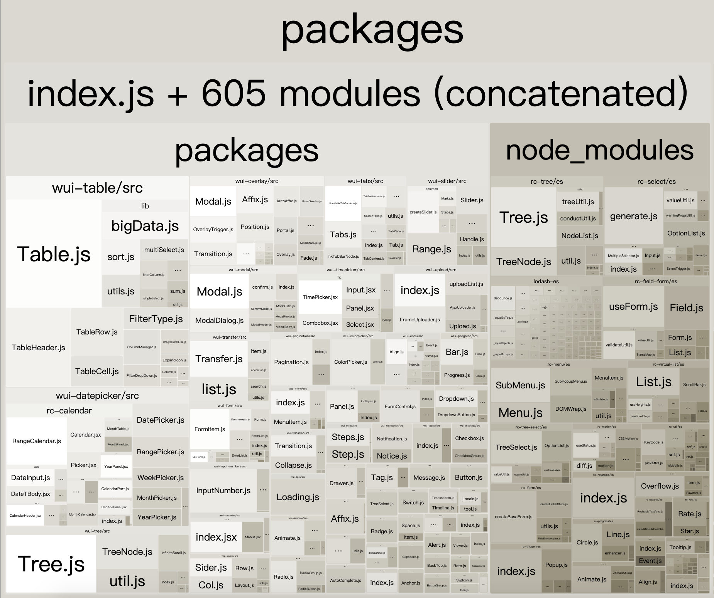

### 使用webpack内置的stats分析

```json
{
    "srcipts":{
        "build:stats": "webpack --env production --json > stats.json"
    }
}
```

### 速度分析：使用speed-measure-webpack-plugin

- 分析整个打包的总耗时
- 每个插件和loader的耗时情况
- 和一些Loader或者Plugin新版本会不兼容，需要进行降级处理，如mini-css-extract-plugin、html-webpack-plugin

```js
const SpeedMeasureWebpackPlugin = require('speed-measure-webpack-plugin');
const smp = new SpeedMeasureWebpackPlugin();
module.exports = smp.wrap({
    ......
})
```

### 体积分析：使用webpack-bundle-analyzer
可以直观的看到打包结果中，文件的体积大小、各模块依赖关系、文件是够重复等问题，极大的方便我们在进行项目优化的时候，进行问题诊断

- 构建完成后会在8888端口展示大小
  
- 依赖的第三方模块文件大小
- 业务里面的组件代码大小

```js
const { BundleAnalyzerPlugin } = require('webpack-bundle-analyzer');
module.exports = {
    plugins: [
      // 配置插件
      new BundleAnalyzerPlugin({
        // analyzerMode: 'disabled',  // 不启动展示打包报告的http服务器
        // generateStatsFile: true, // 是否生成stats.json文件
      })
    ]
}
```

### webpack4

webpack4: 优化原因

- V8带来的优化(for of替代 forEach、Map和Set替代 Object、includes替代indexOf)
- 默认使用更快的md4 hash 算法
- webpacks AST可以直接从loader传递给AST，减少解析时间
- 使用字符串方法替代正则表达式

### 多进程/多实例构建：资源并行解析可选方案

thread-loader

- parallel-webpack
- HappyPack（同样为开启多进程打包的工具，webpack5 已弃用）

### 多进程/多实例：并行压缩

```js
const TerserPlugin = require('terser-webpack-plugin');
module.exports = {
    optimization: {
        minimizer: [
            new TerserPlugin({
                parallel: true,
                cache: true
            })
        ],
	minimize: true,
    },
}
```

### 优化构建速度，缩小构建目标

目的：尽可能的少构建模块，比如babel-loader不解析node_modules、减少文件搜索范围

```js
{
    test: /\.js$/,
    exclude: /node_modules/,
    // 同时使用多个loader  用use数组，多个可以直接配置
    use: [
      /* 
          开启多线程打包。 
          进程启动大概为600ms，进程通信也有开销。
          只有工作消耗时间比较长，才需要多线程打包
      */
      {
        loader: 'thread-loader',
        options: {
          workers: 2 // 进程2个
        }
      },
      {
        loader: 'babel-loader',
        options: {
          // 预设：指示babel做怎么样的兼容性处理
          presets: [
            [
              '@babel/preset-env',
              {
                // 按需加载
                useBuiltIns: 'usage',
                // 指定core-js版本
                corejs: {
                  version: 3
                },
                // 指定兼容性做到哪个版本浏览器
                targets: {
                  chrome: '60',
                  firefox: '60',
                  ie: '9',
                  safari: '10',
                  edge: '17'
                }
              }
            ]
          ],
          // 开启babel缓存
          // 第二次构建时，会读取之前的缓存, 速度会更快一点
          cacheDirectory: true
        }
      }
    ],
}
```

## 无用的CSS如何删除

- PurifyCSS:遍历代码，识别已经用到的CSS class

使用purgecss-webpack-plugin，必须和mini-css-extract-plugin搭配使用

```js
const PurgecssPlugin = require('purgecss-webpack-plugin');
const MiniCssExtractPlugin = require('mini-css-extract-plugin');
const glob = require('glob');
const PATHS = {
    src: path.join(__dirname, 'src')
};
module.exports = {
    plugins: [
        new MiniCssExtractPlugin({
            filename: '[name]_[contenthash:8].css'
        }),
        new PurgecssPlugin({
            paths: glob.sync(`${PATHS.src}/**/*`,  { nodir: true }),
        })
    ]
}
```

- uncss: HTML需要通过jsdom加载，所有的样式通过PostCSS解析，通过document.querySelector来识别在html文件里面不存在的选择器
