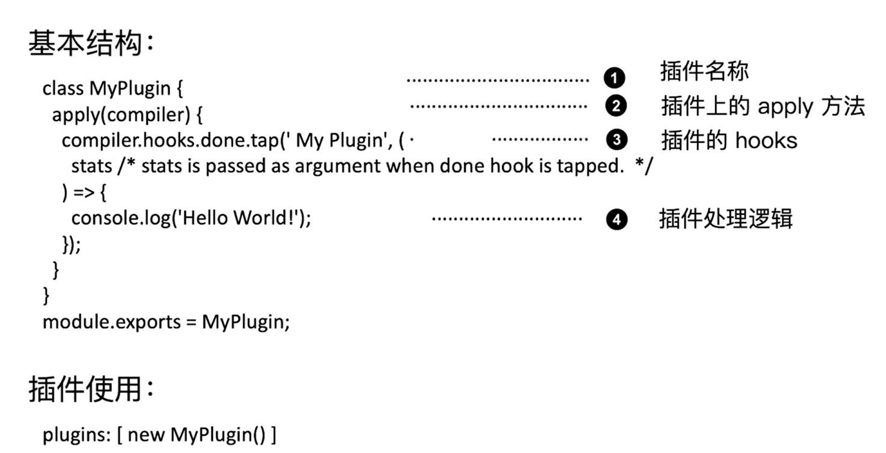
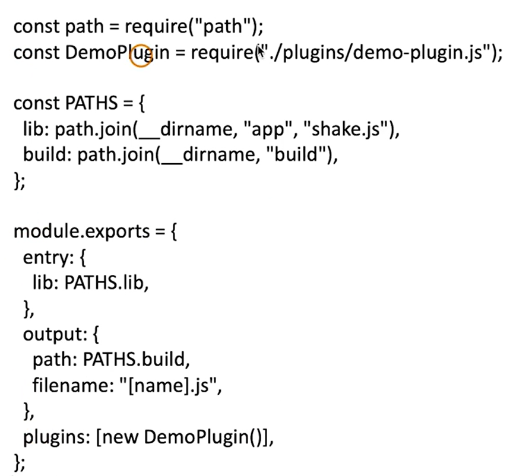

## loader的链式调用与执行顺序

- loader执行的顺序是在use数组内从右到左（从后往前），loader本质上是一个函数。
- 多个loader是串行执行，上一个loader处理完source之后会把处理结果传给下一个loader来处理。
- Compose(webpack采用的函数组合)：`compose = (f, g) => (...args) => f(g(...args))`

```js
module.exports = function(source){
    return newSource;
}
```

### loader-runner

loader-runner运行你在不安装webpack的情况下运行loaders，进行loader的开发和调试，其实像是提供了一个loader运行的环境。

### 手写loader
- Webpack5在loader的上下文中，会带有内置的this.getOptions方法。

[webpack-study](https://github.com/izph/webpack-study)

## 手写插件plugin

插件没有像loader那样的独立运行的环境，只能在webpack里面使用。

### 写插件的基本结构

- webpack运行插件，会调用插件上的apply方法，同时把webpack的compiler对象传递给插件。插件可以通过compiler里的hooks的方法，在不同的阶段，做很多事情，可以监听compiler的hooks
  

### 搭建插件的运行环境



### 插件的错误处理

#### 参数校验阶段可以直接throw的方式抛出

```js
throw new Error(" Error Message")
```

#### 通过compilation对象的warnings和errors接收

```js
compilation.warnings.push("warning");
compilation.errors.push("error");
```

### 通过Compilation进行文件写如入

- Compilation 上的assets可以用于文件写入，可以将zip资源包设置到compilation.assets对象上
- 文件的写入可以使用webpack-sources这个依赖包[webpack-sources](https://github.com/webpack/webpack-sources)

## 编写一个压缩构建资源为zip包的插件

- 生成的zip包文件名称可以通过插件传入
- 需要使用compiler对象上特定的hooks进行资源的生成（不使用node内置的fs模块）

### node.js里如何将文件压缩为一个zip包

使用jszip：[jszip](https://github.com/Stuk/jszip)

#### jszip使用示例

[jszip官网](https://stuk.github.io/jszip/)

```js
var zip = new JSZip();

// 添加文件file，文件名称，文件内容
zip.file("Hello.txt", "Hello World\n");

// 生成images目录
var img = zip.folder("images");
img.file("smile.gif", imgData, {base64: true});

// 把内容写进去
zip.generateAsync({type:"blob"}).then(function(content) {
    // see FileSaver.js
    saveAs(content, "example.zip");
});

/*
Results in a zip containing
Hello.txt
images/
    smile.gif
*/
```

### compiler上复制文件生成的hooks

emit，是一个异步的hook，emit生成文件阶段，读取的是compilation.assets对象的值，可以将zip资源包设置到compilation.assets对象上
