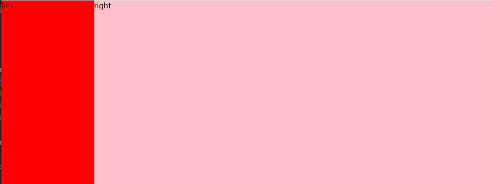

# 1. CSS单行超出省略

```css
   {
   	width: 100px;
   	overflow: hidden;/* 超出隐藏 */
   	text-overflow: ellipsis;/* 文本溢出时显示省略标记 */
   	white-space: no-wrap;/* 文本不换行 */
   }
```

# 2. 多行超出省略

设置文本隐藏的元素不能设置高度，或者有上下padding，否则会导致超出部分不隐藏

```css
   {
       width：300px; /*可自定义，也可不设*/
       overflow: hidden; /*超出隐藏*/
       text-overflow: ellipsis; /*文本溢出时显示省略标记*/
       /* 以下三个属性是多行省略的关键，*/
       display: -webkit-box; /*设置弹性盒模型*/
       -webkit-line-clamp: 3; /*文本占的行数, 如果要设置3行加...则设置为3*/
       -webkit-box-orient: vertical; /*子代元素垂直显示*/
   }
```

# 3. 实现一个宽高自适应的正方形

- 第一种方式是利用vw、vh来实现
  ```css
  .box { 
    width: 20%; 
    height: 20vw;/* vw、vh */
    background: red; 
  }
  ```
- 第二种方式是利用元素的margin/padding百分比是相对父元素width的性质来实现
  ```css
  .box { 
    width: 20%; 
    height: 0;/* 高度为零 */  
    padding-bottom: 20%;
    background: red; 
  }
  ```
- 第三种方式是利用rem

# 4. 实现一个三角形

实现原理是利用了元素边框连接处的等分原理

```css
  .box { 
    /* 宽高设置为0 */ 
    width: 0; 
    height: 0; 
    border-width: 100px; 
    border-style: solid; 
    border-color: red transparent transparent transparent; 
  }
```

# 5. 实现一个自适应矩形，水平垂直居中，且宽高比为 2:1

```css
.box { 
    /* 水平垂直居中 */
    position: absolute; 
    top: 0; 
    right: 0; 
    left: 0; 
    bottom: 0; 
    margin: auto;
    /* 自适应矩形, 且宽高比为2:1 */
    width: 10%; 
    height: 0; 
    /* 元素的margin、padding百分比是相对父元素width的性质来实现 */
    padding-top: 20%; /* vw、padding-bottom */
    background: red; 
  }
```

# 6. 实现一个两栏布局

左边固定，右边自适应

```html
<body>
  <div class="content">
    <div class="left">left</div>
    <div class="right">right</div>
  </div>
</body>
```

```css
/* 原来元素的高度如果设置为百分比的话，
    要么由内容撑开，要么由父元素得到，如果父元素没有高度，那么这个百分比是没有用的。 
    在html中，没有设置宽度的话默认100% ，没有设置高度的话，只能由内容撑开。
     */
html,
body {
  height: 100%;
}
.left {
  width: 200px;
  height: 100%;
  background-color: red;
  float: left;
}
.right {
  height: 100%;
  background-color: pink;
}
.content {
  height: 100%;
}


```



```js
/*两栏布局一般指的是页面中一共两栏，左边固定，右边自适应的布局，一共有四种实现的方式。*/
    /*以左边宽度固定为200px为例*/
    /*（1）利用浮动，将左边元素宽度设置为200px，并且设置向左浮动。将右边元素的margin-left设置为 200px，宽度设置为auto（默认为auto，撑满整个父元素）。*/
    .content {
      height: 100px;
    }

    .left {
      float: left;
      height: 100px;
      width: 200px;
      background: tomato;
    }

    .right {
      margin-left: 200px;
      width: auto;
      height: 100px;
      background: gold;
    }

    /*（2）第二种是利用flex布局，将左边元素的放大和缩小比例设置为0，基础大小设置为200px。将右边的元素的放大比例设置为1，
        缩小比例设置为1，基础大小设置为auto。*/
    .content {
      display: flex;
      height: 100px;
    }

    .left {
      width: 300px;
      flex-basis: 200px;
      background: tomato;
    }

    .right {
      flex: 1 1 auto;
      background: gold;
    }

    /*（3）第三种是利用绝对定位布局的方式，将父级元素设置相对定位。左边元素设置为absolute定位，
        并 且宽度设置为 200px。将右边元素的margin-left的值设置为200px。*/
    .content {
      position: relative;
      height: 100px;
    }

    .left {
      position: absolute;
      width: 200px;
      height: 100px;
      background: tomato;
    }

    .right {
      margin-left: 200px;
      height: 100px;
      background: gold;
    }

    /*（4）第四种还是利用绝对定位的方式，将父级元素设置为相对定位。左边元素宽度设置为200px，
    右边 元素设置为绝对定位，左边固定为200px，其余方向定位为0。*/
    .content {
      position: relative;
      height: 100px;
    }

    .left {
      width: 200px;
      height: 100px;
      background: tomato;
    }

    .right {
      position: absolute;
      top: 0;
      right: 0;
      bottom: 0;
      left: 200px;
      background: gold;
    }
```

# 7. css三栏布局

```html
<head>
  <meta charset="UTF-8">
  <meta name="viewport" content="width=device-width, initial-scale=1.0">
  <title>Document</title>
  <style>
    html,
    body {
      height: 100%;
    }

    .content {
      height: 100%;
    }

    .left {
      float: left;
      background-color: red;
      width: 200px;
      height: 100%;
    }
    .center {
      background-color: green;
      height: 100%;
      /* BFC不与浮动的元素发生重叠 */
      overflow: hidden;
    }

    .right {
      float: right;
      background-color: blue;
      height: 100%;
      width: 200px;
    }
  </style>
</head>

<body>
  <div class="content">
    <div class="left">left</div>
    <div class="right">right</div>
    <div class="center">center</div>
  </div>
</body>
```

# 8. css等高布局

```html
<div class="content">
    <div class="left">left</div>
    <div class="center">center</div>
    <div class="right">right</div>
</div>

```

```css
/* flex布局 */
html,
body {
  height: 100%;
}
.content {
  height: 100%;
  display: flex;
}
.left {
  background-color: red;
  width: 200px;
  height: 100%;
}
.center {
  background-color: green;
  height: 100%;
  flex: 1;
  overflow: hidden;
}
.right {
  background-color: blue;
  height: 100%;
  width: 200px;
}
```

# 9. css上下固定中间自适应

```html
  <style>
    body {
      padding: 0;
      margin: 0;
    }

    .header {
      position: absolute;
      top: 0;


      width: 100%;
      height: 100px;
      background: red;
    }

    .container {
      position: absolute;
      top: 100px;
      bottom: 100px;


      width: 100%;
      background: green;
    }

    .footer {
      position: absolute;
      bottom: 0;

      height: 100px;
      width: 100%;
      background: red;
    }
  </style>
</head>

<body>
  <div class="father">
    <div class="header"></div>
    <div class="container"></div>
    <div class="footer"></div>
  </div>

</body>
```

# 10. 水平垂直居中
## 行内元素
### （1）行内元素的垂直居中
用padding实现居中，父元素不设置高度。
html代码：
```html
<div>
    <span>垂直居中</span>
</div>
```
css代码：
```css
div { 
  /*不设置父元素高度，由子元素撑开*/ 
  width: 200px; 
  /*用上下内边距实现子元素垂直居中*/
  padding-top: 50px;  
  padding-bottom: 50px;
}
span { 
  /*随着子元素字体变大，父元素宽高也会变大*/ 
  font-size: 40px; 
}
```
### （2）行内元素的垂直居中
用子元素的line-height等于父元素的高度(该方法一般适用于单行文字，多行文字不使用！)，如果父元素中文字不用span包裹，则在父元素中设置行高等于高度也可实现文字垂直居中。
html代码：
```html
<div>
    <span>垂直居中</span>
</div>
```
css代码：
```css
div {  
  width: 400px; 
  height: 100px;  
}
span { 
  /*子元素的行高等于父元素的高度*/
  line-height: 100px; 
}
```
### （3）行内元素的居中
父元素设置text-align:center，子元素水平居中。
html代码：
```html
<div>
    <span>子元素居中</span>
</div>
```
css代码：
```css
div {  
  width: 100px; 
  height: 100px; 
  text-align:center；
}

```
### （4）行内元素的水平居中
父元素设置为flex弹性布局
```css
{
  display: flex;
  justify-content: center;
  align-items: center;
    
  /* 针对单行 行内元素水平垂直居中 */
  line-height等于height
  text-align:center
}
```
## 块级元素
### （1）通过top:50%和left:50%定位到页面的中心，然后再通过margin 负值来调整（元素宽高已知）
```css
{
   position: absolute;/*绝对定位*/ 
   width: 100px; 
   height: 100px; 
   top: 50%; 
   left: 50%; 
   margin-left: -50px;  /*外边距为自身宽高的一半*/ 
   margin-top: -50px; 


   /* calc 实现*/
   position: absolute;
   top: calc(50% - 50px);
   left: calc(50% - 50px);
}
```
### （2）通过top:50%和left:50%定位到页面的中心，然后再通过translate移动（元素宽高未知）
```css
{
  position: absolute;/*绝对定位*/ 
  width: 100px; 
  height: 100px; 
  top: 50%; 
  left: 50%; 
  transform:translate(-50%, -50%)

   /* calc 实现*/
  position: absolute;
  top: calc(50% - 50px);
  left: calc(50% - 50px);
}
```
### （3）使用flex布局，通过在父级设置 align-items:center 和 justify-content:center ，让它的子元素实现水平垂直居中
```css
.father { 
  display: flex; 
  align-items: center; /*垂直居中*/ 
  justify-content: center; /*水平居中*/ 
}
.son { 
  width: 100px; 
  height: 100px; 
}
```
### （4）利用绝对定位，设置四个方向的值都为0，并将margin设置为auto（随着浏览器窗口变化而变化兼容性好）
```css
div { 
   position: absolute; 
   width: 100px; 
   height: 100px; 
   margin: auto; 
   top: 0; 
   left: 0; 
   bottom: 0; 
   right: 0; 
   background-color: pink;
}
```
### （5）div水平居中
```css
{
  width: 100px; 
  height: 100px; 
  margin: 0 auto; 
}
```