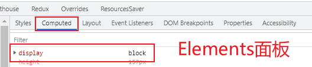
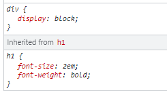
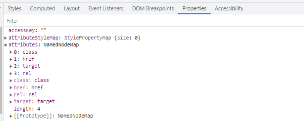
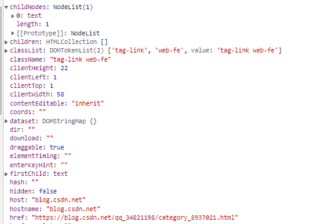

### 1. HTML常识
- html和body都是block元素，不设置宽度，默认是浏览器宽度的100%。不设置高度，默认由内容撑高。body是html子元素。通过Elements面板的Computed查看元素的属性值，如display、color、font-size、width、height属性等等。


- 标签内的文字默认不换行，如果文字有空格，则会以这些空格分为几段，一段一段填充到一行上，如果标签宽度不够，另外的分段会换行显示。

- 常见块级元素div、p、h1-h6、ul、li、html5语义化标签，常见行内元素span、a、label、strong、b、em、del等。

- img是行内元素，但是能设置宽高。input是display: inline-block行内块元素

- 一旦设置浮动，就没有分块状元素和行内元素，原本的行内元素也能设置宽高

- 相邻的行内元素（行内块）在一行上，但是中间会有空白的间隙

- 行内块级元素默认的宽度就是本身内容的宽度，它的高度，行高，内边距和外边距都可以设置

- 块级元素宽度默认是父元素100%，行内元素默认的宽高是auto，依靠文字内容撑开。行内元素一般容纳纯文本和其他行内元素（a标签除外）

- a标签内可以放置块级元素和行内元素，a链接里面不能再存放链接，a标签里放a标签会自动放到外面。
```css
/* a标签的默认样式 
  通常去掉下划线：text-decoration: none;
*/
a:-webkit-any-link {
  color: -webkit-link;
  cursor: pointer;
  text-decoration: underline;
}
```

- p标签不能放块级元素div，而且还能放行内元素，放在p标签内的span垂直的margin、padding、border会生效，影响布局。放在div内的span垂直的margin、padding、border不影响布局。

- h1-h6可以放置div标签，div会继承h标签的属性


- 在Properties面板可以查看某个DOM上的属性：


attributes是我们定义在dom元素上的属性，children是存放子元素（不包括text），childNodes是存放子元素，包括文本。classList是存放class类名的数组，dataset存放自定义属性(data-*), style对象挂载样式属性，innerHTML、nodeType、nodeName（tagName）等等

### 2. 行内元素的margin、padding、border

，设置宽高无效，行内元素的margin、padding、border在水平方向有效，并且会影响布局。而垂直方向是不影响布局的，能看出DOM元素效果，如果给该元素设置了背景色和边框色，并设置垂直的padding和border后，则会显示特定颜色的效果，不影响布局。

### 3. link和@import

加载html页面时，link 标签引入的 CSS 被同时加载；@import 引入的 CSS 将在页面加载完毕后被加载。

### 4. 渲染引擎和JS引擎

浏览器的渲染引擎和JS引擎，渲染引擎可以显示 html文档及图片，JS 引擎：解析和执行 javascript代码来实现网页的动态效果，这两者是互斥的，遇到script标签后由JS引擎处理，阻塞了页面的渲染。

### 5. defer和async

JS会阻塞浏览器的解析，想首屏渲染的越快，就越不应该在首屏就加载大量 JS 文件，将 script 标签放在 body 标签底部的、给 script 标签添加 defer 或者 async 属性都可以减缓阻塞。async 和 defer 的作用是什么：

- defer：表示延迟执行引入的 JavaScript，即这段 JavaScript 加载时 HTML 并未停止解析，这两个过程是并行的，当整个 document 解析完毕后再执行脚本文件，在 DOMContentLoaded 事件触发之前完成，多个脚本按顺序执行。
- async ：异步执行 JavaScript，js如果已经加载好，就会开始执行js代码，这时候会阻塞文档的解析，只是js加载过程不会阻塞，多个js脚本的无法保证执行顺序。

### 6. 重排（回流）和重绘

重排（回流）必定会发生重绘，重绘不一定会引发重排（回流），重排是指一些元素的宽高、位置大小的变化、元素的添加、删除等。重绘则是指dom元素的颜色、背景发生变化等。

### 7. cookies，sessionStorage 和 localStorage 的区别

- cookie 数据大小不能超过4 k，sessionStorage 和 localStorage 大小为5 M
- localStorage存储持久数据，浏览器关闭后数据不丢失、除非主动删除数据。只能被同源的页面访问共享。
- sessionStorage 关闭浏览器时会被清除，刷新页面不会清除。只能被同一个窗口的同源 页面所访问共享。
- cookie是可以设置有效期，只能被同源的页面访问共享

### 8. 常用的 meta 标签

- 声明文档使用的字符编码：``<meta charset='utf-8'>``
- 为移动设备添加 viewport 不允许缩放：user-scalable=no

```html
<meta charset="UTF-8">
<meta name='viewport'  content='initial-scale=1, maximum-scale=3, minimum-scale=1, user-scalable=no'>

<!-- 
    width：页面宽度，可以取值具体的数字，也可以是 device-width，表示跟设备宽度相等。
    height：页面高度，可以取值具体的数字，也可以是 device-height，表示跟设备高度相等。
    initial-scale：初始缩放比例。
    minimum-scale：最小缩放比例。
    maximum-scale：最大缩放比例。
    user-scalable：是否允许用户缩放 
-->
```

- http-equiv属性，设置页面不缓存：

```html
<meta http-equiv='pragma' content='no-cache'> 
<meta http-equiv='cache-control' content='no-cache'> 
<meta http-equiv='expires' content='0'>
```

- Set-Cooike:

```html
<meta http-equiv="Set-Cookie" content="cookievalue=xxx;expires=Friday,12-Jan-200118:18:18GMT；path=/">
<meta http-equiv="content-Type" content="text/html;charset=gb2312">
```

- 设置content-type，并且指定了 http 编码方式。

```html
<meta http-equiv="content-type" content="text/html; charset=UTF-8">
```

- 其他

```html
<meta http-equiv="X-UA-Compatible" content="IE=edge,chrome=1">
<!-- 默认使用最新浏览器 -->

<meta http-equiv="Cache-Control" content="no-siteapp">
<!-- 不被网页(加速)转码 -->

<meta name="robots" content="index,follow">
<!-- 搜索引擎抓取 -->

<meta name="renderer" content="webkit">
<meta name="viewport" content="width=device-width, initial-scale=1, maximum-scale=1, minimum-scale=1, user-scalable=no, minimal-ui">
<meta name="apple-mobile-web-app-capable" content="yes">
<!-- 删除苹果默认的工具栏和菜单栏 -->

<meta name="apple-mobile-web-app-status-bar-style" content="black-translucent">
<!-- 设置苹果工具栏颜色 -->

<meta name="apple-mobile-web-app-status-bar-style" content="black-translucent" />
<!-- 添加到主屏后的标题 -->

<meta name="apple-mobile-web-app-title" content="标题" />
<!-- 忽略数字自动识别为电话号码 -->

<meta content="telephone=no" name="format-detection" />
<!-- 忽略识别邮箱 -->

<meta content="email=no" name="format-detection" />
<meta name="apple-itunes-app" content="app-id=myAppStoreID,
affiliate-data=myAffiliateData, app-argument=myURL" />
```
