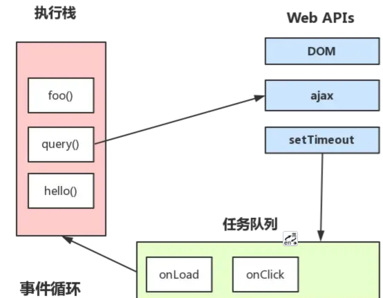

# EventLoop

Event Loop即事件循环，是指浏览器或Node的一种解决javaScript单线程运行时不会阻塞的一种机制，也就是我们经常使用异步的原理。

## MacroTask（宏任务）

script脚本的执行、setTimeout、setInterval、I/O操作、UI渲染、setImmediate（浏览器暂时不支持，只有IE10支持）

## MicroTask（微任务）

Promise的then、async/await、Process.nextTick（Node独有）、对Dom变化监听的MutationObserver

Javascript 有一个 main thread 主线程和 call-stack 调用栈(执行栈)，所有的任务都会被放到调用栈等待主线程执行。运行代码的过程中，将一些同步的方法放到 调用栈里等待主线程的执行，遇到异步的API，会将异步的API挂起，在异步任务有了结果后，将注册的回调函数放入任务队列中，等待主线程空闲的时候（调用栈被清空），主线程从 任务队列 读取这些回调，放到 调用栈 等待主线程的执行。

堆栈溢出问题：递归函数没有结束判断
优化堆栈溢出问题：使用事件循环和异步回调

如果当前浏览器标签页里的JS执行出现了溢出，其他标签回受影响吗？
不会，浏览器的每个标签页是不同进程。
