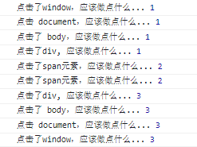

# 事件流

## addEventListener方法为监听dom元素的事件

- addEventListener(type, listener, useCapture)
- @ type 监听事件类型的字符串
- @ listener 一个函数或者一个实现EventListener接口的对象
- @ useCaptrue 是否使用捕获true->捕获，false->冒泡，不填为冒泡

### event.eventPhase

这个值表示当前事件是捕获还是冒泡还是目标元素触发，对于目标元素的捕获和冒泡是相同的。

- 1 -> 捕获
- 2 -> 点击目标元素
- 3 -> 冒泡

```html
<!DOCTYPE html>
<html lang="en">
<head>
  <meta charset="UTF-8">
  <meta name="viewport" content="width=device-width, initial-scale=1.0">
  <meta http-equiv="X-UA-Compatible" content="ie=edge">
  <title>EventFlow</title>
</head>
    <body>
    <div id="parentbox">
        <span id="sonbox">Click Me</>
    </div>
    </body>
</html>
```

```js
//监听 window 点击捕获事件
window.addEventListener("click", function (event) {
  console.log("点击了window，应该做点什么...", event.eventPhase);
}, true);
//监听 window 点击冒泡事件
window.addEventListener("click", function (event) {
  console.log("点击了window，应该做点什么...", event.eventPhase);
}, false);
//监听 document 点击捕获事件
document.addEventListener("click", function (event) {
  console.log("点击 document，应该做点什么...", event.eventPhase);
}, true);
//监听 document 点击冒泡事件
document.addEventListener("click", function (event) {
  console.log("点击 document，应该做点什么...", event.eventPhase);
}, false);
//监听 body 点击捕获事件
document.body.addEventListener("click", function (event) {
  console.log("点击了 body，应该做点什么...", event.eventPhase);
}, true);
//监听 body 点击冒泡事件
document.body.addEventListener("click", function (event) {
  console.log("点击了 body，应该做点什么...", event.eventPhase);
}, false);
//监听 div 点击捕获事件
document.getElementById("parentbox").addEventListener("click",function (event) {
  console.log("点击了div, 应该做点什么...", event.eventPhase);
}, true);
//监听 div 点击冒泡事件
document.getElementById("parentbox").addEventListener("click",function (event) {
  console.log("点击了div, 应该做点什么...", event.eventPhase);
}, false);
//监听 p 点击捕获事件
document.getElementById("sonbox").addEventListener("click",function (event) {
  console.log("点击了span元素，应该做点什么...", event.eventPhase);
}, true);
//监听 p 点击冒泡事件
document.getElementById("sonbox").addEventListener("click",function (event) {
  console.log("点击了span元素，应该做点什么...", event.eventPhase);
}, false);
```

#### 点击span


