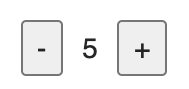

# ReactHooks笔记

### 函数组件和类组件本质的区别
对于类组件来说，底层只需要实例化一次，实例中保存了组件的 state 等状态。对于每一次更新只需要调用 render 方法以及对应的生命周期就可以了。但是在函数组件中，每一次更新都是一次新的函数执行，一次函数组件的更新，里面的变量会重新声明。

React 对函数组件的调用，是采用直接执行函数的方式，而不是通过new的方式。

## Hooks带来的好处

把业务逻辑清晰地隔离开，能够让代码更加容易理解和维护，解决了Class组件存在的一些代码冗余、难以逻辑复用的问题，替代了高阶组件的负担

## Hooks 的使用规则

只能在函数组件的顶级作用域使用；只能在函数组件或者其他 Hooks 中使用。
所谓顶层作用域，就是 Hooks 不能在循环、条件判断或者嵌套函数内执行，而必须是在顶层。同时 Hooks 在组件的多次渲染之间，必须按顺序被执行。(第一，所有 Hook 必须要被执行到。第二，必须按顺序执行。)

## useState

```jsx
[ state , dispatch ] = useState(initData)
```
- state，目的提供给 UI ，作为渲染视图的数据源。
- dispatch 改变 state 的函数，可以理解为推动函数组件渲染的渲染函数。
- initData 有两种情况，第一种情况是非函数，将作为 state 初始化的值。 第二种情况是函数，函数的返回值作为 useState 初始化的值。可以在函数里做一些判断，返回初始化的state。


让函数组件具有维持状态的能力，类组件中的 state 只能有一个，而函数组件中用 useState 则可以很容易地创建多个 state。state 中永远不要保存可以通过计算得到的值。比如说：

- 从 props 传递过来的值。有时候 props 传递过来的值无法直接使用，而是要通过一定的计算后再在 UI 上展示，比如说排序。那么我们要做的就是每次用的时候，都重新排序一下，或者利用某些 cache 机制，而不是将结果直接放到 state 里。
- 从 URL 中读到的值。比如有时需要读取 URL 中的参数，把它作为组件的一部分状态。那么我们可以在每次需要用的时候从 URL 中读取，而不是读出来直接放到 state 里。
- 从 cookie、localStorage 中读取的值。通常来说，也是每次要用的时候直接去读取，而不是读出来后放到 state 里。

### useState 的实现原理

借助闭包，封装一个 `setState` 如下：

```javascript
function render() {
  ReactDOM.render(<App />, document.getElementById("root"));
}

let state: any;

function useState<T>(initialState: T): [T, (newState: T) => void] {
  state = state || initialState;

  function setState(newState: T) {
    state = newState;
    render();
  }

  return [state, setState];
}

render(); // 首次渲染
```

这是一个简易能用的 `useState`雏形了。但如果在函数内声明多个 state，在当前代码中，只有第一个 state 是生效的(请看 `state = state || initialState;`)。

### 让useState支持多个state

React Hook本质上还是通过 Array 来实现的。

前面 useState 的简单实现里，初始的状态是保存在一个全局变量中的。以此类推，多个状态，应该是保存在一个专门的全局容器中。这个容器，就是一个Array。具体过程如下：

- 第一次渲染时候，根据 useState 顺序，逐个声明 state 并且将其放入全局 Array 中。每次声明 state，都要将 cursor 增加 1。
- 更新 state，触发再次渲染的时候。**cursor 被重置为 0**。按照 useState 的声明顺序，依次拿出最新的 state 的值，视图更新。

实现的代码如下：

```javascript
import React from "react";
import ReactDOM from "react-dom";

const states: any[] = [];
let cursor: number = 0;

function useState<T>(initialState: T): [T, (newState: T) => void] {
  const currenCursor = cursor;
  states[currenCursor] = states[currenCursor] || initialState; // 检查是否渲染过

  function setState(newState: T) {
    states[currenCursor] = newState;
    render();
  }

  ++cursor; // update: cursor
  return [states[currenCursor], setState];
}

function App() {
  const [num, setNum] = useState < number > 0;
  const [num2, setNum2] = useState < number > 1;

  return (
    <div>
      <div>num: {num}</div>
      <div>
        <button onClick={() => setNum(num + 1)}>加 1</button>
        <button onClick={() => setNum(num - 1)}>减 1</button>
      </div>
      <hr />
      <div>num2: {num2}</div>
      <div>
        <button onClick={() => setNum2(num2 * 2)}>扩大一倍</button>
        <button onClick={() => setNum2(num2 / 2)}>缩小一倍</button>
      </div>
    </div>
  );
}

function render() {
  ReactDOM.render(<App />, document.getElementById("root"));
  cursor = 0; // 重置cursor
}

render(); // 首次渲染
```

此时，如果想在循环、判断等不在函数组件顶部的地方使用 Hook，如下所示：

```javascript
let tag = true;

function App() {
  const [num, setNum] = useState < number > 0;

  // 只有初次渲染，才执行
  if (tag) {
    const [unusedNum] = useState < number > 1;
    tag = false;
  }

  const [num2, setNum2] = useState < number > 2;

  return (
    <div>
      <div>num: {num}</div>
      <div>
        <button onClick={() => setNum(num + 1)}>加 1</button>
        <button onClick={() => setNum(num - 1)}>减 1</button>
      </div>
      <hr />
      <div>num2: {num2}</div>
      <div>
        <button onClick={() => setNum2(num2 * 2)}>扩大一倍</button>
        <button onClick={() => setNum2(num2 / 2)}>缩小一倍</button>
      </div>
    </div>
  );
}
```

由于在条件判断的逻辑中，重置了 `tag=false`，因此此后的渲染不会再进入条件判断语句。看起来好像没有问题？但是，由于 useState 是基于 Array+Cursor 来实现的，第一次渲染时候，state 和 cursor 的对应关系如下表：

| 变量名    | cursor |
| --------- | ------ |
| num       | 0      |
| unusedNum | 1      |
| num2      | 2      |

当点击事件触发再次渲染，并不会进入条件判断中的 useState。所以，cursor=2 的时候对应的变量是 num2。而其实 num2 对应的 cursor 应该是 3。就会导致 `setNum2`并不起作用。

所以不建议在循环、判断内部使用 Hook。在使用 Hook 的时候，请在函数组件顶部使用！

## useEffect

useEffect执行副作用，每次组件 render 完后判断依赖并执行
useEffect 接收的返回值是一个回调函数，这个回调函数不只是会在组件销毁时执行，而且是每次 Effect 重新执行之前都会执行，用于清理上一次 Effect 的执行结果。当组件销毁时，运行最后一次Effect返回的函数。每个 Effect 必然在渲染之后执行，因此不会阻塞渲染，提高了性能

- 没有依赖项，则每次 render 后都会重新执行
- 空数组作为依赖项，则只在第一次 render 后执行，对应到 Class 组件就是 componentDidMount
- useEffect 还允许你返回一个函数，用于在组件销毁的时候做一些清理的操作。比如移除事件的监听。这个机制就几乎等价于class类组件中的 componentWillUnmount。

```js
// 设置一个 size 的 state 用于保存当前窗口尺寸
const [size, setSize] = useState({});
useEffect(() => {
  // 窗口大小变化事件处理函数
  const handler = () => {
    setSize(getSize());
  };
  // 监听 resize 事件
  window.addEventListener('resize', handler);
  
  // 返回一个 callback 在组件销毁时调用
  return () => {
    // 移除 resize 事件
    window.removeEventListener('resize', handler);
  };
}, []);
```

- 依赖项中定义的变量一般是会在回调函数中用到的，否则声明依赖项其实是没有意义的。
- 依赖项一般是一个常量数组，而不是一个变量。因为一般在创建 callback 的时候，你其实非常清楚其中要用到哪些依赖项了。(依赖项数组好不添加或者删除元素，一开始就定义好需要监听哪些常量)
- React 会使用浅比较来对比依赖项是否发生了变化，所以要特别注意数组或者对象类型。如果你是每次创建一个新对象，即使和之前的值是等价的，也会被认为是依赖项发生了变化。这是一个刚开始使用 Hooks 时很容易导致 Bug 的地方。例如下面的代码：

```javascript
function Sample() {
  // 这里在每次组件执行时创建了一个新数组
  const todos = [{ text: 'Learn hooks.'}];
  useEffect(() => {
    console.log('Todos changed.');
  }, [todos]);
}
```

代码的原意可能是在 todos 变化的时候去产生一些副作用，但是这里的 todos 变量是在函数内创建的，实际上每次都产生了一个新数组。所以在作为依赖项的时候进行引用的比较，实际上被认为是发生了变化的。

`deps` 数组在判断元素是否发生改变时同样也使用了 `Object.is` 进行比较。因此一个隐患便是，当 `deps` 中某一元素为非原始类型时（例如函数、对象等）， **每次渲染都会发生改变** ，从而失去了 `deps` 本身的意义（条件式地触发 Effect）

不建议把 Effect 写成一个 async 函数

```
useEffect(async () => {
  const response = await fetch('...');
  // ...
}, []);
```

`useEffect` 约定 Effect 函数要么没有返回值，要么返回一个函数。而这里 async 函数会隐式地返回一个 Promise，直接违反了这一约定，会造成不可预测的结果。

### useEffect 的实现原理

在 useEffect 的第二个参数中，我们可以指定一个数组，如果下次渲染时，数组中的元素没变，那么就不会触发这个副作用（可以类比 Class 类的关于 nextprops 和 prevProps 的生命周期）。好处显然易见，**相比于直接裸写在函数组件顶层，useEffect 能根据需要，避免多余的 render**。

下面是一个不包括销毁副作用功能的 useEffect 的 TypeScript 实现：

```javascript
// 还是利用 Array + Cursor的思路
const allDeps: any[][] = [];
let effectCursor: number = 0;

function useEffect(callback: () => void, deps: any[]) {
  if (!allDeps[effectCursor]) {
    // 初次渲染：赋值 + 调用回调函数
    allDeps[effectCursor] = deps;
    ++effectCursor;
    callback();
    return;
  }

  const currenEffectCursor = effectCursor;
  const rawDeps = allDeps[currenEffectCursor];
  // 检测依赖项是否发生变化，发生变化需要重新render
  const isChanged = rawDeps.some(
    (dep: any, index: number) => dep !== deps[index]
  );
  if (isChanged) {
    callback();
  }
  ++effectCursor;
}

function render() {
  ReactDOM.render(<App />, document.getElementById("root"));
  effectCursor = 0; // 注意将 effectCursor 重置为0
}
```

参考：

- [useEffect 完整指南](https://overreacted.io/zh-hans/a-complete-guide-to-useeffect/)
- [React Hooks 原理](https://github.com/brickspert/blog/issues/26)

## useCallback

每次组件状态发生变化的时候，函数组件实际上都会重新执行一遍。在每次执行的时候，实际上都会创建一个新的事件处理函数 handleIncrement。
只有当 count 发生变化时，我们才需要重新定一个回调函数。而这正是 useCallback 这个 Hook 的作用，
useCallback一般是包装react合成事件的触发函数

```javascript
// 这样，只有 count 发生变化的时候，才需要重新创建一个回调函数，这样就保证了组件不会创建重复的回调函数。而接收这个回调函数作为属性的组件，也不会频繁地需要重新渲染
function Counter() {
  const [count, setCount] = useState(0);
  const handleIncrement = useCallback(() => setCount(count + 1), [count]);
  // ...
  return <button onClick={handleIncrement}>+</button>
}
```

## useMemo

缓存计算的结果，避免重复计算，useCallback 的功能其实是可以用 useMemo 来实现的：

```javascript
const myEventHandler = useMemo(() => {
   // 返回一个函数作为缓存结果
   return () => {
     // 在这里进行事件处理
   }
 }, [dep1, dep2]);
```

## useRef

在多次渲染之间共享数据，可以把 useRef 看作是在函数组件之外创建的一个容器空间。在这个容器上，我们可以通过唯一的 current 属设置一个值，从而在函数组件的多次渲染之间共享这个值。

使用 useRef 保存的数据一般是和 UI 的渲染无关的，因此当 ref 的值发生变化时，是不会触发组件的重新渲染的，这也是 useRef 区别于 useState 的地方。（我们可以将定时器的timer放到Ref.current中，需求清除定时器时，直接从current取timer）

useRef 还有一个重要的功能，就是保存某个 DOM 节点的引用。

```javascript
function TextInputWithFocusButton() {
  const inputEl = useRef(null);
  const onButtonClick = () => {
    // current 属性指向了真实的 input 这个 DOM 节点，从而可以调用 focus 方法
    inputEl.current.focus();
  };
  return (
    <>
      <input ref={inputEl} type="text" />
      <button onClick={onButtonClick}>Focus the input</button>
    </>
  );
}
```

## useContext

定义全局状态，当这个 Context 的数据发生变化时，使用这个数据的组件就能够自动刷新。(还可以在函数组件中监听Context的value值的变化)，让组件的复用变得困难，因为一个组件如果使用了某个 Context，它就必须确保被用到的地方一定有这个 Context 的 Provider 在其父组件的路径上。

所以在 React 的开发中，我们很少会使用 Context 来做太多数据的共享，Context 更多的是提供了一个强大的机制，让 React 应用具备定义全局的响应式数据的能力。主要是用来实现 Theme(主题)、Language (多语)等功能

## 自定义Hooks

如何创建自定义 Hooks？
自定义 Hooks 在形式上其实非常简单，就是声明一个名字以 use 开头的函数，比如 useCounter。这个函数在形式上和普通的 JavaScript 函数没有任何区别，你可以传递任意参数给这个 Hook，也可以返回任何值。但是要注意，Hooks 和普通函数在语义上是有区别的，就在于函数中有没有用到其它 Hooks。

举一个简单的例子，一个简单计数器的实现，当时把业务逻辑都写在了函数组件内部，但其实是可以把业务逻辑提取出来成为一个 Hook。比如下面的代码：

```js
import { useState, useCallback }from 'react';
function useCounter() {
  // 定义 count 这个 state 用于保存当前数值
  const [count, setCount] = useState(0);
  // 实现加 1 的操作
  const increment = useCallback(() => setCount(count + 1), [count]);
  // 实现减 1 的操作
  const decrement = useCallback(() => setCount(count - 1), [count]);
  // 重置计数器
  const reset = useCallback(() => setCount(0), []);
  
  // 将业务逻辑的操作 export 出去供调用者使用
  return { count, increment, decrement, reset };
}
```

有了这个Hook，我们就可以在组件中使用它，比如下面的代码：

```js
import React from 'react';
function Counter() {
  // 调用自定义 Hook
  const { count, increment, decrement, reset } = useCounter();

  // 渲染 UI
  return (
    <div>
      <button onClick={decrement}> - </button>
      <p>{count}</p>
      <button onClick={increment}> + </button>
      <button onClick={reset}> reset </button>
    </div>
  );
}
```

一次性的代码执行。虽然没有直接的机制可以做到这一点，但是利用 useRef 这个 Hook，我们可以实现一个 useSingleton 这样的一次性执行某段代码的自定义 Hook，代码如下：

```js
import { useRef } from 'react';
// 创建一个自定义 Hook 用于执行一次性代码
function useSingleton(callback) {
  // 用一个 called ref 标记 callback 是否执行过
  const called = useRef(false);
  // 如果已经执行过，则直接返回
  if (called.current) return;
  // 第一次调用时直接执行
  callBack();
  // 设置标记为已执行过
  called.current = true;
}
```

从而在一个函数组件中，可以调用这个自定义 Hook 来执行一些一次性的初始化逻辑：

```js
import useSingleton from './useSingleton';
const MyComp = () => {
  // 使用自定义 Hook
  useSingleton(() => {
    console.log('这段代码只执行一次');
  });
  return (
    <div>My Component</div>
  );
};
```

自定义 hook 使 useEffect 页面初次渲染时不执行

```js
import { useRef, useEffect } from 'react';
// 自定义 hook 使 useEffect 页面初次渲染时不执行
function useDidUpdateEffect(fn, inputs) {
    const didMountRef = useRef(false);
    useEffect(() => {
        if (didMountRef.current) {
            fn();
        } else {
            didMountRef.current = true;
        }
    }, inputs);
}
export default useDidUpdateEffect;

// 使用
useDidUpdateEffect(() => {
		//....
}, [deps]);
```

## 封装通用逻辑：useAsync

在日常 UI 的开发中，有一个最常见的需求：发起异步请求获取数据并显示在界面上。在这个过程中，我们不仅要关心请求正确返回时，UI 会如何展现数据；还需要处理请求出错，以及关注 Loading 状态在 UI 上如何显示。

- 创建 data，loading，error 这 3 个 state；
- 请求发出后，设置 loading state 为 true；
- 请求成功后，将返回的数据放到某个 state 中，并将 loading state 设为 false；
- 请求失败后，设置 error state 为 true，并将 loading state 设为 false。

```js
import { useState } from 'react';

const useAsync = (asyncFunction) => {
  // 设置三个异步逻辑相关的 state
  const [data, setData] = useState(null);
  const [loading, setLoading] = useState(false);
  const [error, setError] = useState(null);
  // 定义一个 callback 用于执行异步逻辑
  const execute = useCallback(() => {
    // 请求开始时，设置 loading 为 true，清除已有数据和 error 状态
    setLoading(true);
    setData(null);
    setError(null);
    return asyncFunction()
      .then((response) => {
        // 请求成功时，将数据写进 state，设置 loading 为 false
        setData(response);
        setLoading(false);
      })
      .catch((error) => {
        // 请求失败时，设置 loading 为 false，并设置错误状态
        setError(error);
        setLoading(false);
      });
  }, [asyncFunction]);

  return { execute, loading, data, error };
};
```

那么有了这个 Hook，我们在组件中就只需要关心与业务逻辑相关的部分。比如代码可以简化成这样的形式：

```js
import React from "react";
import useAsync from './useAsync';
export default function UserList() {
  // 通过 useAsync 这个函数，只需要提供异步逻辑的实现
  const {
    execute: fetchUsers,
    data: users,
    loading,
    error,
  } = useAsync(async () => {
    const res = await fetch("https://reqres.in/api/users/");
    const json = await res.json();
    return json.data;
  });
  
  return (
    // 根据状态渲染 UI...
  );
}
// 利用了 Hooks 能够管理 React 组件状态的能力，将一个组件中的某一部分状态独立出来，从而实现了通用逻辑的重用。
```

## 监听浏览器状态：useScroll

虽然 React 组件基本上不需要关心太多的浏览器 API，但是有时候却是必须的：界面需要根据在窗口大小变化重新布局；在页面滚动时，需要根据滚动条位置，来决定是否显示一个“返回顶部”的按钮。

以滚动条位置的场景为例，来看看应该如何用 Hooks 优雅地监听浏览器状态。
正如 Hooks 的字面意思是“钩子”，它带来的一大好处就是：可以让 React 的组件绑定在任何可能的数据源上。这样当数据源发生变化时，组件能够自动刷新。把这个好处对应到滚动条位置这个场景就是：组件需要绑定到当前滚动条的位置数据上。

```js
import { useState, useEffect } from 'react';
// 获取横向，纵向滚动条位置
const getPosition = () => {
  return {
    x: document.body.scrollLeft,
    y: document.body.scrollTop,
  };
};
const useScroll = () => {
  // 定一个 position 这个 state 保存滚动条位置
  const [position, setPosition] = useState(getPosition());
  useEffect(() => {
    const handler = () => {
      setPosition(getPosition(document));
    };
    // 监听 scroll 事件，更新滚动条位置
    document.addEventListener("scroll", handler);
    return () => {
      // 组件销毁时，取消事件监听
      document.removeEventListener("scroll", handler);
    };
  }, []);
  return position;
};

```

有了这个 Hook，你就可以非常方便地监听当前浏览器窗口的滚动条位置了。比如下面的代码就展示了“返回顶部”这样一个功能的实现：

```js

import React, { useCallback } from 'react';
import useScroll from './useScroll';

function ScrollTop() {
  const { y } = useScroll();

  const goTop = useCallback(() => {
    document.body.scrollTop = 0;
  }, []);

  const style = {
    position: "fixed",
    right: "10px",
    bottom: "10px",
  };
  // 当滚动条位置纵向超过 300 时，显示返回顶部按钮
  if (y > 300) {
    return (
      <button onClick={goTop} style={style}>
        Back to Top
      </button>
    );
  }
  // 否则不 render 任何 UI
  return null;
}

```

## 拆分复杂组件函数组件

虽然很容易上手，但是当某个组件功能越来越复杂的时候，我发现很多同学会出现一个问题，就是组件代码很容易变得特别长，比如超过 500 行，甚至 1000 行。这就变得非常难维护了。

怎么才能让函数组件不会太过冗长呢？做法很简单，就是尽量将相关的逻辑做成独立的 Hooks，然后在函数组中使用这些 Hooks，通过参数传递和返回值让 Hooks 之间完成交互。

这里可以注意一点，拆分逻辑的目的不一定是为了重用，而可以是仅仅为了业务逻辑的隔离。所以在这个场景下，我们不一定要把 Hooks 放到独立的文件中，而是可以和函数组件写在一个文件中。这么做的原因就在于，这些 Hooks 是和当前函数组件紧密相关的，所以写到一起，反而更容易阅读和理解。

设想现在有这样一个需求：我们需要展示一个博客文章的列表，并且有一列要显示文章的分类。同时，我们还需要提供表格过滤功能，以便能够只显示某个分类的文章。

为了支持过滤功能，后端提供了两个 API：一个用于获取文章的列表，另一个用于获取所有的分类。这就需要我们在前端将文章列表返回的数据分类 ID 映射到分类的名字，以便显示在列表里。

这时候，如果按照直观的思路去实现，通常都会把逻辑都写在一个组件里，比如类似下面的代码：

```js
function BlogList() {
  // 获取文章列表...
  // 获取分类列表...
  // 组合文章数据和分类数据...
  // 根据选择的分类过滤文章...
  
  // 渲染 UI ...
}
```

改变这个状况的关键仍然在于开发思路的转变。我们要真正把 Hooks 就看成普通的函数，能隔离的尽量去做隔离，从而让代码更加模块化，更易于理解和维护。
那么针对这样一个功能，我们甚至可以将其拆分成 4 个 Hooks，每一个 Hook 都尽量小，代码如下：

```js

import React, { useEffect, useCallback, useMemo, useState } from "react";
import { Select, Table } from "antd";
import _ from "lodash";
import useAsync from "./useAsync";

const endpoint = "https://myserver.com/api/";
const useArticles = () => {
  // 使用上面创建的 useAsync 获取文章列表
  const { execute, data, loading, error } = useAsync(
    useCallback(async () => {
      const res = await fetch(`${endpoint}/posts`);
      return await res.json();
    }, []),
  );
  // 执行异步调用
  useEffect(() => execute(), [execute]);
  // 返回语义化的数据结构
  return {
    articles: data,
    articlesLoading: loading,
    articlesError: error,
  };
};
const useCategories = () => {
  // 使用上面创建的 useAsync 获取分类列表
  const { execute, data, loading, error } = useAsync(
    useCallback(async () => {
      const res = await fetch(`${endpoint}/categories`);
      return await res.json();
    }, []),
  );
  // 执行异步调用
  useEffect(() => execute(), [execute]);

  // 返回语义化的数据结构
  return {
    categories: data,
    categoriesLoading: loading,
    categoriesError: error,
  };
};
const useCombinedArticles = (articles, categories) => {
  // 将文章数据和分类数据组合到一起
  return useMemo(() => {
    // 如果没有文章或者分类数据则返回 null
    if (!articles || !categories) return null;
    return articles.map((article) => {
      return {
        ...article,
        category: categories.find(
          (c) => String(c.id) === String(article.categoryId),
        ),
      };
    });
  }, [articles, categories]);
};
const useFilteredArticles = (articles, selectedCategory) => {
  // 实现按照分类过滤
  return useMemo(() => {
    if (!articles) return null;
    if (!selectedCategory) return articles;
    return articles.filter((article) => {
      console.log("filter: ", article.categoryId, selectedCategory);
      return String(article?.category?.name) === String(selectedCategory);
    });
  }, [articles, selectedCategory]);
};

const columns = [
  { dataIndex: "title", title: "Title" },
  { dataIndex: ["category", "name"], title: "Category" },
];

export default function BlogList() {
  const [selectedCategory, setSelectedCategory] = useState(null);
  // 获取文章列表
  const { articles, articlesError } = useArticles();
  // 获取分类列表
  const { categories, categoriesError } = useCategories();
  // 组合数据
  const combined = useCombinedArticles(articles, categories);
  // 实现过滤
  const result = useFilteredArticles(combined, selectedCategory);

  // 分类下拉框选项用于过滤
  const options = useMemo(() => {
    const arr = _.uniqBy(categories, (c) => c.name).map((c) => ({
      value: c.name,
      label: c.name,
    }));
    arr.unshift({ value: null, label: "All" });
    return arr;
  }, [categories]);

  // 如果出错，简单返回 Failed
  if (articlesError || categoriesError) return "Failed";

  // 如果没有结果，说明正在加载
  if (!result) return "Loading...";

  return (
    <div>
      <Select
        value={selectedCategory}
        onChange={(value) => setSelectedCategory(value)}
        options={options}
        style={{ width: "200px" }}
        placeholder="Select a category"
      />
      <Table dataSource={result} columns={columns} />
    </div>
  );
}
```

## 异步处理：如何向服务器端发送请求？

实现自己的 API Client无论大小项目，在开始实现第一个请求的时候，通常我们要做的第一件事应该都是创建一个自己的 API Client，之后所有的请求都会通过这个 Client 发出去。而不是上来就用 fetch 或者是 axios 去直接发起请求，因为那会造成大量的重复代码。

实现这样一个 Client 之后，你就有了一个统一的地方，去对你需要连接的服务端做一些通用的配置和处理，比如 Token、URL、错误处理等等

通常来说，会包括以下几个方面：

- 一些通用的 Header。比如 Authorization Token。
- 服务器地址的配置。前端在开发和运行时可能会连接不同的服务器，比如本地服务器或者测试服务器，此时这个 API Client 内部可以根据当前环境判断该连接哪个 URL。
- 请求未认证的处理。比如如果 Token 过期了，需要有一个统一的地方进行处理，这时就会弹出对话框提示用户重新登录。

```js
import axios from "axios";
// 定义相关的 endpoint
const endPoints = {
  test: "https://60b2643d62ab150017ae21de.mockapi.io/",
  prod: "https://prod.myapi.io/",
  staging: "https://staging.myapi.io/"
};

// 创建 axios 的实例
const instance = axios.create({
  // 实际项目中根据当前环境设置 baseURL
  baseURL: endPoints.test,
  timeout: 30000,
  // 为所有请求设置通用的 header
  headers: { Authorization: "Bear mytoken" }
});

// axios 定义拦截器预处理所有请求
instance.interceptors.response.use(
  (res) => {
    // 可以假如请求成功的逻辑，比如 log
    return res;
  },
  (err) => {
    if (err.response.status === 403) {
      // 统一处理未授权请求，跳转到登录界面
      document.location = '/login';
    }
    return Promise.reject(err);
  }
);

export default instance;
// 所有的请求都可以通过 Client 连接到指定的服务器，从而不再需要单独设置 Header，或者处理未授权的请求了
```

## 使用Hooks思考异步请求：封装远程资源

对于一个 Get 类型的 API，我们完全可以将它看成一个远程的资源。只是和本地数据不同的地方在于，它有三个状态，分别是：

1. Data: 指的是请求成功后服务器返回的数据；
2. Error: 请求失败的话，错误信息将放到 Error 状态里；
3. Pending: 请求发出去，在返回之前会处于 Pending 状态。

```js

import { useState, useEffect } from "react";
import apiClient from "./apiClient";

// 将获取文章的 API 封装成一个远程资源 Hook
const useArticle = (id) => {
  // 设置三个状态分别存储 data, error, loading
  const [data, setData] = useState(null);
  const [loading, setLoading] = useState(false);
  const [error, setError] = useState(null);
  useEffect(() => {
    // 重新获取数据时重置三个状态
    setLoading(true);
    setData(null);
    setError(null);
    apiClient
      .get(`/posts/${id}`)
      .then((res) => {
        // 请求成功时设置返回数据到状态
        setLoading(false);
        setData(res.data);
      })
      .catch((err) => {
        // 请求失败时设置错误状态
        setLoading(false);
        setError(err);
      });
  }, [id]); // 当 id 变化时重新获取数据

  // 将三个状态作为 Hook 的返回值
  return {
    loading,
    error,
    data
  };
};
```

那么要显示一篇文章的时候，你的脑子里就不再是一个具体的 API 调用，而可以把它看作一个数据，只不过是个远程数据，于是很自然就有加载状态或者错误状态这些数据了。使用的时候，我们就可以把组件的表现层逻辑写得非常简洁：

```js
import useArticle from "./useArticle";
const ArticleView = ({ id }) => {
  // 将 article 看成一个远程资源，有 data, loading, error 三个状态
  const { data, loading, error } = useArticle(id);
  if (error) return "Failed.";
  if (!data || loading) return "Loading...";
  return (
    <div className="exp-09-article-view">
      <h1>
        {id}. {data.title}
      </h1>
      <p>{data.content}</p>
    </div>
  );
};
```

可以看到，有了这样一个 Hook，React 的函数组件几乎不需要有任何业务的逻辑，而只是把数据映射到 JSX 并显示出来就可以了，在使用的时候非常方便。

事实上，在我们的项目中，可以把每一个 Get 请求都做成这样一个 Hook。数据请求和处理逻辑都放到 Hooks 中，从而实现 Model 和 View 的隔离，不仅代码更加模块化，而且更易于测试和维护。

## 多个API调用：如何处理并发或串行请求？

在刚才讲的文章显示的例子中，我们只是简单显示了文章的内容，要知道，实际场景肯定比这个更复杂。比如，还需要显示作者、作者头像，以及文章的评论列表。那么，作为一个完整的页面，就需要发送三个请求：

- 获取文章内容；
- 获取作者信息，包括名字和头像的地址；
- 获取文章的评论列表；
  这三个请求同时包含了并发和串行的场景：文章内容和评论列表是两个可以并发的请求，它们都通过 Article ID 来获取；用户的信息需要等文章内容返回，这样才能知道作者的 ID，从而根据用户的 ID 获取用户信息，这是一个串行的场景。
  如果用传统的思路去实现，可能会写下这样一段代码，或者类似的代码：

```js
// 并发获取文章和评论列表
const [article, comments] = await Promise.all([
  fetchArticle(articleId),
  fetchComments(articleId)
]);
// 得到文章信息后，通过 userId 获取用户信息
const user = await fetchUser(article.userId);
```

但是我们知道，React 函数组件是一个同步的函数，没有办法直接使用 await 这样的同步方法，而是要把请求通过副作用去触发。因此如果按照上面这种传统的思维，是很难把逻辑理顺的。

函数组件的每一次 render，其实都提供了我们根据状态变化执行不同操作的机会，我们思考的路径，就是利用这个机制，通过不同的状态组合，来实现异步请求的逻辑。那么刚才这个显示作者和评论列表的业务需求，主要的实现思路就包括下面这么四点：

- 组件首次渲染，只有文章 ID 这个信息，产生两个副作用去获取文章内容和评论列表；
- 组件首次渲染，作者 ID 还不存在，因此不发送任何请求；
- 文章内容请求返回后，获得了作者 ID，然后发送请求获取用户信息；
- 展示用户信息。

可以看到，这里的任何一个副作用，也就是异步请求，都是基于数据的状态去进行的。只有当文章的数据返回之后，我们才能得到作者 ID，从而再发送另外一个请求来获取作者信息。这样基于一个数据状态的变化，我们就实现了串行发送请求这个功能。

所以，在代码层面，我们首先需要对 useUser 这个 Hook 做一个改造，使得它在没有传入 ID 的情况下，就不发送请求。对比上面的 useArticle 这个 Hook，唯一的变化就是在 useEffect 里加入了ID 是否存在的判断：

```js
import { useState, useEffect } from "react";
import apiClient from "./apiClient";

export default (id) => {
  const [data, setData] = useState(null);
  const [loading, setLoading] = useState(false);
  const [error, setError] = useState(null);
  useEffect(() => {
    // 当 id 不存在，直接返回，不发送请求
    if (!id) return;
    setLoading(true);
    setData(null);
    setError(null);
    apiClient
      .get(`/users/${id}`)
      .then((res) => {
        setLoading(false);
        setData(res.data);
      })
      .catch((err) => {
        setLoading(false);
        setError(err);
      });
  }, [id]);
  return {
    loading,
    error,
    data
  };
};
```

那么，在文章的展示页面，我们就可以使用下面的代码来实现：

```js

import { useState } from "react";
import CommentList from "./CommentList";
import useArticle from "./useArticle";
import useUser from "./useUser";
import useComments from "./useComments";

const ArticleView = ({ id }) => {
  const { data: article, loading, error } = useArticle(id);
  const { data: comments } = useComments(id);
  const { data: user } = useUser(article?.userId);
  if (error) return "Failed.";
  if (!article || loading) return "Loading...";
  return (
    <div className="exp-09-article-view">
      <h1>
        {id}. {article.title}
      </h1>
      {user && (
        <div className="user-info">
          
          <div>{user.name}</div>
          <div>{article.createdAt}</div>
        </div>
      )}
      <p>{article.content}</p>
      <CommentList data={comments || []} />
    </div>
  );
};
```

这里，结合代码我们再理一下其中并发和串行请求的思路。因为文章的 ID 已经传进来了，因此 useArticle 和 useComments 这两个 Hooks 会发出两个并发的请求，来分别获取信息。而 userUser 这个 Hook 则需要等 article 内容返回后，才能获得 userId 信息，所以这是一个串行的请求：需要等文章内容的请求完成之后才能发起。

## 函数组件设计模式：如何应对复杂条件渲染场景？

### 使用 render props 模式重用 UI 逻辑

对于 React 开发而言，如果要挑选一个最重要的设计模式，那一定是 render props。因为它解决了 UI 逻辑的重用问题，不仅适用于 Class 组件，在函数组件的场景下也不可或缺。

render props 就是把一个 render 函数作为属性传递给某个组件，由这个组件去执行这个函数从而 render 实际的内容。

函数组件情况下，Hooks 有一个局限，那就是只能用作数据逻辑的重用，而一旦涉及 UI 表现逻辑的重用，就有些力不从心了，而这正是 render props 擅长的地方。所以，即使有了 Hooks，我们也要掌握 render props 这个设计模式的用法。

有两个按钮，加一和减一，并将当前值显示在界面上。执行的效果如下图所示：

如果不考虑 UI 的展现，这里要抽象的业务逻辑就是计数逻辑，包括三个部分：

- count: 当前计数值；
- increase: 让数值加 1 的方法；
- decrease: 让数值减 1 的方法。
  如果用 render props 模式把这部分逻辑封装起来，那就可以在不同的组件中使用，由使用的组件自行决定 UI 如何展现。下面的代码就是这个计数器的 render props 的实现：

```js
import { useState, useCallback } from "react";

function CounterRenderProps({ children }) {
  const [count, setCount] = useState(0);
  const increment = useCallback(() => {
    setCount(count + 1);
  }, [count]);
  const decrement = useCallback(() => {
    setCount(count - 1);
  }, [count]);

  return children({ count, increment, decrement });
}
```

可以看到，我们要把计数逻辑封装到一个自己不 render 任何 UI 的组件中，那么在使用的时候可以用如下的代码：

```js
function CounterRenderPropsExample() {
  return (
    <CounterRenderProps>
      {({ count, increment, decrement }) => {
        return (
          <div>
            <button onClick={decrement}>-</button>
            <span>{count}</span>
            <button onClick={increment}>+</button>
          </div>
        );
      }}
    </CounterRenderProps>
  );
}
```

这里利用了 children 这个特殊属性。也就是组件开始 tag 和结束 tag 之间的内容，其实是会作为 children 属性传递给组件。那么在使用的时候，是直接传递了一个函数过去，由实现计数逻辑的组件去调用这个函数，并把相关的三个参数 count，increase 和 decrease 传递给这个函数。

当然，我们完全也可以使用其它的属性名字，而不是 children。我们只需要把这个 render 函数作为属性传递给组件就可以了，这也正是 render props 这个名字的由来。

```js
import { useState, useCallback }from 'react';
function useCounter() {
  // 定义 count 这个 state 用于保存当前数值
  const [count, setCount] = useState(0);
  // 实现加 1 的操作
  const increment = useCallback(() => setCount(count + 1), [count]);
  // 实现减 1 的操作
  const decrement = useCallback(() => setCount(count - 1), [count]);
  
  // 将业务逻辑的操作 export 出去供调用者使用
  return { count, increment, decrement };
}
```

很显然，使用 Hooks 的方式是更简洁的。这也是为什么我们经常说 Hooks 能够替代 render props 这个设计模式。但是，需要注意的是，Hooks 仅能替代纯数据逻辑的 render props。如果有 UI 展示的逻辑需要重用，那么我们还是必须借助于 render props 的逻辑，这就是我一再强调必须要掌握 render props 这种设计模式的原因。

## 路由层面实现权限控制

在一个前端应用中，路由机制不仅能够管理我们的导航，另外一个常用的场景就是进行权限的控制。比如说，只有登录了的用户才能访问某些页面，否则就会显示为“未授权”，并提示登录。那么应该如何利用 React Router 去实现权限控制呢？

我们完全可以利用前端路由的动态特性。你已经看到了，路由是通过 JSX 以声明式的方式去定义的，这就意味着路由的定义规则是可以根据条件进行变化的，也就是所谓的动态路由。

所以我们只需要根据用户是否登录这样一个状态，通过 Route 组件去声明不同的路由就可以了。比如说下面的代码，就展示了权限控制功能应该如何实现：

```js
import { useState } from "react";
import { Button } from "antd";
import { Route, Link } from "react-router-dom";

// 定义了两个示例页面组件
const Page1 = () => "Page 1";
const Page2 = () => "Page 2";

// 定义了一个组件用户展示未登录状态
const UnauthedPage = () => (
  <span style={{ color: "red" }}>Unauthorized, please log in first.</span>
);
export default () => {
  // 模拟用户是否登录的状态，通过一个按钮进行切换
  const [loggedIn, setLoggedIn] = useState(false);
  
  // 定义了两套路由，一套用于登录后，一套用于未登录状态
  const routes = loggedIn
    ? [
        {
          path: "/15/RouterAuth",
          component: Page1,
        },
        {
          path: "/15/RouterAuth/page1",
          component: Page1,
        },
        {
          path: "/15/RouterAuth/page2",
          component: Page2,
        },
      ]
      // 如果未登录，那么对于所有 /15/RouterAuth 开头的路径，显示未授权页面
    : [{ path: "/15/RouterAuth", component: UnauthedPage }];

  return (
    <div>
      <h1>Router Auth</h1>
      <Button
        type={loggedIn ? "primary" : ""}
        onClick={() => setLoggedIn((v) => !v)}
      >
        {loggedIn ? "Log Out" : "Log In"}
      </Button>

      <div className="exp-15-router-auth">
        <div className="exp-15-sider">
          <Link to="/15/RouterAuth/page1">Page 1</Link>
          <Link to="/15/RouterAuth/page2">Page 2</Link>
        </div>
        <div className="exp-15-page-container">
          {/* */}
          {routes.map((r) => (
            <Route path={r.path} component={r.component} />
          ))}
        </div>
      </div>
    </div>
  );

```

代码中核心的机制就在于我们根据登录状态，创建了不同的路由规则，这样就能在源头上对权限进行集中控制，避免用户未经授权就访问某些受保护的页面。同时呢，因为在相同的 URL 下进行了信息提示，那么也就更容易实现用户登录后还能返回原页面的功能。

#### 参考

[geekbang](https://time.geekbang.org/column/intro/100079901)
