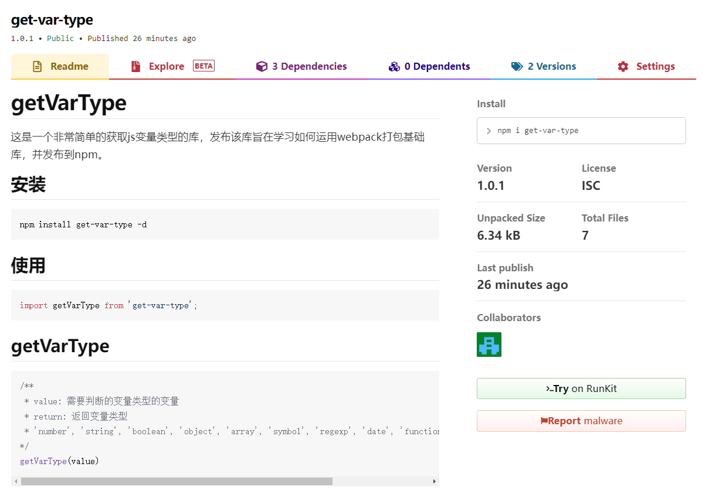

# 如何运用webpack打包基础库

以获取js变量类型的 `get-var-type`库为例，发布该库旨在学习如何运用webpack打包基础库，并发布到npm。

## get-var-type的实现

- 初始化项目：`npm init -y`
- 安装依赖：``npm install webpack webpack-cli terser-webpack-plugin -d``
- 新建 `src/index.js`和 `webpack.config.js`，前者为 `get-var-type`的源代码文件

```js
// src/index.js
export default function (value) {
    // 判断数据是 null 的情况 
    if (value === null) {
        return value + "";
    }
    // 判断数据是引用类型的情况 
    if (typeof value === "object") {
        return Object.prototype.toString.call(value).match(/^\[object ([a-zA-Z]*)\]$/)[1].toLowerCase();
    } else {
        // 判断数据是基本数据类型的情况、函数的情况和没有传入值的情况
        return typeof value;
    }
}
```

```js
// webpack.config.js
const TerserPlugin = require('terser-webpack-plugin');
const { resolve } = require('path')
module.exports = {
    mode: 'none', // mode设置为none，去掉压缩
    entry: {
        'get-var-type': resolve(__dirname, 'src/index.js'), // 未压缩的
        'get-var-type.min': resolve(__dirname, 'src/index.js') // 压缩的
    },
    output: {
        filename: '[name].js',  // [name]是一个占位符
        path: resolve(__dirname, 'dist'),
        library: 'getVarType', // 打包出来的库的名字
        libraryTarget: 'umd', // 可以通过amd、cjs、esm、umd（script标签） 全局变量引入
        libraryExport: 'default'  // 不设置defaut的话，引入的时候需要使用 getVarType.default的方式引入
    },
    optimization: {
        minimize: true,
        minimizer: [
            // 压缩插件，webpack4生产环境默认开启，对ES6的语法友好
            new TerserPlugin({
                // 针对.min.js 才做压缩
                include: /\.min\.js$/,
            })
        ]
    }
}
```

- 执行 `npm run build`打包，进行本地测试

## get-var-type发布到npm

- 在package.json中配置一些必要信息和命令，如main的入口index.js、npm script中的prepublish等

```json
{
  "name": "get-var-type",
  "version": "1.0.1",
  "description": "a get variable type lib",
  "main": "index.js",
  "module": "index.js",
  "scripts": {
    "test": "echo \"Error: no test specified\" && exit 1",
    "build": "webpack",
    "prepublish": "webpack"
  },
  "keywords": [
    "getType"
  ],
  "author": "",
  "license": "ISC",
  "dependencies": {
    "terser-webpack-plugin": "^5.3.1",
    "webpack": "^5.72.1",
    "webpack-cli": "^4.9.2"
  }
}
```

- 根目录的index.js中添加引入dist依赖模块

```js
if (process.env.NODE_ENV === 'production') {
    module.exports = require('./dist/get-var-type.min.js');
} else {
    // 非生产
    module.exports = require('./dist/get-var-type.js');
}
```

- 执行 `npm publish`发布到npm（提前是登录的npm账号，才能）

## 预览效果



## 项目源码

[get-var-type](https://github.com/izph/get-var-type)
