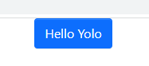

# 核心技术栈

React + TypeScript + Less + dumi

# 样式解决方案

## 1. Inline CSS：快速写一些简单的样式

性能较差，不如直接使用CSS类名，再定义样式的性能好

```jsx
const divStyle = {
  color: 'blue',
};

function Hello() {
  return <div style={divStyle}>Hello</div>;
}
```

## 2. CSS in JS（styled Component）

不在是把css样式独立的写在css文件中，而是将css抽象到了js代码中。
不太喜欢在js中书写css样式，增加了成本和复杂度，强行把两者混在一起比较奇怪。

```js
const Button = styled.button`
color: red;
font-size: 1em;
`
```

## 3. Less和Sass（预处理器）

提供了变量、函数、运算和继承等等，扩展性和复用性都有了很大的提升。

# Yolo组件库的色彩体系
## 组件库样式变量分类

- 基础色彩样式，primary（#0d6efd）、default（#ffffff）、success（#15bd02）、warning（#ffd300）、danger（#eb1e3d）、info(#009bb0)
- 字体样式，默认font-family、默认font-size(1rem)、默认font-weight(400)、字体颜色、h1-h6(h6 默认是 1rem)
- 超链接样式(默认primary，无下划线)
- line-height(行高默认是字体的1.5倍大小)
- body(字体大小是1rem、背景白色、字体淡黑色)
- border边框(宽度1px、颜色@gray-300、radius是0.25rem)
- 盒子阴影(@box-shadow: 0 0.5rem 1rem rgba(@black, 0.15))
- 基础表单控件样式（input、auto-input、select等）
## 其他配置
- normalize.less初始化默认样式
- classnames、@types/classnames处理类名的一个工具
# 组件实现步骤

组件正确的开发流程：组件属性的分析 -> 组件开发 -> (上生产需组件测试) -> 组件的使用说明文档

大致的思路：
- 通过组件的分析去定义一些接口或者类型别名，接口是用来描述props，声明组件的时候通过泛型传入
- 组件开发：不同的组件有不同的实现方式，相似的组件可以复用，编写组件基础样式
- 组件的使用说明：描述一些需要通过props传入组件的属性，方便定制不同场景
- ......

# Button组件实现

需要考虑padding的大小、lineHeight高度、颜色、文字居中、box-shadow，disabled时的特殊样式，鼠标的cursor的变化。

- 使用button标签和a标签实现
- Button Size的大小其实就是`padding`控制，`font-size`不同、`border`的不同。
- Button Type是变化`background-color`，`border-color`、`字体颜色color`。
- 添加不同的状态：hover之后要颜色发生一定的变化，focus颜色变化，disabled颜色也发生变化(cursor: not-allowed和opacity: .65)。

## 不同的Button Type（颜色）


## 不同的Button Size（padding的大小、lineHeight高度）

利用less的混合方法，传入不同的参数，实现样式的复用和切换。


## Button的禁用状态


## Button大致的使用方法

```js
<Button
  size={"lg"}
  type={"primary"}
  disabled
  href="" // 与type="link"连用
  className=""
  onClick={}
  ...{restProps}
>
  Primary Button
</Button>
```

# Menu组件实现
## Menu最基本样式分为横向(horizontal)和纵向(vertical)
- 导航在各个页面中进行跳转。一般分为顶部导航和侧边导航。
- 横向(horizontal)：一种是没有下拉菜单的类型，一种是有下拉菜单的类型，menu上有两个重要的属性，一个是active（菜单项高亮），菜单项是可以被disabled的，disabled后有特殊样式，并且点击没有响应。
- 纵向(vertical)：和横向差不多，只是左右展示。

## Menu需要的基本属性值

- defaultIndex表示默认选中的key
- onSelect选中后执行的回调
- mode分为横向(horizontal)和纵向(vertical)
- className自定义类名

- Menu.Item提取出来做单独的组件，任何属性都可以加到Item上，并且Menu.Item的children可以是任何元素，如string，jsx。
- Menu.Item上可以有index属性（item 的唯一标志）、disabled禁用。

- Menu.SubMenu放置子菜单项，有唯一标识index，它本身title标题。

## Menu的具体实现思路

采用flex布局，ul和li这两个标签，并使用useState和useContext这两个hooks实现，useState记录当前active的元素，classes是根据传入的属性值，来判断是否需要加类名来使用某种样式，通过Context传递数据（当前活跃的菜单项index值，用index做一些判断；onSelect点击菜单项的回调；mode传给SubMenu，垂直才有下拉菜单；defaultOpenKeys，初始需要展开的菜单项，对应index，最外面是1、2、3、4，接下来是1-1, 1-2...）

使用React.Children处理props.children传入的内容，React.Children.map函数第一个参数指向children，第二个参数是一个类似数组变量的函数，主要是用来为每个元素生成默认的index

MenuItem主要接收Context中的index和onSelect，点击时执行回调修改父级Menu的currentSelectedKey

SubMenu从Context获取mode来判断当前的模式，vertical垂直才有下拉菜单；有自己的title，点击切换菜单项的折叠与展开。也使用了React.Children.map，生成index

# 图标Icon的实现

图标的历史演化，上古时期的雪碧图（不能缩放），Font Icon（用字体文件的字符编码，代表图标，然后通过特定的class加伪类，加入到浏览器中），SVG（可以用任何的css控制）

# Icon的具体实现

Icon基于Font Awesome封装，传入theme主题色可以改变图标的颜色

# Transition

封装一个Transition过渡动画，以便其他组件的引用。基于`react-transition-group`的CSSTransition
[CSSTransition笔记](05-css-transition-note.md)

[CSSTransition](https://reactcommunity.org/react-transition-group/css-transition)

# input输入框

- 基本的样式、支持不同的大小、disabled状态、是否带图标、前缀、后缀
- 支持原生input的type属性，value属性

```js
<Input 
    disabled
    size="lg|md|sm"
    icon="图标"
    prefix="input的前缀，string或者ReactElement类型"
    suffix="input的后缀，string或者ReactElement类型"
    value={value}
    type={"text"}
    {...restProps} // 支持其他所有的HTMLInput属性、用户自定义的属性
/>

```
## input输入框的实现
一个div包含input子元素，通过一些属性来判断是否要添加前缀、后缀和图标等。input的size属性大小由padding、fontSize、borderRadius控制，其他input原生属性放在了restProps里，onChange是输入框内容变化时执行的回调

# auto-complete
auto输入框元素相对定位，选项的展示是绝对定位

auto-complete是基于input的基础上进行扩展，使用了useState分别记录当前的输入值(inputValue)，是否聚焦(focused)，是否显示下拉选项(showDropdown)，数据加载状态(isLoading)，数据(options)，当前高亮的index下标(highlightIndex)等，使用useRef这个hook记录了triggerSearch和DOM元素的引用，triggerSearch记录的是input输入框发生变化还是点击item项目。

使用自定义的useDebounce和useClickOutside这两个hook，useDebounce对用户输入的内容，利用防抖降低频率，useClickOutside作用是当点击到AutoComplete组件外的区域，会自动关闭下拉框选项部分

useEffect的第二个参数监听了debouncedValue, onSearch, focused，当这些值发生变化时，执行副作用。在副作用函数中，要考虑传入的onSearch执行结果是同步的、还是异步的关键词匹配，异步加载数据会有loading效果，点击一个选项时触发回调。次外，还设置了esc(Escape)、enter(Enter)、上移(ArrowUp)和下移(ArrowDown)选项等基本功能。

# Select
## Select的分析
SelectProps接口的描述信息：defaultValue默认选中的选项，它可以是字符串或者字符串数组，placeholder是提示文字，disabled是否禁用，multiple是否支持多个选项，onChange值发生改变时回调，onVisibleChange是下拉框出现或者隐藏时触发，

SelectOptionProps接口：选项的下标index，vaule选项的值，label选项显示的文本，disabled是否禁止选择该项。
## Select的实现


# Alert
## Alert的分析
message可以说是alert警告提示内容或者标题，description可以说是副标题或者描述信息，type是颜色分类，默认的type是info蓝色的，closable是否可关闭，showIcon是否显示图标，onClose关闭时执行的回调等等。

[yolo-alert](images/yolo-alert-001.png)
## Alert的实现
一个外层的div包含3个子元素，分别是放message的span标签，p标签动态显示description，最后一个是span标签，根据是否传入closable，来显示关闭按钮。

# Progress

## Progress的分析
percent代表当前进度条的百分比，strokeHeight设置高度，showText是否显示百分比数字，另外还提供了几种进度条的主题色theme。


## Progress的实现

根据传入的数字，来控制一个进度条长度。最外面有一个灰色progress-outer，它的高度可以配置。progress-outer内存会有一个子元素progress-inner，通过该元素的width来显示当前进度颜色，这个宽度是继承父元素progress-outer的，并悬浮到progress-outer上。通过在progress-inner设置flex布局，flex-end表示子项目从后往前排列，设置百分比数字显示在进度条右边，百分比数字也是支持显示和隐藏。

# Upload上传

点击上传按钮，选择想要上传的文件，然后开始自动上传，之后会显示上传进度（progress），当进度满了就会显示上传成功，反之上传失败。鼠标悬浮到上传的文件，会显示叉号，可以取消上传的文件。
支持用户自定义请求头headers，文件名称，上传额外的 `data（{key：vale}）`，支持input本身file的属性，如multiple（多选）、accept（限制文件类型）、是否默认携带cookie。自定义触发的元素（在Upload设置按钮、文本。。。）、支持拖动上传文件、用户点击文件执行的自定义的回调等等。


## 组件测试用例分析和编码
刚开始有写一些简单的测试，后续由于时间的关系，没有增加新的测试代码

[组件测试](02-yolo-test-notes.md)

## 代码打包输出和发布

### 1. 组件库的入口文件

- 组件库的入口文件为 ``src/index.ts``
- 组件库的全局样式文件为 ``src/style/index.less``或者 ``src/global.less``，两者都可以用来全局样式的提取。

### 2. 组件的打包

#### 在根目录新建tsconfig.build.json文件

```json
{
  "compilerOptions": {
    "outDir": "dist", // 编译之后的存放路径
    "module": "ESNext",
    "target": "ES5", // 指定编译之后的目标版本
    "declaration": true, // 为每一个js文件生成 .d.ts类型声明文件
    "jsx": "react",
    "moduleResolution": "node", // classic 和 Node
    "allowSyntheticDefaultImports": true //  true 支持 defalut 引入的方式
  },
  "include": ["src/"],
  "exclude": ["src/**/style", "src/**/*.md"]
}
```

#### 在package.json文件中添加命令

- 分别安装lessc和rimraf依赖，lessc将less转化为css，rimraf用来删除dist目录。

```json
{ 
  "scripts": {
    "clean": "rimraf ./dist",
    "build:lib": "npm run clean && npm run build-ts && npm run build-css",
    "build-ts": "tsc -p tsconfig.build.json",
    "build-css": "lessc ./src/style/index.less ./dist/index.css",
  }
}
```

- 在执行build-ts发生了很多个报错如下，经过在[stackoverflow](https://stackoverflow.com/)上查找相关资料得知，是 ``@types/react-router-dom``和 ``@types/react-router``的版本太低了导致了，把这两个依赖升级到最新版本后，就可以正常打包了。

```js
xxx/node_modules/@types/react-router-dom/index.d.ts(59,34): error TS2694: Namespace '"/node_modules/history/index"' has no exported member 'LocationState'.
```

### 本地测试(npm link)

- 在yolo-ui的根目录下执行npm link命令，npm link的作用是可以让未发布的npm包，做本地测试，映射脚本吧。
- 在yolo-ui-test（create-react-app生成的测试项目）工程下执行npm link yolo-ui。
- 在yolo-ui-test的package.json中加入yolo-ui依赖

```json
{ 
  "dependencies": {
    "yolo-ui": "^0.1.0"
  },
}
```

- 分别在 ``App.tsx``和 ``index.tsx``引入组件和组件的样式

```tsx
// App.tsx
import { Button } from 'yolo-ui';

function App() {
  return (
    <div className="App">
      <Button type="primary">Hello Yolo</Button>
    </div>
  );
}

export default App;
```

```tsx
// index.tsx
import "yolo-ui/dist/index.css";
```

- 测试结果如下，本地测试没问题。



### 将yolo-ui发布到npm

- 切换npm的源镜像为npm的原生源
- 在命令行工具执行npm adduser，填写username、password and email 登录(sign in)
- 在package.json添加一些必要信息

```json
{ 
  "files": [
    "dist"
  ], // 发布哪些文件到npm
  // 添加prepublish命令
  "scripts": {
    "clean": "rimraf ./dist",
    "build:lib": "npm run clean && npm run build-ts && npm run build-css",
    "build-ts": "tsc -p tsconfig.build.json",
    "build-css": "lessc ./src/style/index.less ./dist/index.css",
    "prepublish": "npm run build:lib"
  },
}
```

- 执行npm publish即可发布到npm
  
- 此外，还可以在peerDependencies中告诉用户，要使用某某依赖需要安装什么依赖，如下：
  要使用yolo-ui库，需要安装react和react-dom的16.8.0版本以上。当npm i yolo-ui的，peerDependencies里面的依赖不会被安装，会有一个日志输出，npm warning会提示用户需要安装react和react-dom的依赖。

```json
// package.json
{ 
  "peerDependencies": {
    "react": "≥16.8.0",
    "react-dom": "≥16.8.0"
  },
}
```

## CI/CD，文档的生成

### CI-持续集成

- 频繁的奖代码集成到主干（master）
- 快速发现错误
- 防止分支大幅偏离主干
- 持续集成的目的，让产品快速迭代，同时保证比较高的质量
- 集成到主干master之前，必须通过自动化测试，只要有一个测试用例失败，就不能集成

### CD-持续交付和持续部署

- 持续交付：频繁的将软件的新版本，交付给质量团队或者用户，以供评审，然后由QA进行测试，通过之后，就进入生产阶段
- 持续部署：代码通过评审以后，自动部署到生产环境，持续部署的前提是能够自动化完成测试，构建部署等等步骤

## Travis CI（自动化平台）

## yolo-ui静态文档上传至阿里云服务器

[yolo-ui静态文档上传至阿里云服务器](03-yolo-upload-aliyun.md)
