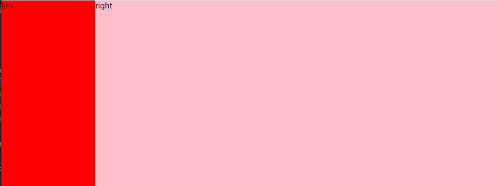

## 1. CSS单行超出省略

   ```css
   {
   	width: 100px;
   	overflow: hidden;/* 超出隐藏 */
   	text-overflow: ellipsis;/* 文本溢出时显示省略标记 */
   	white-space: no-wrap;/* 文本不换行 */
   }
   ```
## 2. 多行超出省略

   设置文本隐藏的元素不能设置高度，或者有上下padding，否则会导致超出部分不隐藏

   ```css
   {
       width：300px; /*可自定义，也可不设*/
       overflow: hidden; /*超出隐藏*/
       text-overflow: ellipsis; /*文本溢出时显示省略标记*/
       /* 以下三个属性是多行省略的关键，*/
       display: -webkit-box; /*设置弹性盒模型*/
       -webkit-line-clamp: 3; /*文本占的行数, 如果要设置3行加...则设置为3*/
       -webkit-box-orient: vertical; /*子代元素垂直显示*/
   }
   ```
## 3. 实现一个宽高自适应的正方形
- 第一种方式是利用vw、vh来实现
  ```css
  .box { 
    width: 20%; 
    height: 20vw;/* vw、vh */
    background: red; 
  }
  ```
- 第二种方式是利用元素的margin/padding百分比是相对父元素width的性质来实现
  ```css
  .box { 
    width: 20%; 
    height: 0;/* 高度为零 */  
    padding-bottom: 20%;
    background: red; 
  }
  ```
### 4. 实现一个三角形
实现原理是利用了元素边框连接处的等分原理
```css
  .box { 
    /* 宽高设置为0 */ 
    width: 0; 
    height: 0; 
    border-width: 100px; 
    border-style: solid; 
    border-color: red transparent transparent transparent; 
  }
```
## 5. 实现一个自适应矩形，水平垂直居中，且宽高比为 2:1
```css
.box { 
    /* 水平垂直居中 */
    position: absolute; 
    top: 0; 
    right: 0; 
    left: 0; 
    bottom: 0; 
    margin: auto;
    /* 自适应矩形, 且宽高比为2:1 */
    width: 10%; 
    height: 0; 
    /* 元素的margin、padding百分比是相对父元素width的性质来实现 */
    padding-top: 20%; /* vw、padding-bottom */
    background: red; 
  }
```
## 5. 实现一个两栏布局
左边固定，右边自适应
```html
<body>
  <div class="content">
    <div class="left">left</div>
    <div class="right">right</div>
  </div>
</body>
```
```css
/* 原来元素的高度如果设置为百分比的话，
    要么由内容撑开，要么由父元素得到，如果父元素没有高度，那么这个百分比是没有用的。 
    在html中，没有设置宽度的话默认100% ，没有设置高度的话，只能由内容撑开。
     */
html,
body {
  height: 100%;
}
.left {
  width: 200px;
  height: 100%;
  background-color: red;
  float: left;
}
.right {
  height: 100%;
  overflow: hidden;
  background-color: pink;
}
.content {
  height: 100%;
  position: relative;
}
```
