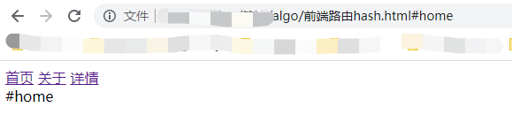
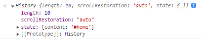

# 前端路由

简要分析路由的实现

详细原理可参考：[react-router路由原理](https://juejin.cn/post/6886290490640039943)

## hash路由



```html
<body>
  <div>
    <a href="#home">首页</a>
    <a href="#about">关于</a>
    <a href="#detail">详情</a>
  </div>
  <div id="container"></div>
  <script>
    // 监听url中hash值的变化更新内容
    window.addEventListener('hashchange', (e) => {
      let container = document.getElementById('container');
      container.innerText = location.hash;
    })
  </script>
</body>
```

## history路由

```html
<body>
  <div>
    <a onclick="changeRoute(this)" data-path="#home">首页</a>
    <a onclick="changeRoute(this)" data-path="#about">关于</a>
    <a onclick="changeRoute(this)" data-path="#detial">详情</a>
  </div>
  <div id="container"></div>
  <script>
    function changePage(pageContent) {
      let content = document.getElementById('container');
      content.innerText = pageContent;
    }

    function changeRoute(route) {
      // route即为当前dom
      let path = route.dataset.path;
      /**
       * window.history.pushState(state, title, url)
       * state：一个与添加的记录相关联的状态对象，主要用于popstate事件。该事件触发时，该对象会传入回调函数。
       * 也就是说，浏览器会将这个对象序列化以后保留在本地，重新载入这个页面的时候，可以拿到这个对象。
       * 如果不需要这个对象，此处可以填 null。
       * title：新页面的标题。但是，现在所有浏览器都忽视这个参数，所以这里可以填空字符串。
       * url：新的网址，必须与当前页面处在同一个域。浏览器的地址栏将显示这个网址。
       */
      changePage(path);
      history.pushState({ content: path }, null, path);
    }

    /**
     * 调用 history.pushState() 或者 history.replaceState() 不会触发 popstate 事件。
     * 点击后退、前进按钮、或者在 js 中调用 history.back()、history.forward()、history.go() 方法会触发
     */
    window.addEventListener('popstate', (e) => {
      let content = e.state && e.state.content;
      changePage(content);
    });
  </script>
</body>
```

length是记录了我们点击路由的总次数，state是当前的路由状态


