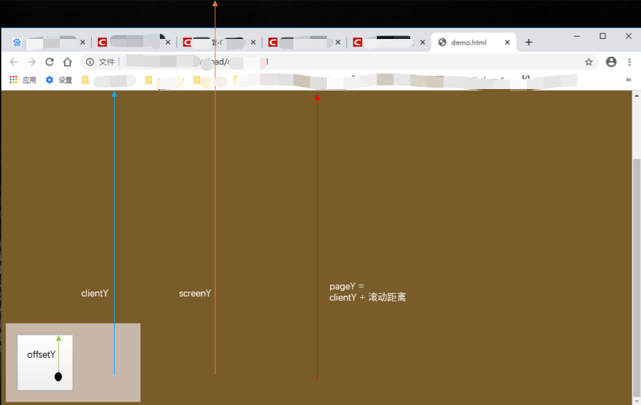

# JS坐标位置属性
## 元素视图属性
### offset相关
- offsetWidth: 元素外尺寸的宽度，水平方向 width + 左右padding + 左右border-width，不包括外边距与滚动条
- offsetHeight: 元素外尺寸的高度，垂直方向 height + 上下padding + 上下border-width，不包括外边距与滚动条
- offsetTop: 子元素距离已定位的父容器的上边(top)距离，不包括子元素与父元素的border
- offsetLeft: 子元素距离已定位的父容器的左边(left)距离，不包括子元素与父元素的border
### client相关
- clientWidth: 元素尺寸宽度，水平方向 width + 左右padding，不包括边框
- clientHeight: 元素尺寸高度，垂直方向 height + 上下padding，不包括边框
- clientTop: 元素的内边距外边缘和边框外边缘的距离，实际就是上边框的厚度
- clientLeft: 元素的内边距外边缘和边框外边缘的距离，实际上是左边框的厚度
### scroll相关
- scrollWidth: 内容区域，加内边距，加上溢出的尺寸。内容不超出盒子高度时为盒子的clientWidth
- scrollHeight: 内容区域，加内边距，加上溢出的尺寸。内容不超出盒子高度时为盒子的clientHeight
- scrollTop: 元素滚动条上边已经滚动的高度
- scrollLeft: 元素滚动条左边已经滚动的乱度

## window视图属性
- innerWidth 浏览器窗口可视区宽度（不包括浏览器控制台、菜单栏、工具栏） 
- innerHeight 浏览器窗口可视区高度（不包括浏览器控制台、菜单栏、工具栏）

## document文档视图
- document.documentElement.clientWidth 浏览器窗口可视区宽度（不包括浏览器控制台、菜单栏、工具栏、滚动条）
- document.documentElement.clientHeight 浏览器窗口可视区高度（不包括浏览器控制台、菜单栏、工具栏、滚动条）
- document.documentElement.offsetHeight 获取整个文档的高度（包含body的margin）
- document.body.offsetHeight 获取整个文档的高度（不包含body的margin）
- document.documentElement.scrollTop 返回文档的滚动top方向的距离（当窗口发生滚动时值改变）
- document.documentElement.scrollLeft 返回文档的滚动left方向的距离（当窗口发生滚动时值改变）

## 元素方法
1. getBoundingClientRect() 获取元素到body

-  bottom: 元素底边（包括border）到可视区最顶部的距离
-  left: 元素最左边（不包括border）到可视区最左边的距离
-  right: 元素最右边（包括border）到可视区最左边的距离
-  top: 元素顶边（不包括border）到可视区最顶部的距离
-  height: 元素的offsetHeight
-  width: 元素的offsetWidth
-  x: 元素左上角的x坐标 
-  y: 元素左上角的y坐标

## 事件对象(e)中鼠标的(x, y)位置
- 阻止默认行为（事件），让链接不跳转或者让表单提交按钮不提交
e.preventDefault() ；
- 阻止事件冒泡e.stopPropagation()；
- clientX 鼠标相对于浏览器左上角x轴的坐标； 不随滚动条滚动而改变；
- clientY 鼠标相对于浏览器左上角y轴的坐标； 不随滚动条滚动而改变；
- pageX 鼠标相对于浏览器左上角x轴的坐标； 随滚动条滚动而改变；
- pageY 鼠标相对于浏览器左上角y轴的坐标； 随滚动条滚动而改变；
- screenX 鼠标相对于显示器屏幕左上角x轴的坐标；
- screenY 鼠标相对于显示器屏幕左上角y轴的坐标；
- offsetX 鼠标相对于事件源左上角X轴的坐标；
- offsetY 鼠标相对于事件源左上角Y轴的坐标；
- 在双屏场景中，screenX 和 screenY 要考虑到屏幕顺序问题，如果主屏在右，副屏在左，那么副屏中的 screenX 为负值；

参考CSDN：
[HTML页面中的位置属性](https://blog.csdn.net/antony1776/article/details/104625623)