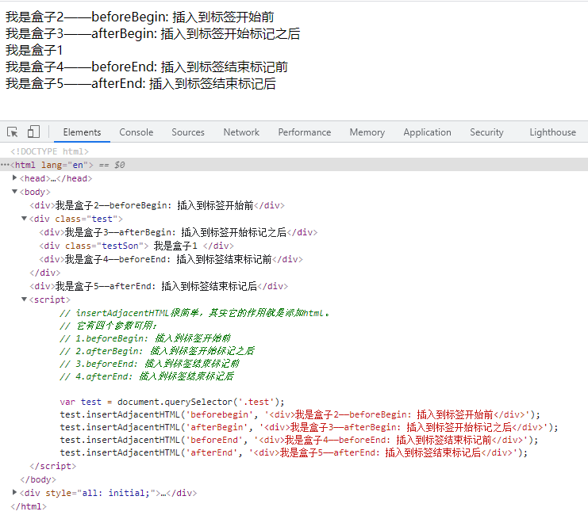

### 1、load 和 DOMContentLoaded

- load 等页面内容全部加载完毕，包含页面dom元素、图片、css等等
- DOMContentLoaded是DOM 加载完毕，不包含图片、 css等就可以执行，加载速度比load更快一些

```javascript
window.addEventListener('load', function() {
	alert('load');
})
document.addEventListener('DOMContentLoaded', function() {
    alert('DOMContentLoaded');
})
```

### 2、DOM操作

创建、添加、删除、移动、克隆、查找节点

#### (1) 创建新节点

- 文档碎片：createDocumentFragment(node);
- 元素节点：createElement(node);
- 文本节点：createTextNode(text);

#### (2) 添加、删除、替换、插入

- 添加：parentNode.appendchild(node)
- 删除：parentNode.removechild(node)
- 替换：parentNode.replacechild(newnode, oldnode)
- 插入：parentNode.insertBefore(child, 指定元素)
添加节点到父节点的第四个子元素之前，parentNode.insertBefore(child, parentNode.children[3])
children：子节点
childrenNodes（数组）: 所有的子节点，包含元素节点、文本节点等等
#### (3) 查找

getElementById();
getElementsByName();
getElementsByTagName();
getElementsByclassName();
querySelector();
querySelectorAll();

#### (4) 属性操作

getAttribute(key);
setAttribute(key，value);
hasAttribute(key);
removeAttribute(key);

### 3、DOM元素的classList

dom元素的class类名会以字符串的形式存储到classList(类数组，有length属性)

```javascript
let node = document.getElementById("app");
// 添加一个类名
node.classList.add("classname_1");
// 删除一个类名
node.classList.remove("classname_2") ; 去掉一个类名
// 切换，引号中的类名，有就删除，没有就添加
node.classLis.toggle("classname_3"); 
// 判断一个类名是否存在于dom元素中，返回true、false
node.contains("classname_4");
```

### 4、insertAdjacentHTML

insertAdjacentHTML的作用：添加html标签

1. 第一个参数可选值：

- beforeBegin: 插入到标签开始前
- afterBegin: 插入到标签开始标记之后
- beforeEnd: 插入到标签结束标记前
- afterEnd: 插入到标签结束标记后

2. 第二个参数是包含html标签的字符串
3. 具体例子如下：


### 5、动态添加样式规则
```javascript
// 创建 style 标签
var stylelabel = document.createElement('style');
// 样式内容
stylelabel.innerHTML = `
body {
  color:red
} 
#app:hover {
  background-color: red;
  color: white;
}`;
// 将style内容添加到head中
document.head.appendChild(stylelabel);
```
