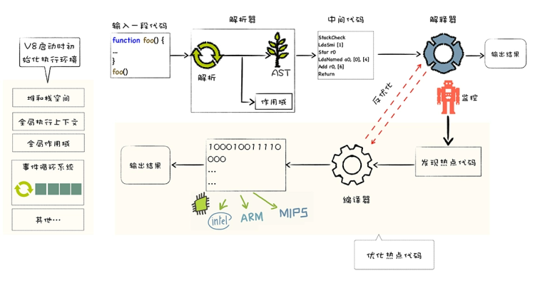
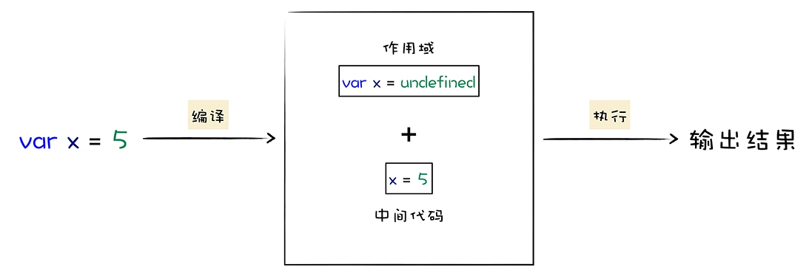
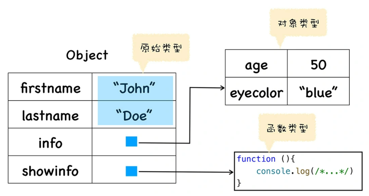
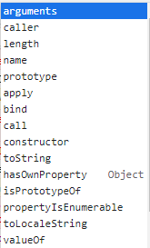
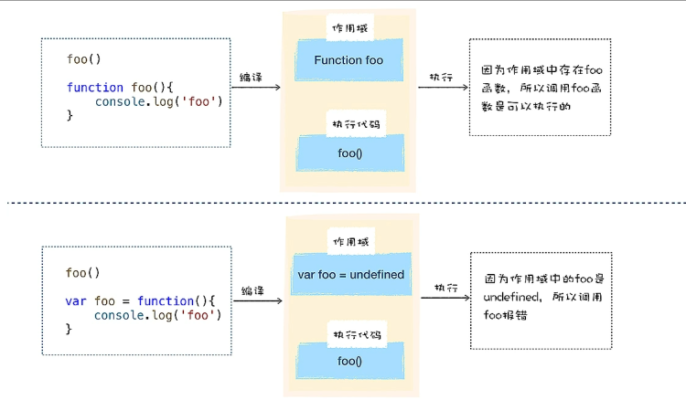
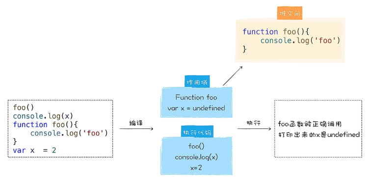

V8是V8 是一个由 Google 开发的开源 JavaScript引擎（虚拟机），目前用在 Chrome 浏览器和 Node.js ，作用是将JavaScript代码转化为机器所能识别的机器代码(二进制)。
JavaScript 借鉴了很多语言的特性，比如 C 语言的基本语法、Java 的类型系统和内存管理、Scheme 的函数作为一等公民，还有 Self 基于原型（prototype）的继承机制。（为了实现原型继承，V8 为每个对象引入了 __proto__ 属性）

V8 的编译流水线

V8 启动执行 JavaScript 之前，它还需要准备执行 JavaScript 时所需要的一些基础环境，这些基础环境包括了“堆空间”“栈空间”“全局执行上下文”“全局作用域”“事件循环系统”“内置函数”等，这些内容都是在执行 JavaScript 过程中需要使用到的

V8重要特性：事件循环系统和垃圾回收机制
JavaScript 是一种自动垃圾回收的语言，V8 在执行垃圾回收时，会占用主线程的资源，如果我们编写的程序频繁触发垃圾回收，那么无疑会阻塞主线程，这也是我们经常会遇到的一个问题。

V8 是怎么执行 JavaScript 代码：核心流程分为**编译**和**执行**两步

高级代码为什么需要先编译再执行？
计算机操作系统无法识别高级代码，只能识别机器代码，需要将代码编译成机器可以识别的二进制机器代码，机器才能识别，并执行。（1000100111011000  机器指令）

JavaScript 中的函数就是一种特殊的对象：可以将一个函数赋值给一个变量，还可以将函数作为一个参数传递给另外一个函数，甚至可以使得一个函数返回另外一个函数。
JavaScript不是一门面向对象的语言，因为面向对象语言天生支持封装、继承、多态，但是 JavaScript 并没有直接提供多态的支持。
JavaScript 中实现继承的方式却非常简单清爽，只是在对象中添加了一个称为原型的属性，把继承的对象通过原型链接起来，就实现了继承，我们把这种继承方式称为基于原型链继承。

```javascript
var person=new Object()
person.firstname="John"
person.lastname="Doe"
person.info = new Object()
person.info.age=50
person.info.eyecolor="blue"
person.showinfo = function (){
    console.log(/*...*/)
}

在 JavaScript 中，函数是一种特殊的对象，它和对象一样可以拥有属性和值，
但是函数和普通对象不同的是，函数可以被调用
function foo(){  
  var test = 1
}
// 给 foo 函数设置了 myName 和 uName 的属性
foo.myName = 1
foo.uName = 2
console.log(foo.myName)
foo()
```



js函数内置了一部分的属性，如name为函数名，length为函数参数长度，caller表示：函数A的caller返回调用A的函数对象，即A的执行环境，如果A的执行环境为window则返回null。


```javascript
function foo(){
    var number = 1
    function bar(){
        number++
        console.log(number)
    }
    return bar
}
var mybar = foo()
mybar()
```

观察上段代码可以看到，我们在 foo 函数中定义了一个新的 bar 函数，并且 bar 函数引用了 foo 函数中的变量 number，当调用 foo 函数的时候，它会返回 bar 函数(闭包)

```javascript
function Foo() {
    this[100] = 'test-100'
    this[1] = 'test-1'
    this["B"] = 'bar-B'
    this[50] = 'test-50'
    this[9] =  'test-9'
    this[8] = 'test-8'
    this[3] = 'test-3'
    this[5] = 'test-5'
    this["A"] = 'bar-A'
    this["C"] = 'bar-C'
}
var bar = new Foo()
for(key in bar){
    console.log(`index:${key}  value:${bar[key]}`)
}

打印出来的结果：
index:1 value:test-1
index:3 value:test-3
index:5 value:test-5
index:8 value:test-8
index:9 value:test-9
index:50 value:test-50
index:100 value:test-100
index:B value:bar-B
index:A value:bar-A
index:C value:bar-C
```

观察这段打印出来的数据，我们发现打印出来的属性顺序并不是我们设置的顺序，我们设置属性的时候是乱序设置的，比如开始先设置 100，然后又设置了 1，但是输出的内容却非常规律，总的来说体现在以下两点：

- 设置的数字属性被最先打印出来了，并且是按照数字大小的顺序打印的；
- 设置的字符串属性依然是按照之前的设置顺序打印的，比如我们是按照 B、A、C 的顺序设置的，打印出来依然是这个顺序。

之所以出现这样的结果，是因为在 ECMAScript 规范中定义了数字属性应该按照索引值大小升序排列，字符串属性根据创建时的顺序升序排列。
在这里我们把对象中的数字属性称为排序属性，在 V8 中被称为 elements，字符串属性就被称为常规属性，在 V8 中被称为 properties。
V8 会先从 elements 属性中按照顺序读取所有的元素，然后再在 properties 属性中读取所有的元素，这样就完成一次索引操作。

**声明式与函数表达式**

var foo 是在编译阶段完成的，也可以说是在变量提升阶段完成的，而foo = function(){ console.log('foo') }是表达式，所有的表达式都是在执行阶段完成的。

在变量提升阶段，V8 将这些变量存放在作用域时，还会给它们赋一个默认的 undefined 值，所以在定义一个普通的变量之前，使用该变量，那么该变量的值就是 undefined。现在我们知道，表达式是不会在编译阶段执行的。

```javascript
function foo(){
    console.log('Foo')
}
```

执行上面这段代码，它并没有输出任何内容，所以可以肯定，函数声明并不是一个表达式，而是一个语句。V8 在变量提升阶段，如果遇到函数声明，那么 V8 同样会对该函数声明执行变量提升操作。
函数也是一个对象，所以在编译阶段，V8 就会将整个函数对象提升到作用域中，并不是给该函数名称赋一个 undefined，理解这一点尤为重要。

总的来说，在 V8 解析 JavaScript 源码的过程中，如果遇到普通的变量声明，那么便会将其提升到作用域中，并给该变量赋值为 undefined，如果遇到的是函数声明，那么 V8 会在内存中为声明生成函数对象，并将该对象提升到作用域中。


立即调用的函数表达式（IIFE）
现在我们知道了，在编译阶段，V8 并不会处理函数表达式，而 JavaScript 中的立即函数调用表达式正是使用了这个特性来实现了非常广泛的应用
JavaScript 中有一个圆括号运算符，圆括号里面可以放一个表达式，比如下面的代码 (a=3)，括号里面是一个表达式，整个语句也是一个表达式，最终输出 3

```javascript
(function () {
    //statements
})

因为小括号之间存放的必须是表达式，所以如果在小阔号里面定义一个函数，
那么 V8 就会把这个函数看成是函数表达式，执行时它会返回一个函数对象。

存放在括号里面的函数便是一个函数表达式，它会返回一个函数对象，
如果我直接在表达式后面加上调用的括号，这就称为立即调用函数表达式
(function () {
    //statements
})()
```

因为函数立即表达式也是一个表达式，所以 V8 在编译阶段，并不会为该表达式创建函数对象。这样的一个好处就是**不会污染环境，函数和函数内部的变量都不会被其他部分的代码访问到。**

```javascript
var a = (function () {
    return 1
})()
// 1
```

继承就是一个对象可以访问另外一个对象中的属性和方法，在JavaScript 中，我们通过原型和原型链的方式来实现了继承特性。
class 关键字，只是语法糖，不要以为 JavaScript 也是面向对象语言了。

实践：利用 __proto__ 实现继承

```javascript

var animal = {
    type: "Default",
    color: "Default",
    getInfo: function () {
        return `Type is: ${this.type}，color is ${this.color}.`
    }
}
var dog = {
    type: "Dog",
    color: "Black",
}

//可以通过设置 dog 对象中的 __proto__ 属性，将其指向 animal
dog.__proto__ = animal
```

构造函数是怎么创建对象的？

```javascript
function DogFactory(type,color){
    this.type = type
    this.color = color
}
var dog = new DogFactory('Dog','Black')
```

当 V8 执行上面这段代码时，V8 会在背后悄悄地做了以下几件事情，模拟代码如下所示：

```javascript
var dog = {}  
dog.__proto__ = DogFactory.prototype
DogFactory.call(dog,'Dog','Black')
```


函数的作用域在函数创建(声明)的时候就有了，
