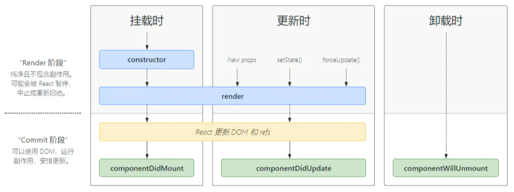
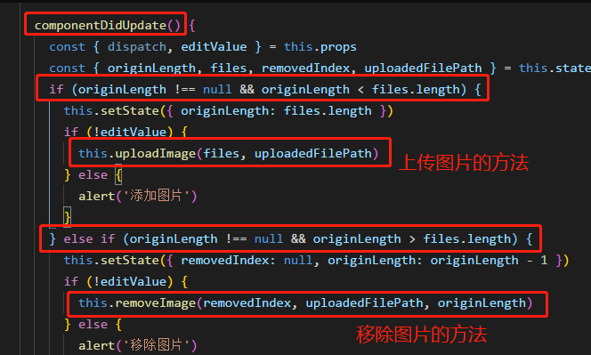
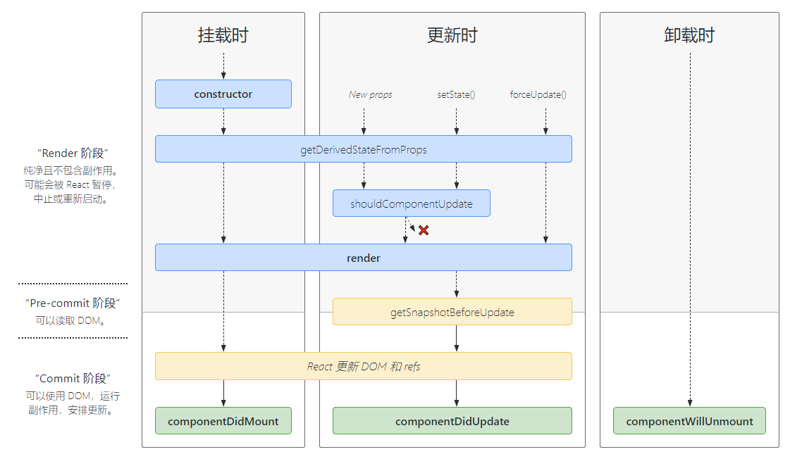

## 一、生命周期调用顺序

1. **挂载**
   constructor()
   render()
   componentDidMount()
2. **更新**

shouldComponentUpdate()
render()
componentDidUpdate()

3. **卸载**
   componentWillUnmount()



## 二、详解生命周期函数

### 1.construcor()

**如果不初始化 state 或不进行方法绑定，则不需要为 React 组件实现构造函数。**

- 在 React 组件挂载之前，会调用它的构造函数。在为 React.Component 子类实现构造函数时，应在其他语句之前前调用 super(props)。
- 构造函数的调用情况：
- 需要通过this.state复制对象来初始化内部state
- 为事件函数绑定实例，this.handleClick = this.handleClick.bind(this)。

注意：

- 在 constructor() 函数中**不要调用 setState() 方法**。如果你的组件需要使用内部 state，请直接在构造函数中为 **this.state 赋值初始state**：

```javascript
constructor(props){
    super(props)
    // 不要在这里调用 this.setState()
    this.state = { counter: 0 };
    this.handleClick = this.handleClick.bind(this);
}
```

- 避免将 props 的值复制给 state。直接使用this.props.xxx就可以了。

### 2.componentDidMount()

1、UI渲染完成后调用。

2、只执行一次

3、典型场景：获取外部资源

- 组件挂载后调用，依赖DOM节点的初始化应该在此函数中执行，网络请求大多也在次函数中，进行数据初始化
- componentDidMount() 里**可以直接调用 setState()**
- 只要进入页面就会调用该函数
- 适合添加订阅，但不要忘记在componentWillUnmount取消

### 3.render()

- render()方法是class组件唯一必须实现的方法
- 调用render时，检测this.props和this.state的变化并返回：
- React元素:

通常通过 JSX 创建。例如，`<div />` 会被 React 渲染为 DOM 节点，`<MyComponent />` 会被 React 渲染为自定义组件，无论是 `<div />` 还是 `<MyComponent />` 均为 React 元素。

- 数组或fragment
- protals
- 字符转或数值类型: 它们在 DOM 中会被渲染为文本节点
- 布尔类型或null:  什么都不渲染。（主要用于支持返回 test && `<Child />` 的模式，其中 test 为布尔类型。)
- render()不与浏览器直接交互:

  render() 函数应该为纯函数，这意味着在不修改组件 state 的情况下，每次调用时都返回相同的结果，并且它不会直接与浏览器交互。如需与浏览器进行交互，请在 componentDidMount() 或其他生命周期方法中执行你的操作。

### 4.componentDidUpdate(prevProps, prevState, snapshot)

1、每次UI更新时被调用

2、典型场景：页面需要根据props变化重新获取数据

- 只要页面的state或者model中的state中定义的变量值发生改变，这个方法就会执行，首次渲染不执行
- 例如：在componentDidUpdata()中对originLength的监听从而达到上传或删除的操作

该方法有三个参数：

- prevProps: 更新前的props
- prevState: 更新前的state
- snapshot: getSnapshotBeforeUpdate()生命周期的返回值



- 当组件更新后可在此函数中进行DOM操作或网络请求

```javascript
componentDidUpdate(prevProps){
    //典型用法，判断props
    if(this.props.userId !== prevProps.userId){
        this.fetchData(this.props.userId)
    }
}
```

- componentDidUpdate() 中**直接调用 setState()**，但请注意**它必须被包裹在一个条件语件里**，否则会造成死循环。（每一次setState都会触发componentDidUpdate）

### 5.componentWillUnmount()

1、组件移除时调用

2、典型场景：资源释放

- componentWillUnmount() 会在组件卸载及销毁之前直接调用。在此方法中执行必要的清理操作，例如，清除 timer，取消网络请求或清除在 componentDidMount() 中创建的订阅等。
- componentWillUnmount() 中**不应调用 setState()**，因为该组件将永远不会重新渲染。组件实例卸载后，将永远不会再挂载它。

### 6.错误处理阶段

componentDidCatch(error, info)，此生命周期在后代组件抛出错误后被调用。 它接收两个参数∶

- error：抛出的错误。
- info：带有 componentStack key 的对象，其中包含有关组件引发错误的栈信息

## 三、不常用的生命周期函数

**react16.4**后使用了新的生命周期，使用getDerivedStateFromProps代替了旧的componentWillReceiveProps及componentWillMount。使用getSnapshotBeforeUpdate代替了旧的componentWillUpdate。
在 Fiber 机制下，render 阶段是允许暂停、终止和重启的。
废弃的生命周期钩子函数，它们都处于render阶段，都可能被重复执行。


### 1.getDerivedStateFromProps  不常用

1.当state需要从pros初始化时使用

2.尽量不要使用：维护两者状态一致性会增加复杂度

3.每次render都会调用

4.典型场景：表单控件获取默认值

```javascript
static getDerivedStateFromProps(props, state)
```

(1) getDerivedStateFromProps 会在调用 render 方法之前调用，并且在初始挂载及后续更新时都会被调用。它应返回一个对象来更新 state，如果返回 null 则不更新任何内容。
我们知道getDerivedStateFromProps是一个静态函数，在其中是无法访问到组件实例的，也就是强制开发者在render之前只做无副作用的操作，而是根据props和state决定新的state，仅此而已。

(2) 此方法适用于[罕见的用例](https://links.jianshu.com/go?to=https%3A%2F%2Fzh-hans.reactjs.org%2Fblog%2F2018%2F06%2F07%2Fyou-probably-dont-need-derived-state.html%23when-to-use-derived-state)，即 state 的值在任何时候都取决于 props。例如，实现 `<Transition>` 组件可能很方便，该组件会比较当前组件与下一组件，以决定针对哪些组件进行转场动画。
派生状态会导致代码冗余，并使组件难以维护。 [确保你已熟悉这些简单的替代方案：](https://links.jianshu.com/go?to=https%3A%2F%2Fzh-hans.reactjs.org%2Fblog%2F2018%2F06%2F07%2Fyou-probably-dont-need-derived-state.html)

- 如果你需要**执行副作用**（例如，数据提取或动画）以响应 props 中的更改，请改用 [componentDidUpdate](https://links.jianshu.com/go?to=https%3A%2F%2Fzh-hans.reactjs.org%2Fdocs%2Freact-component.html%23componentdidupdate)。
- 如果只想在 **prop 更改时重新计算某些数据**，[请使用 memoization helper 代替](https://links.jianshu.com/go?to=https%3A%2F%2Fzh-hans.reactjs.org%2Fblog%2F2018%2F06%2F07%2Fyou-probably-dont-need-derived-state.html%23what-about-memoization)。
- 如果你想**在 prop 更改时“重置”某些 state**，请考虑使组件[完全受控](https://links.jianshu.com/go?to=https%3A%2F%2Fzh-hans.reactjs.org%2Fblog%2F2018%2F06%2F07%2Fyou-probably-dont-need-derived-state.html%23recommendation-fully-controlled-component)或[使用 key 使组件完全不受控](https://links.jianshu.com/go?to=https%3A%2F%2Fzh-hans.reactjs.org%2Fblog%2F2018%2F06%2F07%2Fyou-probably-dont-need-derived-state.html%23recommendation-fully-uncontrolled-component-with-a-key) 代替。

### 2.shouldComponentUpdate() 不常用

1.决定虚拟DOM是否要重绘

2.一般可以由PureComponent自动实现

3.典型场景：性能优化

```javascript
shouldComponentUpdate(nextProps, nextState)
```

根据 shouldComponentUpdate() 的返回值，判断 React 组件的输出是否受当前 state 或 props 更改的影响。默认行为是 state 每次发生变化组件都会重新渲染。大部分情况下，你应该遵循默认行为。
当 props 或 state 发生变化时，shouldComponentUpdate() 会在渲染执行之前被调用。返回值默认为 true。首次渲染或使用 forceUpdate() 时不会调用该方法。

此方法仅作为**性能优化的方式**而存在。不要企图依靠此方法来“阻止”渲染，因为这可能会产生 bug。你应该**考虑使用内置的 PureComponent 组件**，而不是手动编写 shouldComponentUpdate()。PureComponent 会对 props 和 state 进行浅层比较，并减少了跳过必要更新的可能性。
如果你一定要手动编写此函数，可以将 this.props 与 nextProps 以及 this.state 与nextState 进行比较，并返回 false 以告知 React 可以跳过更新。请注意，返回 false 并不会阻止子组件在 state 更改时重新渲染。
我们不建议在 shouldComponentUpdate() 中进行深层比较或使用 JSON.stringify()。这样非常影响效率，且会损害性能。
目前，如果 shouldComponentUpdate() 返回 false，则不会调用 [UNSAFE_componentWillUpdate()](https://links.jianshu.com/go?to=https%3A%2F%2Fzh-hans.reactjs.org%2Fdocs%2Freact-component.html%23unsafe_componentwillupdate)，[render()](https://links.jianshu.com/go?to=https%3A%2F%2Fzh-hans.reactjs.org%2Fdocs%2Freact-component.html%23render) 和 [componentDidUpdate()](https://links.jianshu.com/go?to=https%3A%2F%2Fzh-hans.reactjs.org%2Fdocs%2Freact-component.html%23componentdidupdate)。后续版本，React 可能会将 shouldComponentUpdate 视为提示而不是严格的指令，并且，当返回 false 时，仍可能导致组件重新渲染。

### 3.getSnapshotBeforeUpdate  不常用

1.在页面render之前调用，state已更新

2.典型场景：获取render之前的DOM状态

```javascript
getSnapshotBeforeUpdate(prevProps, prevState)
```

getSnapshotBeforeUpdate() 在最近一次渲染输出（提交到 DOM 节点）之前调用。它使得组件能在发生更改之前从 DOM 中捕获一些信息（例如，滚动位置）。此生命周期的任何返回值将作为参数传递给 componentDidUpdate(prevProps, prevState, snapshot)。

getSnapshotBeforeUpdate() 在最近一次渲染输出（提交到 DOM 节点）之前调用。它使得组件能在发生更改之前从 DOM 中捕获一些信息（例如，滚动位置）。此生命周期的任何返回值将作为参数传递给 componentDidUpdate()。
此用法并不常见，但它可能出现在 UI 处理中，如需要以特殊方式处理滚动位置的聊天线程等。
应返回 snapshot 的值（或 null）。
