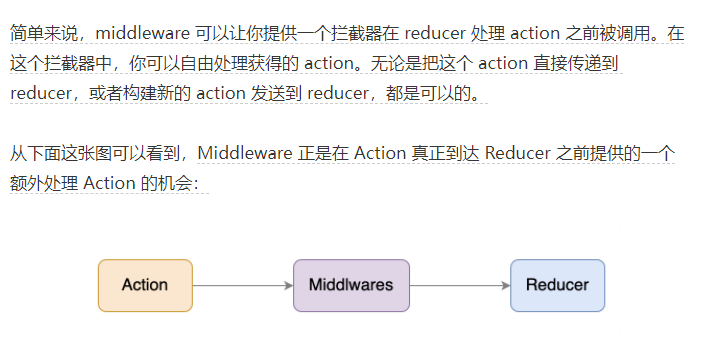

# Redux笔记

## Redux例子（一）
```javascript
// 目录结构，src下建立
	-redux
		-store.js
		-reducer.js

// store.js
// 1) 引入redux中的createStore函数，创建一个store
// 2) createStore调用时要传入一个为其服务的reducer
// 3) 最后暴露store对象
 
 //引入createStore，专门用于创建redux中最为核心的store对象
 import { createStore } from 'redux';

 //引入为Count组件服务的reducer
 import countReducer from './reducer'
 //暴露store
 export default createStore(countReducer)

// 异步action
// import { createStore, applyMiddleware } from 'redux'
// import thunk from 'redux-thunk'
// export default createStore(countReducer, applyMiddleware(thunk))

// reducer.js： reducer和type可以分开文件来写
// 1) reducer的本质是一个函数，接收：preState,action，返回加工后的状态
// 2) reducer有两个作用：初始化状态，加工状态
// 3) reducer被第一次调用时，是store自动触发的，
const initState = 0 //初始化状态
export default function countReducer(preState = initState, action){
  // console.log(preState);
  // 从action对象中获取：type, data
  const {type,data} = action
  // 根据type决定如何加工数据
  switch (type) {
    case 'increment': //如果是加
      return preState + data;
    case 'decrement': //若果是减
      return preState - data;
    default:
      return preState;
  }
}

// 在index.js入口中监测store中状态的改变，一旦发生改变重新渲染<App/>
// 备注：redux只负责管理状态，至于状态的改变驱动着页面的展示，要靠我们自己写。
import store from './redux/store';
store.subscribe(() => {
ReactDOM.render(<App/>, document.getElementById('root'))

// 最后在UI组件Count中派发reducer
store.dispatch({ type: 'increment', data: value * 1 })
store.dispatch({ type: 'decrement', data: value * 1 })
```
## 异步actions例子
```javascript
// store.js
//引入为Count组件服务的reducer
import countReducer from './reducer';
// 异步action
import { createStore, applyMiddleware } from 'redux';
import thunk from 'redux-thunk';
export default createStore(countReducer, applyMiddleware(thunk))

// reducer.js不变

// action.js: 专门为Count组件生成action对象
//同步action，就是指action的值为Object类型的一般对象
export const createIncrementAction = data => ({ type: increment, data })

//异步action，就是指action的值为函数,异步action中一般都会调用同步action，异步action不是必须要用的。
export const createIncrementAsyncAction = (data, time) => {
  // 返回一个函数，异步action  因为函数里面可以开启异步任务setTimeout
  return (dispatch) => {
    setTimeout(() => {
      dispatch(createIncrementAction(data))
    }, time)
  }
}

// 在Count中使用
store.dispatch(createIncrementAsyncAction(value * 1, 500));

// (1). 明确：延迟的动作不想交给组件自身，想交给 action
// (2). 何时需要异步action：想要对状态进行操作，但是具体的数据靠异步任务返回。
// (3). 具体编码：
			// 1).npm i redux-thunk，并配置在store中
			// 2).创建action的函数不再返回一般对象，而是一个函数，该函数中写异步任务。
			// 3).异步任务有结果后，分发一个同步的action去真正操作数据。
// (4).备注：异步action不是必须要写的，完全可以自己等待异步任务的结果了再去分发同步action。
```
## react-redux基本使用
```javascript
// (1).明确两个概念：
// 		1).UI组件: 不使用任何redux的api，只负责页面的呈现、交互等。
// 		2).容器组件：负责和redux通信，将结果交给UI组件。
// (2).如何创建一个容器组件————靠react-redux 的 connect函数
// 		connect(mapStateToProps, mapDispatchToProps)(UI组件)
// 		    -mapStateToProps: 映射状态，返回值是一个对象
// 				-mapDispatchToProps: 映射操作状态的方法，返回值是一个对象
// (3).备注1：容器组件中的store是靠props传进去的，而不是在容器组件中直接引入
// (4).备注2：mapDispatchToProps，也可以是一个对象

// ./containers/Count.js:

//引入Count的UI组件
import CountUI from '../../components/Count'
// 引入action，和 异步actions例子一样
import {
	createIncrementAction,
	createIncrementAsyncAction
} from '../../redux/action'

//引入connect用于连接UI组件与redux
import { connect } from 'react-redux';

/* 
	1.mapStateToProps函数返回的是一个对象；
	2.返回的对象中的key就作为传递给UI组件props的key,value就作为传递给UI组件props的value
	3.mapStateToProps用于传递状态
*/
function mapStateToProps(state) {
	return { count: state }
}

/* 
	1.mapDispatchToProps函数返回的是一个对象；
	2.返回的对象中的key就作为传递给UI组件props的key,value就作为传递给UI组件props的value
	3.mapDispatchToProps用于传递操作状态的方法
*/
// function mapDispatchToProps(dispatch) {
// 	return {
// 		number => dispatch(createIncrementAction(number)),
// 		number => dispatch(createDecrementAction(number)),
// 		(number, time) => dispatch(createIncrementAsyncAction(number, time)),
// 	}
// }

function mapDispatchToProps(dispatch) {
	return {
		jia: number => dispatch(createIncrementAction(number)),
		jian: number => dispatch(createDecrementAction(number)),
		jiaAsync: (number, time) => dispatch(createIncrementAsyncAction(number, time)),
	}
}

//使用connect()()创建并暴露一个Count的容器组件
export default connect(mapStateToProps, mapDispatchToProps)(CountUI)


// app.js中，引入的Count是包装过的Count：路径是 './containers/Count'
import React, { Component } from 'react'
import Count from './containers/Count'
import store from './redux/store'

export default class App extends Component {
	render() {
		return (
			<div>
				{/* 给容器组件传递store */}
				<Count store={store} />
			</div>
		)
	}
}


// 在原来的组件中，通过this.props调用
components/Count.js
this.props.jia(value * 1)
this.props.jian(value * 1)
this.props.jiaAsync(value * 1, 500)
```
### react-redux数据共享版

```javascript
// (1).定义一个Pserson组件，和Count组件通过redux共享数据。
// (2).为Person组件编写：reducer、action，配置constant常量。
// (3).重点：Person的reducer和Count的Reducer要使用combineReducers进行合并，
		// 合并后的总状态是一个对象！！！
// (4).交给store的是总reducer，最后注意在组件中取出状态的时候，记得“取到位”。

// store.js
/* 
  该文件专门用于暴露一个store对象，整个应用只有一个store对象
*/
//引入createStore，专门用于创建redux中最为核心的store对象
// 引入 combineReducers进行合并reducer
import {createStore, applyMiddleware, combineReducers} from 'redux'
//引入为Count组件服务的reducer
import countReducer from './reducers/count'
//引入为Count组件服务的reducer
import personReducer from './reducers/person'
//引入redux-thunk，用于支持异步action
import thunk from 'redux-thunk'
//汇总所有的reducer变为一个总的reducer
const allReducer = combineReducers({
  he: countReducer,
  rens: personReducer
})
//暴露store
export default createStore(allReducer, applyMiddleware(thunk))
// 为person创建reducer、action


// 在Person文件 引入
 //引入action
import {
  personAction,
} from '../../redux/person_action';
//引入connect用于连接UI组件与redux
import {connect} from 'react-redux';
(.......)

底部导出
export default connect(
	state => ({ yiduiren: state.rens, he:state.he}),  //映射状态
	{jiaYiRen: createAddPersonAction}  //映射操作状态的方法
)(Person)
```
