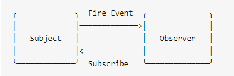
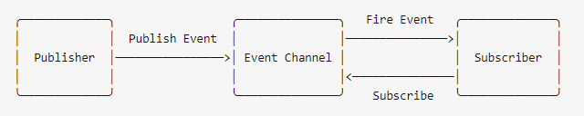

# 观察者模式

在观察者模式中，观察者需要直接订阅目标事件；在目标发出内容改变的事件后，直接接受事件并做出响应。



**JS的事件模型就是一种观察者模式的体现，当对应的事件被触发时，监听该事件的所有监听函数都会被调用。**

(**鼠标单击click，键盘事件keyDown......**)

### 观察者模式例子

定义了一种一对多的关系，让多个观察者对象同时监听某一个主题对象，这个主题对象的状态发生变化时就会通知所有的观察者对象，使它们能够自动更新自己。

```javascript
// 主题 保存状态，状态变化之后触发所有观察者对象
class Subject {  // 被观察的对象
  constructor() {
    this.state = 0;
    this.observers = [];
  }
  getState() {
    return this.state;
  }
  setState(state) {
    this.state = state;
    this.notifyAllObservers();
  }
  notifyAllObservers() {
    this.observers.forEach(observer => {
      observer.update();
    })
  }
  attach(observer) {
    this.observers.push(observer);
  }
}

// 观察者
class Observer {
  constructor(name, subject) {
    this.name = name;
    this.subject = subject;
    this.subject.attach(this);
  }
  update() {
    console.log(`${this.name} update, state: ${this.subject.getState()}`);
  }
}

// 测试
let s = new Subject();
let o1 = new Observer('o1', s);
let o2 = new Observer('02', s);

s.setState(12);
```

**当一个对象的改变需要同时改变其它对象，并且它不知道具体有多少对象需要改变的时候，就应该考虑使用观察者模式。**

# 发布订阅模式

在发布订阅模式中，发布者和订阅者之间多了一个事件通道；一方面从发布者接收事件，另一方面向订阅者发布事件；订阅者需要从事件通道订阅事件（**发布订阅模式比观察者模式多了一个事件通道**）



## 简易版发布订阅

```js
var PubSub = function(){
    this.events = {}; 
};
PubSub.prototype.subscribe = function(eventType, callback) {
    if (!this.events[eventType]) {
        this.events[eventType] = [];
    }
    //添加事件监听器
    this.events[eventType].push(callback); 
    // 返回上下文环境以实现链式调用
    return this;
};
PubSub.prototype.publish = function(eventType, ...args) {
    let _events = this.events[eventType];
    for (var i = 0; i < _events.length; i++) {
      //遍历事件监听器
      _events[i].apply(this, _args);
      // _events[i].call(this, ..._args);
    }
    return this;
};
// 构造PubSub实例
var ps = new PubSub();
ps.subscribe('list', function(msg) {
    console.log(msg);
});
ps.publish('list', {data: ['one,', 'two']});
// Object {data: Array[2]}
```

# Node.js中EventEmitter 的实现

```javascript
class EventEmitter { 
  constructor() { 
    //私有属性，保存订阅方法
    this.events = {}; 
  }
  // 用于订阅事件
  on(event, callback) { 
    if (!this.events[event]) {
    	this.events[event] = []
    }
    this.events[event].push(callback)
    return this; 
  }
  // off方法即为退订，原理同观察者模式一样，将订阅方法从数组中移除即可。
  off(event, callback) { 
    let cb = this.events[event]; 
    //过滤掉退订的方法，从数组中移除
    this.events[event] = cb && cb.filter(fn => fn !== callback); 
    return this;
  }
  // 将订阅方法取出执行，使用call方法来修正this的指向，使其指向子类的实例。
  emit(event, ...args) { 
    let callbacks = this.events[event]; 
    callbacks.forEach(fn => { 
      fn.call(this, ...args); 
    }); 
    return this; 
  }
  // once方法非常有趣，它的功能是将事件订阅“一次”，当这个事件触发过就不会再次触发了。
  // 其原理是将订阅的方法再包裹一层函数，在执行后将此函数移除即可。
  once(event, callback) { 
    let wrapFun = function(...args) { 
      callback(...args); 
      this.off(event, wrapFun); 
    };
    this.on(event, wrapFun); 
    return this; 
  } 
}
```

测试：

```javascript
const add = (a, b) => console.log(a + b)
const add1 = (a, b, c) => console.log(a + b + c)
const log = (...args) => console.log(...args) 
const event = new EventEmitter()

event.on('add', add)
event.on('add', add1)
event.on('log', log)
event.emit('add', 1, 2) // 3
event.emit('log', 'hi~') // 'hi~'
event.off('add')
event.emit('add', 1, 2) // Error: add event is not registered.
event.once('once', add)
event.emit('once', 1, 2) // 3
event.emit('once', 1, 2)
event.emit('once', 1, 2)
```

```js
var events = (function () {
    var topics = {};
    return {
        // 注册监听函数 
        subscribe: function (topic, handler) {
            if (!topics.hasOwnProperty(topic)) {
                topics[topic] = [];
            }
            topics[topic].push(handler);
        },
        // 发布事件，触发观察者回调事件 
        publish: function (topic, info) {
            if (topics.hasOwnProperty(topic)) {
                topics[topic].forEach(function (handler) {
                    handler(info);
                });
            }
        },
        // 移除主题的一个观察者的回调事件 
        remove: function (topic, handler) {
            if (!topics.hasOwnProperty(topic)) return;
            var handlerIndex = -1;
            topics[topic].forEach(function (item, index) {
                if (item === handler) {
                    handlerIndex = index;
                }
            });
            if (handlerIndex >= 0) {
                topics[topic].splice(handlerIndex, 1);
            }
        },
        // 移除主题的所有观察者的回调事件 
        removeAll: function (topic) {
            if (topics.hasOwnProperty(topic)) {
                topics[topic] = [];
            }
        }
    };
})();
```
