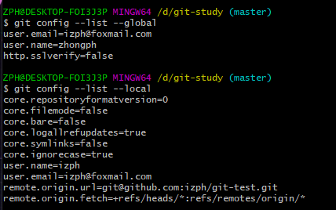
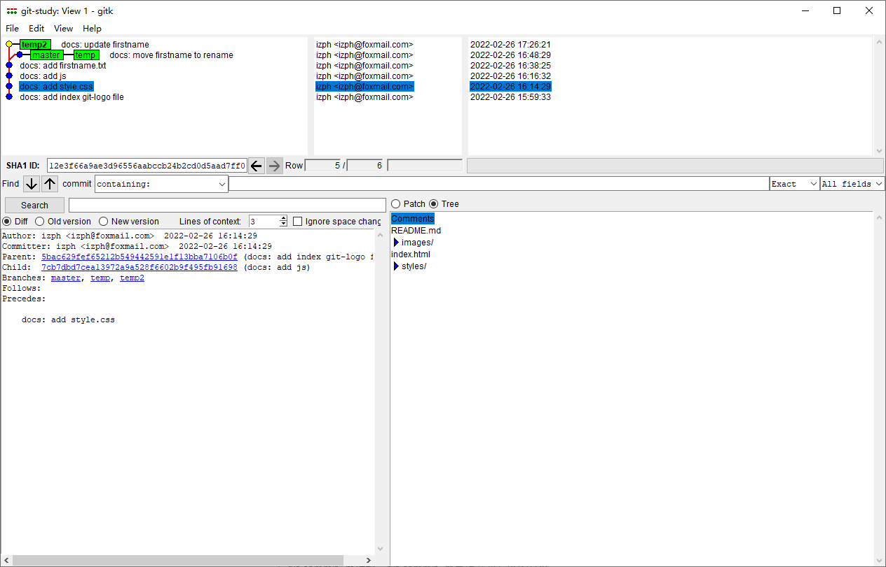
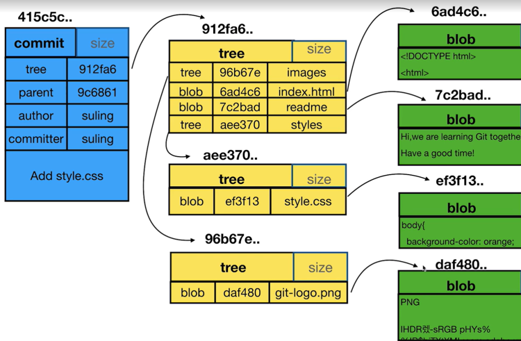
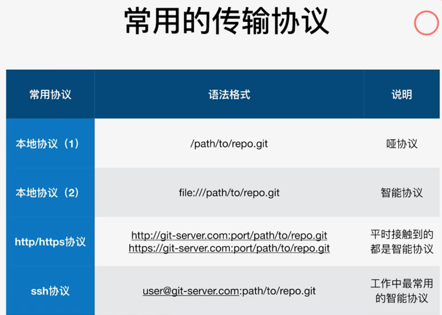
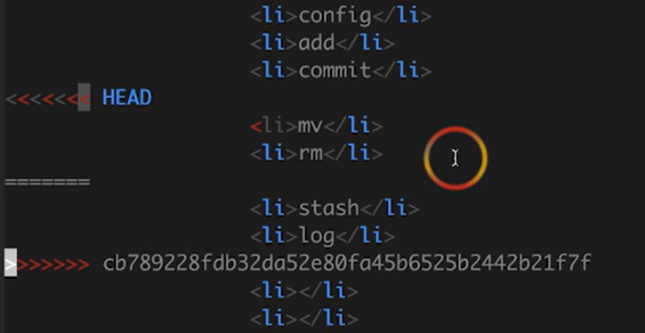
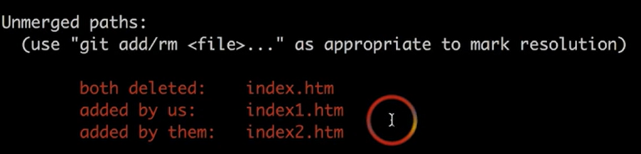

# git笔记

## 1、git基本使用

### 初始化git管理

对于已创建的文件夹，直接在文件夹目录下执行：git init
创建并初始化git，可以执行：git init 文件夹名

### 添加最小配置

git config --local user.name 'izph'
git config --local user.email 'izph@foxmail.com'（收得到email的邮箱）

#### 参数区别

local的优先级比global的高
git config --local（只对某个仓库有效，切换到另外一个仓库失效）
git config --global （当前用户的所有仓库有效，工作当中最常用）
git config --sysstem （系统的所有用户，几乎不用）

#### 查看配置

git config --list --local（只能在仓库里面起作用，普通路径git不管理）
git config --list --global
git config --list --system

#### 清除设置

git config --unset --local user.name
git config --unset --global user.name
git config --unset --system user.name

local的在.git/config里面；
global的在个人home目录下的.gitconfig里面；
system应该在git安装目录的下


#### 我们从远程拉取仓库下拉时，默认使用的是global的user，email。如何修改成其他的user和email呢？

git config --add --local user.name 'xxx';
git config --add --local user.email 'xxx';

#### 已经初始化了name和email，如何修改global的 user.name和 user.email

git config --global --replace-all user.email "输入你的邮箱"
git config --global --replace-all user.name "输入你的用户名"

$ pwd
表示当前工作路径/d/git-study

$ git config --list --global
user.email=izph@foxmail.com
user.name=zhongph
http.sslverify=false

$ ls -al（查看当前文件夹下的文件有哪些ls -al）
drwxr-xr-x 1 ZPH 197121 0 Feb 26 15:28 .git/

$ git config --local --list
user.name=izph
user.email=izph@foxmail.com

$ git add 文件名 文件夹 或者 git add . 或者 git add -u(-update)
将文件添加到git的暂存区，文件进入git的管控区了
**·  **git add -A  提交所有变化
**·**  git add -u  提交被修改(modified)和被删除(deleted)文件，不包括新文件(new)
**·**  git add .  可以添加编辑过的，新增的和删除的文件，只对当前目录及其子目录有效

git commit -m "docs: xxx xxx xxx"  提交

$ git log，是查看commit提交的信息
commit 5bac629fef65212b549442591e1f13bba7106b0f (HEAD -> master)
Author: izph <izph@foxmail.com>
Date:   Sat Feb 26 15:59:33 2022 +0800
    docs: add index git-logo file

$ cp addressA rename
cp是拷贝路径addressA下的某个文件到当前目录，重命名为rename
$ cp ../Git-Learning-master/0-material/index.html.01 index.html

$ cp ../Git-Learning-master/0-material/styles/style.css.01 styles/style.css
拷贝style.css.01 文件   到当前文件夹下的styles文件夹下，并命名为 style.css

$ cp -r ../Git-Learning-master/0-material/images  .
cp  -r   命令(r 代表 recurse，递归)，递归拷贝文件夹images  下的所有文件 到当前文件下

$ mkdir styles
在当前文件夹下创建styles文件夹

$ vi style.css
查看style.css文件的内容，弹出编辑器

## 2、git文件名重命名方式(git commit后的文件名如何修改？)

将fitstname.txt修改成rename.txt
$ mv firstname.txt remane.txt

$ git add rename.txt

$ git rm firstname.txt

$ git status
On branch master
Changes to be committed:
  (use "git restore --staged `<file>`..." to unstage)
        renamed:    firstname.txt -> rename.txt

以上几个步骤可以只用一条命令实现:
git mv firstname.txt remane.txt
接下来就可以git commit -m "提交重命名的原因"

## 3、git查看版本的历史

git log只显示当前分支的提交日志信息
git log --all查看工作区所有分支的log信息
git log --all --graph图形化显示

git log --oneline（简洁的看一下commit log记录）
git log --oneline temp（只显示temp分支的log信息）
只看最近4条记录
git log -n4 --oneline

git branch -v（查看本地有多少分支）
git branch -av （查看所有分支，如果关联了远端，那也可以看到远端的分支）

git branch develop（创建一个develop分支）

git checkout -b temp  dcc45ad0d827e1e73f8（基于以前的id版本，创建一个temp分支，并切换到temp分支）

git commit -am "xxx"  直接提交跟踪的文件(也就是跳过了git add添加到暂存区的步骤)
与git commit -m相比，git commit -m是提交暂存区的文件

$ gitk
弹出图形化工具


## 4、探索.git目录

$ cd .git
进入git目录

$ ls -al
查看目录信息
total 23
drwxr-xr-x 1 ZPH 197121   0 Feb 26 18:40 ./
drwxr-xr-x 1 ZPH 197121   0 Feb 26 18:40 ../
-rw-r--r-- 1 ZPH 197121  23 Feb 26 17:26 COMMIT_EDITMSG
-rw-r--r-- 1 ZPH 197121  23 Feb 26 18:40 HEAD
-rw-r--r-- 1 ZPH 197121  41 Feb 26 16:45 ORIG_HEAD
-rw-r--r-- 1 ZPH 197121 176 Feb 26 15:30 config
-rw-r--r-- 1 ZPH 197121  73 Feb 26 15:28 description
-rw-r--r-- 1 ZPH 197121 464 Feb 26 18:13 gitk.cache
drwxr-xr-x 1 ZPH 197121   0 Feb 26 15:28 hooks/
-rw-r--r-- 1 ZPH 197121 634 Feb 26 18:40 index
drwxr-xr-x 1 ZPH 197121   0 Feb 26 15:28 info/
drwxr-xr-x 1 ZPH 197121   0 Feb 26 15:59 logs/
drwxr-xr-x 1 ZPH 197121   0 Feb 26 17:26 objects/
drwxr-xr-x 1 ZPH 197121   0 Feb 26 15:28 refs/

$ cat HEAD（查看HEAD）
cat：查看一个文件的内容

$ cat config（查看配置config信息）
[core]
        repositoryformatversion = 0
        filemode = false
        bare = false
        logallrefupdates = true
        symlinks = false
        ignorecase = true
[user]
        name = izph
        email = izph@foxmail.com
（可以直接vi .git/config，修改config信息里面的user.name user.email等信息）

## 5、commit、tree、blob之间的关系

tree是文件夹，blob是一个文件



$ git cat-file -p dcc45ad
tree 84c86ae06a51d431237093b991fb1fdfe9c3670a
parent 2aa5019e3b4f30ca8f168e5e5466a1c95f560027
author izph <izph@foxmail.com> 1645865309 +0800
committer izph <izph@foxmail.com> 1645865309 +0800

docs: move firstname to rename
（git cat-file -p ID）：用来查看ID下的tree和blob

$ git cat-file -p 84c86ae06a51d
100644 blob 0899c2993dab9bdadd79689c1c3accc971096f18    README.md
040000 tree 96b67e399c8496ec36cbbbcb776eb924fad7f9a7    images
100644 blob 6ad4c68d567a1a5b415dcfce2010fce1a60b245f    index.html
040000 tree 87b3e92f70e7dfa555f141afeae28a2bc4a343b6    js
100644 blob 2ee05f1f6e4cfd98b49d5312149b35928ec1d92d    remane.txt
040000 tree aee37060401d19e7bd9f80b7b33920a000e96b5b    styles

$ git cat-file -t 84c86ae06a51d
tree（blob、commit）

$ git checkout ID（HEAD已经指向了某个commit了，处于分离头指针状态）
处于分离头指针状态，git会认为当前状态下的修改是不重要的，后续可能会被git清除。
我们需要将当前的修改和一个分支绑定在一起，让git认为当前的修改是重要的，如下：
$ git checkout  developtest ID
绑定到了developtest 分支下

## 6、HEAD和branch的理解

HEAD可以指向分支，也可以指向commit

$ git checkout -b dev (developtest | commit | master | 远端分支)
基于developtest或者commit 创建一个dev分支，并让当前的HEAD指向dev分支
也可以基于远端分支建立分支：origin/develop

$ git diff commit1 commit2 (-- filename 指定两个commitID的同一个文件的差异)
用git diff比较两个commit之间的差异

$ git diff develop master index.html
// 比较master和develop分支的 index.html文件

$ git diff HEAD HEAD^（HEAD~1）
比较当前HEAD和上一个HEAD之间的差异
(HEAD^^，HEAD^1^1，HEAD~2)是相同的

$ git diff --cached
表示的是，比较HEAD和暂存区的差异
如果比较没有问题，就可以git commit -m 'xxx'

$ git diff
//直接git diff 可查看所有的工作区和暂存区的差异

$ git diff -- index.html
// -- (空格) 后面跟哪个文件就查看哪个文件工作区和暂存区之间的差异

$ git reset HEAD
取消暂存区所有的文件，恢复到与工作区一致

$ git restore index.html
取消暂存区中index.html文件的修改

如果要变暂存区的文件，使用reset！！！
$ git reset HEAD filename (git reset filename)
$ git reset HEAD filename01 filename02 filename03
**回退文件，将文件从暂存区回退到工作区，跟HEAD一样**

假如我们想变更工作区的内容，一定记得使用checkout！！！
$ git checkout -- filename（工作区的文件不想要了，想要工作区的filename跟暂存区的一样，执行这个命令）

$ git reset --hard commitID (或者是HEAD，恢复成HEAD)
将暂存区和工作区恢复到指定的commitID，这是一条非常危险的命令

## 7、分支的删除

$ git branch -d 分支名
$ git branch -D 分支名
（-d删不了，就用大写的-D）

## 8、commit信息的修改

$ git commit -amend
修改最近的一次commit的message信息，弹出一个vim编辑器

简单介绍一个vim编辑器的使用：

- 按一下字母"i" 按键即可进入编辑模式
- 编辑完成后，按"esc" 键即可退出编辑模式，退出编辑模式之后按":wq"即可保存文件并退出
- 退出编辑模式后，如果要保存文件，或者是退出编辑器，往往涉及以下输入：**
- :wq 表示保存退出
- :wq! 表示强制保存退出（有一些文件打开的时候是只读的，不能正常保存，就需要加上 ！进行强制保存 ）
- :x 表示保存退出
- :q 表示只退出
- :w 保存，但是不退出
- :q! 强制退出，不保存
- :e! 放弃当前修改，重新编辑

当前分支下的，历史的commit信息怎么修改
`$ git rebase -i HEAD~2`
表示要修改当前版本的倒数第2次状态
[vim编辑器的使用](https://blog.csdn.net/u012999810/article/details/121078588)
$ git rebase -i commitID
修改当前commitID的message，弹出vim编辑器（当前分支下的commitID）

合并多个commit：
$ git rebase -i commitID(这个commitID是需要合并的最后一个)
弹出vim，将中间的需要合并的commit 的pick修改成s，保存退出，弹出另一个vim编辑器，稍微编辑一下合并commit的原因，写完后即可退出。

### Github文件夹大小写问题

git是默认不区分大小写的，之前的Button文件夹，后来将文件夹的名称改为了button，然而在Github上是不会将大写改为小写的。

#### 解决方法

进入 `.git`文件夹，将 `config`文件的 `ignorecase=true` 改为 `ignorecase=false`。

## 9、git如何删除文件

从当前的commit删除一些不想要的文件
$ git rm filename(具体的文件名)

或者先执行：$ rm filename 再执行 $ git rm filename  都是删除filename文件

## 10、开发过程中临时加塞了紧急任务怎么处理呢？

在我们开发的过程中，测试突然说，某个commit出问题了，要临时修复这个commit的，这个时候就需要把我们当前的修改保存到一个区域里面，先去解决临时的commit，问题解决后，再回到开发过程

$ git stash
将我们当前的修改存到一个区域里面

$ git stash list
查看区域的最新的stash信息

$ git stash apply
恢复到我们接临时任务的情况，将我们修改的代码恢复到工作区，不会删除git stash list里的信息

$ git stash pop(将之前保存的代码恢复到工作区，删除git stash list里的信息)

## 11、指定不需要git管理的文件(也就是说，指定一些不需要上传到git仓库的文件)

```javascript
#  过滤掉整个node_modules文件夹
node_modules

# 过滤所有 .log后缀的文件
*.log

#  过滤掉dist文件夹下的文件
dist/
```

**shell命令：**
1、删除单个文件$ rm 1.txt
2、强制删除文件，无需确认 $ rm -rf 1.txt
3、删除文件夹 $ rm -rf mydir
4、删除目录下全部文件，包括文件夹 $ rm -rf
5、删除全部文件，但保留1.txt
$ rm -rf !(1.txt)

## 12、Git的备份



Git 备份：将原有的Git仓库从一个地方传输到另一个地方做个备份，需要用的传输协议。

传输协议
Git的传输协议包含三种类型的协议：本地协议，http/https协议，ssh协议
本地协议1： git clone --bare /d/git-study/.git  ya.git (又称 “哑协议”）
本地协议2：git clone --bare file:///d/git-study/.git  zhienng.git (又称“智能协议”)

http/https协议：
http://git-server.com:port/path/to/path/repo.git
https://git-server.com:port/path/to/path/repo.git
ssh协议：user@git-server.com:/path/to/path/repo.git (工作中最常用的智能协议)

注：除哑协议外，其他均称为智能协议，二者最明显的区别：使用智能协议在仓库备份的过程中会有进度的显示。备份操作，Git备份，可以使用 git clone 使用不同的协议将远端仓库备份到本地。

git clone --bare  remote-repo.git  new-repo.git
--bare: 克隆一个不带工作区的仓库
git clone --bare /d/git-study/.git  ya.git  (哑协议)
git clone --bare file:///d/git-study/.git  zhienng.git (智能协议)

查看所有的远端仓库：
git remote -v

添加新的远端仓库：
git remote add filename file:///d/git-study/zhineng.git
filename  新建远端仓库别名

$ git push filename 分支名

## 13、查看公私钥

$ cd ~/.ssh
$ ls -al
total 29
drwxr-xr-x 1 ZPH 197121    0 Sep 20 15:06 ./
drwxr-xr-x 1 ZPH 197121    0 Feb 26 22:05 ../
-rw-r--r-- 1 ZPH 197121 2602 Sep  5 20:20 id_rsa
-rw-r--r-- 1 ZPH 197121  570 Sep  5 20:20 id_rsa.pub
-rw-r--r-- 1 ZPH 197121 1144 Nov 11 09:44 known_hosts
-rw-r--r-- 1 ZPH 197121  784 Sep  5 20:22 known_hosts.old

$ cat id_rsa.pub
查看公钥

## 14、本地仓库同步到Github

$ git remote add origin git@github.com:izph/git-test.git
origin：是远程仓库的名称，可自行命名

$ git remote -v
origin  git@github.com:izph/git-test.git (fetch)
origin  git@github.com:izph/git-test.git (push)
git remote -v 指令查看仓库关联的远端地址

$ git push origin --all
将本地的仓库推送到远程仓库(所有分支一起推送)

$ git push origin main
将本地的mian推送到远端

$ git fetch origin
将远端的所有分支同步到本地

$ git fetch origin main
将远端origin 下的main分支拉取下来，origin是我们自定义远端的仓库名。
$ git merge origin/main
本地的mian跟远端的main合并

$ git pull
在当前分支下，拉取远端对应分支的代码

$ git clone url（filename，不写的话，默认为远端仓库名称）
拉取远程代码到当前目录下，并且重命名文件夹为filename

## 15、不同的人修改了不同的文件如何处理

A同事修改dev分支的index.html文件，提交了，并且推送到了远端git仓库
此时，B同事也修改了dev分支的readme文件，这时候B同事提交，并想push到远端，这时候会报错，说远端的最新dev分支和B同事，本地的dev分支有冲突，
B同事应该执行：
$ git fetch origin（拉取远端最新代码）

$ git merge origin/dev（将远端最新的dev合并到本地dev）
$ git merge commitID（也可以，但是必须是最新拉下来dev的commitID），用 git branch -av 查看commitID

$ git push origin（此时，推送push到远端就不会出错了）

## 16、不同的人修改了相同的文件的不同地方

和15基本上一样的操作，git是有能力merge合并 同一文件，不同区域的修改的
其实可以直接git pull（拉取fetch，并且merge合并），再推送即可git push

## 17、不同的人修改了相同的文件的相同区域，这时候需要人为手动修改冲突

想push时，无法提交，此时我们需要git pull拉取最新代码
不同的人修改了相同的文件的相同区域，这时候需要人为手动修改冲突，进入到有冲突的文件，如下
HEAD为当前同事修改的，====以下为其他同事修改的，这时候就需要和同事沟通，进行处理
如果同事双方的修改都需要，则把
<<<<<<HEAD
==========

这些注释说明都删除了，保存
git commit -m "xxxxx"提交
git push再推送


## 18、一个人修改了home文件的文件名，另一个人还在home文件在修改内容，这时候该怎么办？

A同事修改了home文件的文件名，另一个同事B还在home文件在修改内容，变更名字的同事A commit后，将更名的信息push到远端，这时候B同事修改后，也想push的远端，会报错，此时B同事再拉取一下git pull即可，
git会知道是文件名变更了

A同事将index.htm修改成index1.htm，B同事将index.htm修改成index2.htm，B同事先提交和push了
A同事此时也想push，但是失败了
需要执行 git pull拉取代码，再执行git status看一下情况

假如此时我们想要保存index1.htm，这时候A同事应该执行以下操作：
$ git rm index.htm
$ git add index1.htm
$ git rm index2.htm
$ git commit -m "xxxxx"
最后push即可

## 19、git集成使用禁忌！！！

当我们再进行版本回退的过程中执行
$ git reset --hard commitID
如果再执行
$ git push -f（origin 分支名称）
会把远程仓库也会倒退回去以前的版本，只是非常危险的！

## 20、github搜索

**Git** 是一个开源的**分布式版本控制系统**，可以有效、高速地处理从很小到非常大的项目版本管理。
**GitHub是一个面向开源及私有软件项目的托管平台**
**Github常用词含义**

- **watch**：会持续收到项目的动态
- **fork**：复制某个项目到自己的仓库
- **star**：点赞数，表示对该项目表示认可，点赞数越多的项目一般越火
- **clone**：将项目下载到本地
- **follow**：关注你感兴趣的作者，会收到他们的动态

github的搜索栏是按照仓库名称和描述信息进行匹配搜索的

created:<2018-12-24
搜索所有2018-12-24之前创建的仓库

- **pushed:> YYYY-MM-DD** **最后上传日期大于YYYY-MM-DD**
- **created:> YYYY-MM-DD** **创建日期大于YYYY-MM-DD**

xxx xxx xxx in:readme
这几个关键字在README里面搜索

xxx xxx xxx in:readme start:>1000
这几个关键字在README里面搜索，并且start大于1000的仓库

forks:>10
forks大于10的项目

language:JavaScript
语言的类型是JavaScript

location: China
按照地区进行搜索

- **in:name xxx** 项目名包含xxx
- **in:description xxx** 项目描述包含xxx
- **in:readme xxx** 项目介绍文档里含有xxx
- **stars:>xxx** **stars数大于xxx**
- **stars:xx..xx** **stars数在xx..xx之间**
- **forks:>xxx** **forks数大于xxx**
- **forks:xx..xx** **forks数在xx..xx之间**

 查找fork在100到200之间并且stars数在80到100之间的javascript项目
     javascript forks:100..200 stars:80..100

**awesome 关键字** awesome 系列一般是用来收集学习、工具、书籍类相关的项目
**比如搜索优秀的python相关的项目，包括框架、教程等**
**awesome python**

找百科大全 awesome xxx
• 找例子 xxx sample
• 找空项目架子 xxx starter / xxx boilerplate
• 找教程 xxx tutorial

blog in:readme stars:>5000
博客搜索
