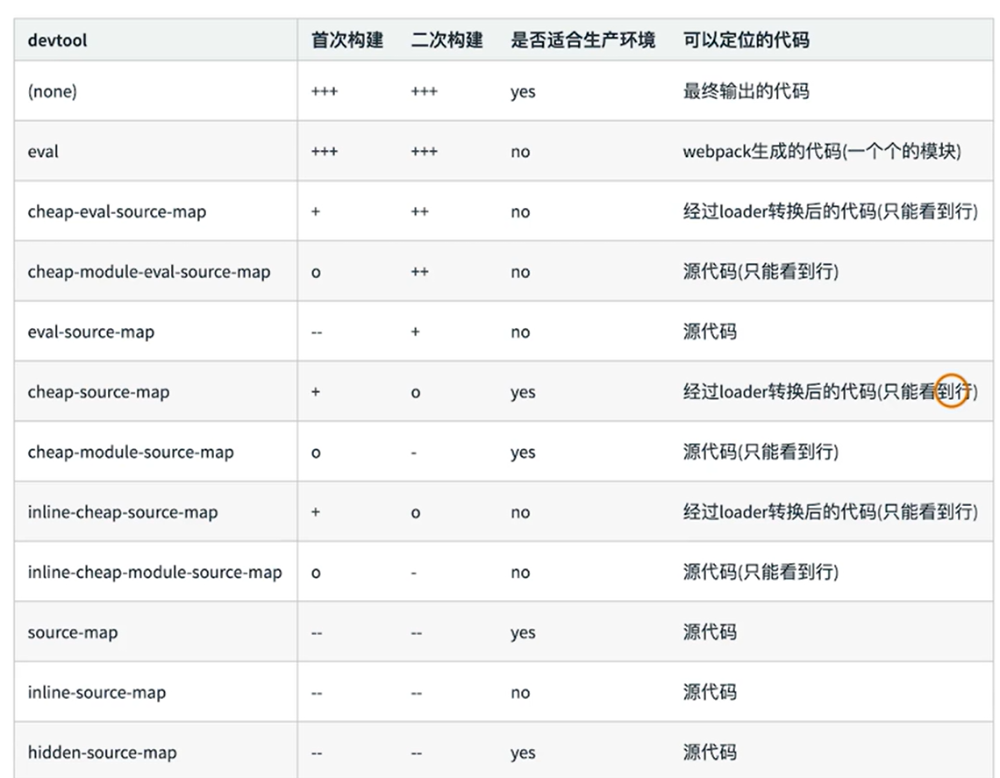
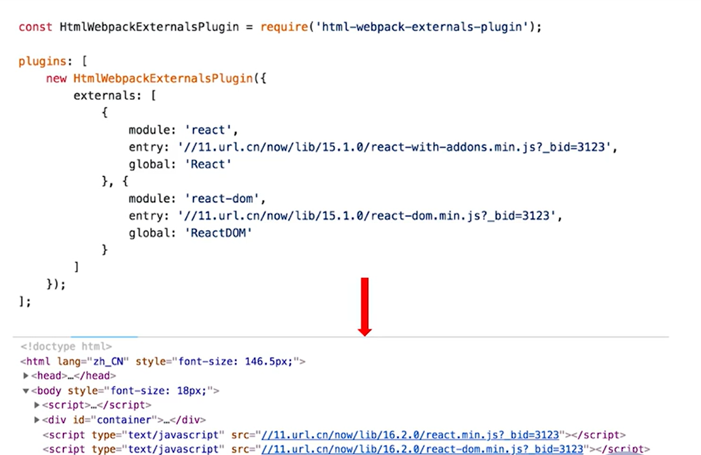
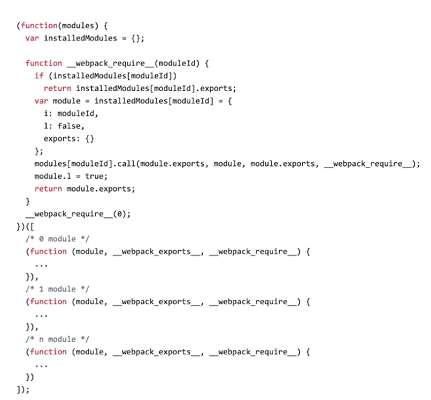
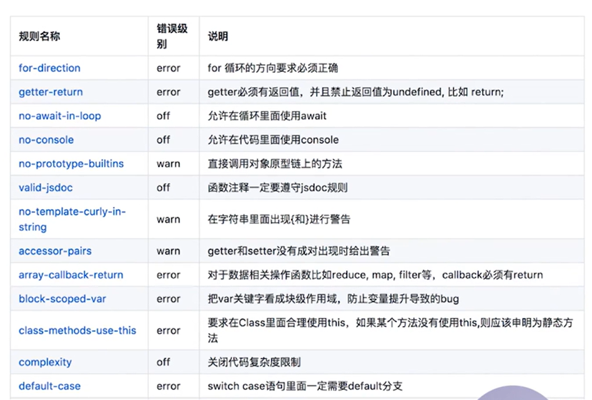

## 自动清理构建产物
- 通过 npm scripts 清理构建目录
```bash
rm -rf ./dist && webpack
rimraf ./dist && webpack
```
- 避免构建前每次都需要手动删除 dist，使用 clean-webpack-plugin，默认会删除 output 指定的输出目录
```js
const path = require('path');
const CleanWebpackPlugin = require('clean-webpack-plugin');
module.exports = {
    entry: {
        index: './src/index.js',
    },
    output: {
        path: path.join(__dirname, 'dist'),
        filename: '[name][chunkhash:8].js'
    },
    plugins: [
        new CleanWebpackPlugin()
    ]
}

```
## webpack之PostCSS插件autoprefixer自动补齐CSS3前缀
为了实现 CSS3 前缀的自动补齐，使用autoprefixer 插件：对代码打包完成后的 CSS 进行后置处理，与 postcss-loader 结合使用
[Can I Use 插件](https://caniuse.com/) 查看兼容性
```bash
npm i autoprefixer postcss-loader -d
```
```js
const path = require('path');
const MiniCssExtractPlugin = require('mini-css-extract-plugin');

module.exports = {
    entry: {
        index: './src/index.js',
    },
    output: {
        path: path.join(__dirname, 'dist'),
        filename: '[name]_[chunkhash:8].js'
    },
    // 有单行注释代码的时候，需要把less loader放到后面，不然会报错的
    module: {
        rules: [
            {
                test: /.less$/,
                use: [
                    MiniCssExtractPlugin.loader,
                    'css-loader',
                    'less-loader',
                    {
                        loader: 'postcss-loader',
                        options: {
                            plugins: () => [
                                require('autoprefixer')({
                                    // browsers 指定 autoprefixer 所需要兼容的浏览器版本
                                    // 最近两个版本，浏览器使用量大于1%
                                    browsers: ['last 2 version', '>1%', 'ios 7']
                                    // browsers改成overrideBrowserslist
                                })
                            ]
                        }
                    }
                ]
            }
        ]
    },
    plugins: [
        new MiniCssExtractPlugin({
            filename: '[name]_[contenthash:8].css'
        })
    ]
}

```
## 移动端CSS px自动转换成rem
px2rem-loader：将 px 自动转换成 rem
```js
const path = require('path');

module.exports = {
    module: {
        rules: [
            {
                test: /.less$/,
                use: [
                    MiniCssExtractPlugin.loader,
                    'css-loader',
                    'less-loader',
                    // 移动端CSS px自动转换成rem
                    {
                        loader: 'px2rem-loader',
                        options: {
                            remUnit: 75,  // 1rem = 75px
                            remPrecision: 8  // px 转换为 rem 时小数点后的位数
                        }
                    }
                ]
            }
        ]
    }
}

```
- lib-flexible：页面渲染时计算根元素的 font-size 值(可以使用手淘的 lib-flexible 库https://github.com/amfe/lib-flexible)
- 将 node_modules -> lib-flexible -> flexible.js 文件全部代码手动引入到 模板html 文件中

## 静态资源的内联

```bash
# raw-loader的版本是0.5.1
npm i raw-loader@0.5.1 -d
```
1. raw-loader 内联 html
```html
${require('raw-loader!./meta.html')}
```
2. raw-loader 内联JS
```html
<script>${require('raw-loader!babel-loader!../node_modules/lib-flexible/flexible.js')}</script$>
```
3. css 内联
- 方案一：借助style-loader
```js
module.exports = {
    modules: {
        rules:[
            {
                test: /\.css$/,
                /**
                 * css-loader用于处理加载.css文件，并且转换成commonjs对象
                 * style-loader将样式通过<style>标签插入到head中
                */
                use: [
                    {
                        loader: 'style-loader',
                        options: {
                            insertAt: 'top', // 样式插入到<head>
                            singleton: true, // 将所有的style标签合并成一个
                        }
                    },
                    'css-loader'
                ]
            },
        ]
    }
};
```
- 方案二：html-inline-css-webpack-plugin
```js
module.exports = {
    plugins: [
        new HTMLInlineCSSWebpackPlugin()  
    ]
};
```

## 多页面应用(PWA)
1. 页面有多个入口，多页面应用每个应用都是解耦的，多页面应用对SEO更加友好。
- 多页面跳转需要刷新所有资源，每个公共资源(js、css等)需选择性重新加载;
- 页面跳转：使用window.location.href = "./index.html"进行页面间的跳转；
- 数据传递：可以使用path?account=123&password=456 路径携带数据传递的方式，或者localstorage、cookie等存储方式;

2. 每个页面对应一个entry，一个html-webpack-plugin，缺点是每次新增或者删除页面需要修改webpack配置
3. 解决方案：动态获取entry和设置html-webpack-plugin的数量
- 约定js入口文件放置格式为`./src/xxx/index.js`，xxx为某个特定模块的名称，html模板为index.html
- 利用glob.sync读取文件：[glob](https://github.com/isaacs/node-glob)
```js
// npm i glob -d
glob.sync(path.join(__dirname, './src/*/index.js'))
```
```js
// webpack.config.js
const glob = require('glob');
const path = require('path');
const HtmlWebpackPlugin = require('html-webpack-plugin');
const setMPA = () => {
    const entry = {};
    const htmlWebpackPlugins = [];
    const entryFiles = glob.sync(path.join(__dirname, './src/*/index.js'));

    Object.keys(entryFiles)
        .map((index) => {
            const entryFile = entryFiles[index];
            const match = entryFile.match(/src\/(.*)\/index\.js/);
            const pageName = match && match[1];

            entry[pageName] = entryFile;
            htmlWebpackPlugins.push(
                new HtmlWebpackPlugin({
                    inlineSource: '.css$',
                    template: path.join(__dirname, `src/${pageName}/index.html`),
                    filename: `${pageName}.html`,
                    chunks: ['vendors', pageName],
                    inject: true,
                    minify: {
                        html5: true,
                        collapseWhitespace: true,
                        preserveLineBreaks: false,
                        minifyCSS: true,
                        minifyJS: true,
                        removeComments: false
                    }
                })
            );
        });

    return {
        entry,
        htmlWebpackPlugins
    }
}

const { entry, htmlWebpackPlugins } = setMPA();

module.exports = {
    entry: entry,
    output: {
        path: path.join(__dirname, 'dist'),
        filename: '[name]_[chunkhash:8].js'
    },
    mode: 'production',
    // module: {......},
    plugins: [
        new MiniCssExtractPlugin({
            filename: '[name]_[contenthash:8].css'
        }),
        new OptimizeCSSAssetsPlugin({
            assetNameRegExp: /\.css$/g,
            cssProcessor: require('cssnano')
        }),
        new CleanWebpackPlugin(), 
        new HTMLInlineCSSWebpackPlugin() 
    ].concat(htmlWebpackPlugins)
};
```

## sourcemap
- sourcemap是一种提供源代码到构建后代码映射技术（如果构建后代码出错了，通过映射可以追踪源代码错误）
- sourcemap一般在开发环境使用，生产环境关闭

|关键字|说明|
|---|---|
|eval|使用eval包裹模块代码|
|source-map|产生.map文件|
|cheap|不包含列信息|
|inline|将.map作为DataURI嵌入，不单独生成.map文件|
|module|包含loader的sourcemap|

### sourcemap的类型


- 不开起source-map调试是打包之后的内容，不方便调试
- 开启source-map调试看到的是源代码，方面调试
```js
module.exports = {
    devtool: 'source-map'
}
```
### sourcemap的类型总结
```js
[inline-、hidden-、eval-][nosources-][cheap-[module-]]source-map
```

说明：外部则是生成xxx.js.map文件，内联则是将.map内嵌，不生成.map文件，内联构建速度更快，但是体积比外部大

1. source-map：外部，能显示出错误代码准确信息和源代码的错误位置
2. inline-source-map：内联，只生成一个内联source-map，能显示错误代码准确信息和源代码的错误位置
3. eval-source-map：内联，每一个文件都生成对应的source-map，都在eval中，能显示错误代码准确信息和源代码的错误位置(文件后面会多一个hash值，print.js?8d3a)
4. hidden-source-map：外部，为了隐藏源代码而诞生的，错误代码能显示错误原因，但是没有源代码的错误位置，不能追踪源代码错误，只能提示到构建后代码的错误位置
5. nosources-source-map：外部，为了隐藏源代码而诞生的，错误代码准确信息，但是没有任何源代码信息(找不到任何代码信息)
6. cheap-source-map：外部，能显示错误代码准确信息和源代码的错误位置，**只能精确的行的错误，不能精确到列**（比如第四行只是后面的一个代码错误，但是是整行报错，**而source-map可以准确提示哪一行的那一列出错了**，同一行没错误的分号(;) 不提示错误）
7. cheap-module-source-map：外部，能错误代码准确信息和源代码的错误位置，有module，会将loader的source map加入。

8. 开发环境：速度快，调试更友好
- 速度快慢，eval>inline>cheap>...
  - eval-cheap-souce-map (有cheap只精确到行)
  - eval-source-map
- 调试更友好  
  - souce-map
  - cheap-module-souce-map(module会将loader的source map加入)
  - cheap-souce-map
- eval-source-map(调试最友好) 、eval-cheap-module-souce-map(调试性能最友好)、react脚手架（cra）默认使用的是eval-source-map

9. 生产环境：源代码要不要隐藏? 调试要不要更友好
- 内联会让代码体积变大，所以在生产环境不用内联，我们要让体积变小，就不要内联，而采用外部的方式。
- nosources-source-map 全部隐藏（源码和构建后的代码都会隐藏）
- hidden-source-map 只隐藏源代码，会提示构建后代码错误信息
- source-map(调试友好) 
- cheap-module-souce-map（cheap的速度会快一点）

## 提取页面的公共资源
### 基础库的分离
- 思路:将react、react-dom 基础包通过cdn 引入，不打入bundle 中
- 方法:使用html-webpack-externals-plugin
- entry: 可以是本地文件、cdn引入等


### 使用SplitChunksPlugin进行公共脚本分离
webpack内置的
```js
module.exports = {
    //...
    optimization: {
      splitChunks: {
        // async：异步引入的库进行分离（默认），  initial： 同步引入的库进行分离， all：所有引入的库进行分离（推荐）
        chunks: 'async', 
        minSize: 30000, // 抽离的公共包最小的大小，单位字节 30k   如果minSize: 0,只要有引用，就会抽离
        maxSize: 0, // 最大的大小
        minChunks: 1, // 资源使用的次数(在多个页面使用到)， 大于1， 最小使用次数
        maxAsyncRequests: 5,  // 并发请求的资源数量
        maxInitialRequests: 3, // 入口文件做代码分割最多能分成3个js文件
        automaticNameDelimiter: '~', // 文件生成时的连接符
        automaticNameMaxLength: 30, // 自动自动命名最大长度
        name: true, //让cacheGroups里设置的名字有效
        cacheGroups: { //当打包同步代码时,上面的参数生效
          vendors: {
            test: /[\\/]node_modules[\\/]/,  //检测引入的库是否在node_modlues目录下的
            priority: -10, //值越大,优先级越高.模块先打包到优先级高的组里
            filename: 'vendors.js'//把所有的库都打包到一个叫vendors.js的文件里
          },
          default: {
            minChunks: 2, // 上面有
            priority: -20,  // 上面有
            reuseExistingChunk: true //如果一个模块已经被打包过了,那么再打包时就忽略这个上模块
          },
          commons: {
              test: /(react|react-dom)/,
              // 分离处理的名称，可将vendors这个chunk添加到html-webpack-plugin中的chunks数组里使用，chunks: ['vendors', pageName]
              name: 'vendors', 
              chunks: 'all'
          }
        }
      }
    }
};
```

## Tree Shaking的使用和原理分析
- webpack默认支持，模式为production默认开启，必须是es module的模块规范，cjs不支持
- Tree Shaking就是把模块中使用到的代码打入bundle，引入了但是没有使用，也不会被打包进入bundle。
- **Tree Shaking原理**：Tree Shaking会对模块的代码进行静态的分析，在编译的阶段已经确定了哪些代码需要使用的，不需要的代码会被Tree Shaking进行注释标记，最终在uglify阶段删除无用的代码。

- DCE
dead code elimination，消除死代码，通常在编译阶段由编译器进行判断某些代码是否可达从而删除那些不可能执行的代码
- 代码不会被执行，不可到达
```js
if(false){
    console.log("1") // 这段代码永远不会执行
}
```
- 代码的执行结果不会被用到
- 代码只会影响死变量（只写不读）
- 常规的死代码消除一般来说包含上面这几种类型的无用代码，会在打包阶段，一般是uglify.js分析并删除无用代码。
- 副作用的代码不能treeshking，如在window对象挂载属性值，但是没有使用；export封装成对象导出，没有使用的方法不能被treeshking，原因是treeshking只能做到export级别，编译期间的静态分析只能对es module的相关语法做分析，是不会真正去执行代码的。

## Scope Hoisting（作用域提升）
Scope Hoisting 是 webpack3 的新功能，它可以让 webpack 打包出来的代码文件更小，运行更快。

当前现状：webpack构建后的代码存在大量的闭包代码，导致什么问题？
- 大量函数闭包包裹代码，导致包体积增大（模块越多越明显）
- 代码在运行时因为创建的函数作用域更多，内存开销变大。

### 模块转换分析
- 模块转化为模块初始化函数，转换后的模块会带上一层包裹
- import会被转换成__webpack_require，__webpack_require的参数有moduleId，exprot也会发生转换
### webpack模块机制

- webpack 打包输出打是一个 IIFE（匿名闭包）；
- modules 是一个数组，每一项是一个模块初始化函数，modules会传入IIFE函数中；
- IIFE函数最核心的是使用 __webpack_require() 来加载和处理模块，返回 module.exports；
- __webpack_require()根据moduleId来查看installModules里是否存在，不存在会创建一个新的module存放到installModules；
- 通过 __webpack_require__(__webpack_require__.s = 0)，entry入口依赖，启动程序。

## Scope Hoisting原理（从rollup借鉴）
- 原理：将所有模块的代码按照引用顺序放在一个函数作用域里，然后适当的重命名一些变量以防止变量名冲突，消除包裹
- Scope Hoisting的使用：webpack4以上，模式为production默认开启，必须是ESM，不支持cjs
- ModuleConcatenationPlugin() 插件
[参考Scope Hoisting](https://juejin.cn/post/6844904003109650445)

1. 没有 Scope Hoisting 时用 webpack 打包下面两个文件
```js
// main.js
export default "hello";

// index.js
import str from "./main.js";
console.log(str);
```
2. 使用 webpack 打包后输出文件内容如下：
```js
// module指代源代码，__webpack_exports__就是export、__webpack_require__是import
/* harmony import 是ES6语法的标识 */
/* harmony exports 是ES6语法的标识 */
[  (function (module, __webpack_exports__, __webpack_require__) {    
        var __WEBPACK_IMPORTED_MODULE_0__main_js__ = __webpack_require__(1);    
        console.log(__WEBPACK_IMPORTED_MODULE_0__main_js__["a"]);  
    }),  
    (function (module, __webpack_exports__, __webpack_require__) {    
        __webpack_exports__["a"] = ('hello');  
    })
]
```
3. 再开启 Scope Hoisting 后，相同源码打包输出结果变为：
```js
[  (function (module, __webpack_exports__, __webpack_require__) {    
        var main = ('hello');    
        console.log(main);  
    })
]
```
对比两种打包方式输出的代码，我们可以看出，启用 Scope Hoisting 后，函数声明变成一个， main.js 中定义的内容被直接注入到 main.js 对应模块中，这样做的好处：

- 代码体积更小，因为函数申明语句会产生大量代码，导致包体积增大（模块越多越明显）；
- 代码在运行时因为创建的函数作用域更少，内存开销也随之变小。
- 对比结果: 通过scope hoisting 可以减少函数声明代码和内存开销

scope hoisting理解为是把每个模块被webpack处理成的模块初始化函数整理到一个统一的包裹函数里，也就是把多个作用域用一个作用域取代，以减少内存消耗并减少包裹块代码，从每个模块有一个包裹函数变成只有一个包裹函数包裹所有的模块，但是有一个前提就是，当模块的引用次数大于1时，比如被引用了两次或以上，那么这个效果会无效，也就是被引用多次的模块在被webpack处理后，会被独立的包裹函数所包裹

Scope housting对模块的引用次数大于1次是不产生效果的，这个其实也很好理解，如果一个模块引用次数大于1次，那么这个模块的代码会被内联多次，从而增加了打包出来的js bundle的体积。

## 代码分割和动态import
代码分割场景
1. 抽离相同代码到一个共享模块
2. 脚本懒加载，使得初始下载的代码更小，懒加载方式：
- cjs：require.ensure
- esm：动态import（目前还没有原生支持，需要babel转换）
  - 静态分析（在模块的头部import xxx from 'xxx'）
  - 动态引入（在if...else{ import('xxx')}），按需加载
3. 动态import的js代码在打包时，会被抽离出来，用到的时候才会加载这个被抽离出来的js文件，通过webpackJsonp的一个请求加载。
（典型的通过jsonp的形式往html插入script标签），动态import（懒加载）必定会分割代码，生成新的chunk。
### 如何动态import
- 使用@babel/plugin-syntax-dynamic-import插件，下载该插件，并在.babelrc的plugins配置插件

```js
/*
  通过js代码，让某个文件被单独打包成一个chunk
  import动态导入语法：能将某个文件单独打包
*/

// 魔法注释当注解用了，标注打包后的文件名为test
/* webpackChunkName: 'test' */  

import(/* webpackChunkName: 'test' */'./test')
  .then(({ add }) => {
    // 文件加载成功~
    // eslint-disable-next-line
    console.log(add(1, 2));
  })
  .catch(() => {
    // eslint-disable-next-line
    console.log('文件加载失败~');
  });
```

## 在webpack中使用ESLint

制定ESLint规范，检查JS
- 不重复造轮子，基于eslint:recommend配置并改进
- 能够帮助发现代码错误的规则，全部开启



### ESLint如何执行落地
- 和CI/CD系统集成
- 和webpack集成

- 本地开发阶段增加precommit钩子
- 安装husky，`npm i husky -d`
- 增加npm script，通过lint-staged增量检查修改的文件
```json
{
  "scripts": {
    "precommit": "lint-staged",
  },
  "lint-staged": {
    "linters": {
        "*.{js, less}": [
            "eslint --fix", "git add"
        ],
    }
  },
}
```
- 使用eslint-webpack-plugin，构建时检查js规范

### eslint-config-airbnb的使用

- eslint-config-airbnb(react项目使用)、eslint-config-airbnb-base(其他项目)
[eslint-config-airbnb](https://github.com/airbnb/javascript/tree/master/packages/eslint-config-airbnb)

- 下载`npm install eslint eslint-plugin-import eslint-plugin-react eslint-plugin-react-hooks eslint-plugin-jsx-a11y -d`
- 下载`npm install babel-eslint eslint-config-airbnb -d`
[eslint官网](http://eslint.cn/docs/user-guide/getting-started)
- eslint配置文件：.eslint.*(.eslint.js/.eslint.json/.eslint.yml)
```js
// .eslint.js
module.exports = {
    "parser": "babel-eslint", // 使用的parser是babel-eslint，需要下载安装babel-eslint
    "extends": "airbnb",  // 继承airbnb，需要安装
    "env": {   // 识别browser和node环境的一些全局变量
        "browser": true,
        "node": true
    },
    // 定义规则
    "rules": {
        "indent": ["error", 4] //indent空格， "error"错误级别、4是控制的空格数量
    }
};
```

## webpack打包库和组件
rollup打包组件和库更纯粹、更适合

[实现get-var-type](/%E9%A1%B9%E7%9B%AE/get-var-type/01-get-var-type.md)

## 服务端渲染(ssr)
所有模板的资源的存储在服务端，内网机器获取数据更快，核心的优势是减少请求，减少白屏时间，对SEO友好。

大致的思路是：将需要的服务端渲染的组件打包component，再通过一个renderToString(component)的方法将组件转化成字符串，最终将字符串拼接到html模板字符串中，由服务器路由将对应html模板返回给客户端。

### next.js(react的ssr)

## 优化构建时命令行的显示日志

### 统计信息stats

|Preset|Alternative|Description|
|---|---|---|
|"errors-ondy"|none|只在发生错误时输出|
|"minimal"|none|只在发生错误或有新的编译时输出|
|"none"|false|没有输出|
|"normal"|true|标准输出|
|"verbose"|none|全部输出|
```js
module.exports = {
    // 开发阶段使用的是develop-server是
    devServer:{
        contentBase: './dist',
        hot: true,
        stats: "errors-ondy"
    },
    // 生产构建时
    stats:"errors-ondy"
}
```

### 优化构建信息

- 安装`npm i friendly-errors-webpack-plugin -d`
- 构建提示`success/waring/error`
```js
const FriendlyErrorsWebpackPlugin = require('friendly-errors-webpack-plugin');
module.exports = {
    plugins: [
        new FriendlyErrorsWebpackPlugin(),
    ]
}
```

## webpack错误捕获和异常处理

### Node.js中的process.exit规范
- 0表示成功完成，回调函数中，err 为null
- 非0表示执行失败，回调函数中，err 不为 null，err.code 就是传给exit的数字

### 如何主动捕获并处理构建错误
- compiler在每次构建结束后会触发done这个hook
- process.exit主动处理构建错误

```js
// webpack4，捕获错误
module.exports = {
    plugins: [
        // 
        function() {
            // compiler里有hook，如果是done，代表这个构建完成
            this.hooks.done.tap('done', (stats) => { // 监听
                // stats的compilation是否存在errors，存在则构建失败
                if (stats.compilation.errors && stats.compilation.errors.length && process.argv.indexOf('--watch') == -1){
                    console.log('build error');
                    process.exit(1); // errno 1
                }
            })
        }    
    ]
}
```
