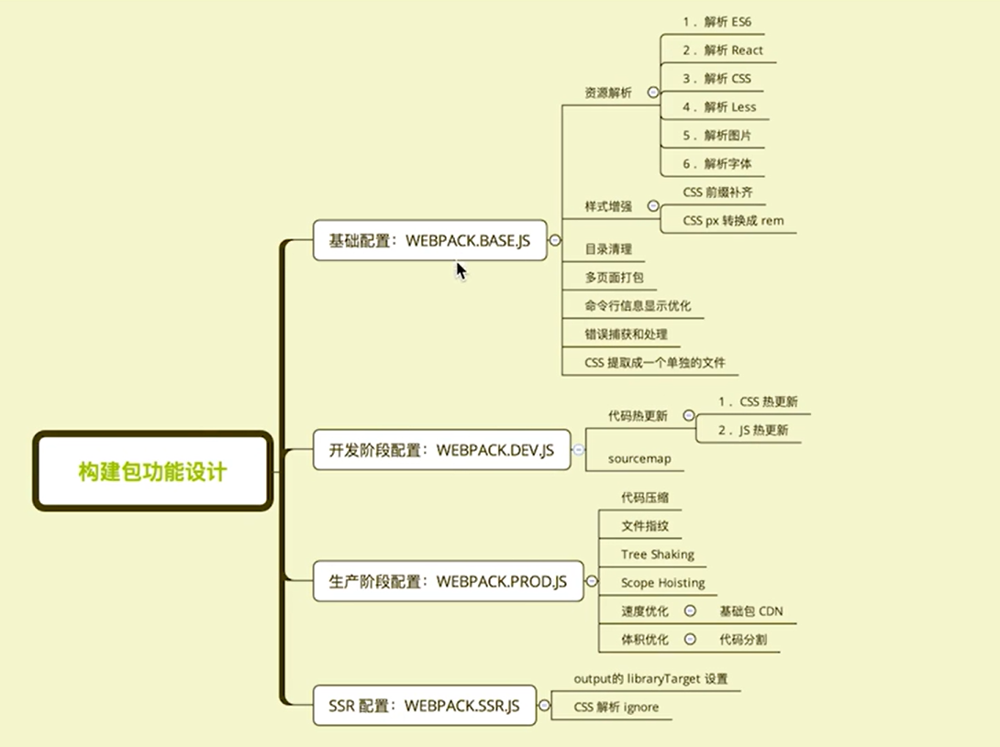

## 构建配置抽离成npm包的意义
1. 通用性
- 业务开发者无需关注构建配置
- 统一团队构建脚本
2. 可维护性
- 构建配置合理的拆分
- README文档、ChangeLog文档等
3. 质量
- 冒烟测试、单元测试、测试覆盖率
- 持续集成

## 构建配置管理的可选方案
1. 通过多个配置文件管理不同环境的构建，webpack --config 参数进行控制
2. 将构建配置设计成一个库，比如: hjs-webpack、Neutrino、webpack-blocks
3. 抽成一个工具进行管理，比如: create-react-app, kyt, nwb（团队规模大抽成一个cli）
4. 将所有的配置放在一个文件，通过--env参数控制分支选择

## 构建配置包设计

### 通过多个配置文件管理不同环境的webpack构建

- 基础配置:webpack.base.js
- 开发环境:webpack.dev.js
- 生产环境:webpack.prod.js
- SSR环境:webpack.ssr.js
- ...

### 抽离成一个npm包统一管理
- 规范: git commit日志、README、ESLint规范、Semver规范
- 质量:冒烟测试、单元测试、测试覆盖率和Cl

### 通过webpack-merge组合配置
合并配置
```js
const merge = require('webpack-merge')
module.exports = merge(baseConfig, devConfig)
```
### 功能模块设计

### 目录结构设计
```bash
-/test # 测试代码
-/lib # 源代码
  - webpack.dev.js
  - webpack.prod.js
  - webpack.ssr.js
  - webpack.base.js
index.js
README.md
CHANGELOG.md
.eslinrc.js
package.json
```

## 冒烟测试

冒烟测试是指对提交测试的软件在进行详细深入的测试之前而进行的预测试，这种预测试的主要目的是暴露导致软件需重新发布的基本功能失效等严重问题。（还有其他测试如单元测试，集成测试）
