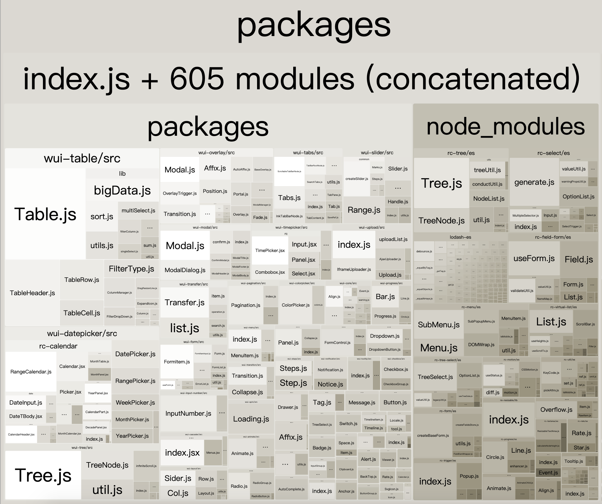

### 使用webpack内置的stats分析
```json
{
    "srcipts":{
        "build:stats": "webpack --env production --json > stats.json"
    }
}
```

### 速度分析：使用speed-measure-webpack-plugin
- 分析整个打包的总耗时
- 每个插件和loader的耗时情况
- 这个插件和html-webpack-plugin冲突了，报错
```js
const SpeedMeasureWebpackPlugin = require('speed-measure-webpack-plugin');
const smp = new SpeedMeasureWebpackPlugin();
module.exports = smp.wrap({
    ......
})
```
### 体积分析：使用webpack-bundle-analyzer
- 构建完成后会在8888端口展示大小

- 依赖的第三方模块文件大小
- 业务里面的组件代码大小
```js
const { BundleAnalyzerPlugin } = require('webpack-bundle-analyzer');
module.exports = {
    plugins: [
        new BundleAnalyzerPlugin()
    ]
}
```
### webpack4
webpack4: 优化原因
- V8带来的优化(for of替代 forEach、Map和Set替代 Object、includes替代indexOf)
- 默认使用更快的md4 hash 算法
- webpacks AST可以直接从loader传递给AST，减少解析时间
- 使用字符串方法替代正则表达式

### 多进程/多实例构建：资源并行解析可选方案

thread-loader
- parallel-webpack
- HappyPack

### 多进程/多实例：并行压缩

```js
const TerserPlugin = require('terser-webpack-plugin');
module.exports = {
    optimization: {
        minimizer: [
            new TerserPlugin({
                parallel: true,
                cache: true
            })
        ]
    },
}
```

### 优化构建速度，缩小构建目标
目的：尽可能的少构建模块，比如babel-loader不解析node_modules、减少文件搜索范围
```js
{
    test: /\.js$/,
    exclude: /node_modules/,
    // 同时使用多个loader  用use数组，多个可以直接配置
    use: [
      /* 
          开启多线程打包。 
          进程启动大概为600ms，进程通信也有开销。
          只有工作消耗时间比较长，才需要多线程打包
      */
      {
        loader: 'thread-loader',
        options: {
          workers: 2 // 进程2个
        }
      },
      {
        loader: 'babel-loader',
        options: {
          // 预设：指示babel做怎么样的兼容性处理
          presets: [
            [
              '@babel/preset-env',
              {
                // 按需加载
                useBuiltIns: 'usage',
                // 指定core-js版本
                corejs: {
                  version: 3
                },
                // 指定兼容性做到哪个版本浏览器
                targets: {
                  chrome: '60',
                  firefox: '60',
                  ie: '9',
                  safari: '10',
                  edge: '17'
                }
              }
            ]
          ],
          // 开启babel缓存
          // 第二次构建时，会读取之前的缓存, 速度会更快一点
          cacheDirectory: true
        }
      }
    ],
}
```
## 无用的CSS如何删除

- PurifyCSS:遍历代码，识别已经用到的CSS class

使用purgecss-webpack-plugin，必须和mini-css-extract-plugin搭配使用
```js
const PurgecssPlugin = require('purgecss-webpack-plugin');
const MiniCssExtractPlugin = require('mini-css-extract-plugin');
const glob = require('glob');
const PATHS = {
    src: path.join(__dirname, 'src')
};
module.exports = {
    plugins: [
        new MiniCssExtractPlugin({
            filename: '[name]_[contenthash:8].css'
        }),
        new PurgecssPlugin({
            paths: glob.sync(`${PATHS.src}/**/*`,  { nodir: true }),
        })
    ]
}
```
- uncss: HTML需要通过jsdom加载，所有的样式通过PostCSS解析，通过document.querySelector来识别在html文件里面不存在的选择器
