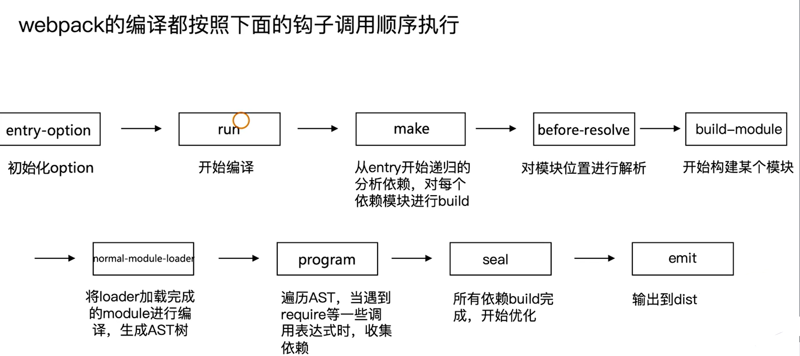

## webpack入口文件

- 在命令行运行以上命令后，npm会让命令行工执行，查找是否存在 webpack.sh 或者webpack.cmd文件，如果存仕，就执行，不存在，就抛出错误。
- 实际的入口文件是: `node_modules\webpack\bin\webpack.js`

```js
// webpack/package.json  
{
    "bin": {
        "webpack": "./bin/webpack.js" // 实际的入口
    }
}
```
```js
// webpack-cli/package.json
{
    "bin": {
        "webpack-cli": "./bin/cli.js"
    }
}
```
### 分析webpack.js(4.31.0版本)
```js
// 1.正常执行返回
process.exitCode = O;
// 2.运行某个命令，通过子进程child_process模块的spawn
const runCommand = (command, args)=>{
    // command是命令，如npm 
};
// 3.判断某个包是否安装
const islnstalled = packageName =>{...};
// 4. webpack可用的CLI: webpack-cli和 webpack-command
const CLls =[..];
// 5.判断是否两个CLl是否安装了
const installedClis = CLls.filter(cli => cli.installed);
// 6.根据安装数量进行处理，webpack必须安装一个cli
if (installedClis.length === O){
    ...
}else if(installedClis.length === 1){
    ...
}else{
    ...
}
```
启动会的结果：webpack最终找到webpack-cli (webpack-command)这个npm 包，并且执行CLI


### 完整的webpack.js文件(5.72.1版本)
```js
#!/usr/bin/env node

/**
 * @param {string} command process to run
 * @param {string[]} args command line arguments
 * @returns {Promise<void>} promise
 */
const runCommand = (command, args) => {
	const cp = require("child_process");
	return new Promise((resolve, reject) => {
		const executedCommand = cp.spawn(command, args, {
			stdio: "inherit",
			shell: true
		});

		executedCommand.on("error", error => {
			reject(error);
		});

		executedCommand.on("exit", code => {
			if (code === 0) {
				resolve();
			} else {
				reject();
			}
		});
	});
};

/**
 * @param {string} packageName name of the package
 * @returns {boolean} is the package installed?
 */
const isInstalled = packageName => {
	if (process.versions.pnp) {
		return true;
	}

	const path = require("path");
	const fs = require("graceful-fs");

	let dir = __dirname;

	do {
		try {
			if (
				fs.statSync(path.join(dir, "node_modules", packageName)).isDirectory()
			) {
				return true;
			}
		} catch (_error) {
			// Nothing
		}
	} while (dir !== (dir = path.dirname(dir)));

	return false;
};

/**
 * @param {CliOption} cli options
 * @returns {void}
 */
const runCli = cli => {
	const path = require("path");
	const pkgPath = require.resolve(`${cli.package}/package.json`);
	// eslint-disable-next-line node/no-missing-require
	const pkg = require(pkgPath);
	// eslint-disable-next-line node/no-missing-require
	require(path.resolve(path.dirname(pkgPath), pkg.bin[cli.binName]));
};

/**
 * @typedef {Object} CliOption
 * @property {string} name display name
 * @property {string} package npm package name
 * @property {string} binName name of the executable file
 * @property {boolean} installed currently installed?
 * @property {string} url homepage
 */

/** @type {CliOption} */
const cli = {
	name: "webpack-cli",
	package: "webpack-cli",
	binName: "webpack-cli",
	installed: isInstalled("webpack-cli"),
	url: "https://github.com/webpack/webpack-cli"
};

if (!cli.installed) {
	const path = require("path");
	const fs = require("graceful-fs");
	const readLine = require("readline");

	const notify =
		"CLI for webpack must be installed.\n" + `  ${cli.name} (${cli.url})\n`;

	console.error(notify);

	let packageManager;

	if (fs.existsSync(path.resolve(process.cwd(), "yarn.lock"))) {
		packageManager = "yarn";
	} else if (fs.existsSync(path.resolve(process.cwd(), "pnpm-lock.yaml"))) {
		packageManager = "pnpm";
	} else {
		packageManager = "npm";
	}

	const installOptions = [packageManager === "yarn" ? "add" : "install", "-D"];

	console.error(
		`We will use "${packageManager}" to install the CLI via "${packageManager} ${installOptions.join(
			" "
		)} ${cli.package}".`
	);

	const question = `Do you want to install 'webpack-cli' (yes/no): `;

	const questionInterface = readLine.createInterface({
		input: process.stdin,
		output: process.stderr
	});

	// In certain scenarios (e.g. when STDIN is not in terminal mode), the callback function will not be
	// executed. Setting the exit code here to ensure the script exits correctly in those cases. The callback
	// function is responsible for clearing the exit code if the user wishes to install webpack-cli.
	process.exitCode = 1;
	questionInterface.question(question, answer => {
		questionInterface.close();

		const normalizedAnswer = answer.toLowerCase().startsWith("y");

		if (!normalizedAnswer) {
			console.error(
				"You need to install 'webpack-cli' to use webpack via CLI.\n" +
					"You can also install the CLI manually."
			);

			return;
		}
		process.exitCode = 0;

		console.log(
			`Installing '${
				cli.package
			}' (running '${packageManager} ${installOptions.join(" ")} ${
				cli.package
			}')...`
		);

		runCommand(packageManager, installOptions.concat(cli.package))
			.then(() => {
				runCli(cli);
			})
			.catch(error => {
				console.error(error);
				process.exitCode = 1;
			});
	});
} else {
	runCli(cli);
}
```


### webpack-cli做的事情(3.3.2版本)

#### 引入yargs，对命令行进行定制

#### 分析命令行参数，对各个参数进行转换，组成编译配置项
#### 引用webpack，根据配置项进行编译和构建

## webpack的流程(4版本)


## webpack: 模块构建和chunk生成阶段
Compiler hooks
### 流程相关

- (before-)run
- (before-/after-)compile
- make
- (after-)emit
- done

### 监听相关
- watch-run
- watch-close

### Chunk生成算法
1. webpack 先将entry 中对应的module 都生成一个新的chunk
2. 遍历module 的依赖列表，将依赖的module 也加入到chunk中
3. 如果一个依赖module是动态引入的模块，那么就会根据这个module 创建一个新的chunk，继续遍历依赖
4. 重复上面的过程，直至得到所有的chunks
## webpack: 文件生成

## 动手实现一个简易的webpack
- 可以将ES6语法转换成ES5的语法
  - 通过babylon生成AST
  - 通过babel-core 将AST重新生成源码

- 可以分析模块之间的依赖关系
  - 通过babel-traverse 的 lmportDeclaration方法获取依赖属性
  
- 生成的JS文件可以在浏览器中运行
