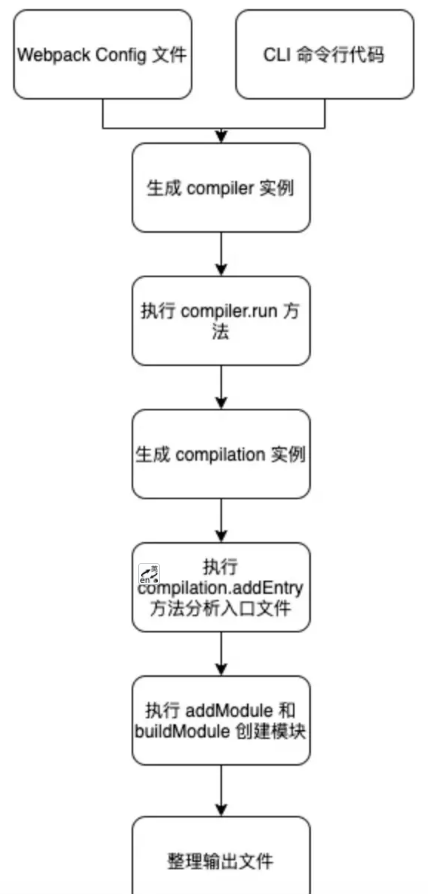

# 实现一个小插件（plugin）

为什么要实现这个乞丐版的md转化html的插件，一是最近加班不是很多，有更多的空余时间去做自己想做的事情；二是想做一些有挑战的小Demo，工作以来，大多数是调接口、做交互，维护老项目，做CRUD的事情，感觉这样下去，技术会越来越菜，得不到成长。所以，突破自己，尝试去实现一些有难度的东西，做一些有意义的事情。参考了许多资料，慢慢的实现了这个乞丐版plugin。
## 如何创建 Plugin
参考：[手把手带你入门WebpackPlugin](https://juejin.cn/post/6968988552075952141)
```js
const pluginName = 'md-to-html-plugin';

class MdToHtmlPlugin {
    apply(compiler) {
        // 代表开始读取 records 之前执行
        compiler.hooks.emit.tap(pluginName, (compilation) => {
            console.log("webpack 构建过程开始！");

            // _assets 打包的资源详情
            const _assets = compilation.assets;
        });
    }
}
```
- compiler 对象包含了 Webpack 环境所有的的配置信息，包含 options，loaders，plugins 这些信息，这个对象在 Webpack 启动时候被实例化，它是全局唯一的，可以简单地把它理解为 Webpack 实例；
- webpack会提供一个apply方法，接受一个编译器compiler，编译的时候都是在apply里执行，是执行具体的插件方法。
- apply 方法的入参注入了一个 compiler 实例，compiler 实例是 Webpack 的支柱引擎，代表了 CLI 和 Node API 传递的所有配置项。
- compiler会有钩子hooks，钩子hooks会有一个发布器emit（类似node的EmitterEvent发布订阅）
tap第一个参数是插件的名字，第二个参数是回调函数，回调函数的参数是一个compilation。
- compilation 对象包含了当前的模块资源、编译生成资源、变化的文件等。当 Webpack 以开发模式运行时，每当检测到一个文件变化，一次新的 compilation 将被创建。compilation 对象也提供了很多事件回调供插件做扩展。通过 compilation 也能读取到 Compiler 对象。
- Hook 上还暴露了 3 个方法供使用，分别是 tap、tapAsync 和 tapPromise。这三个方法用于定义如何执行 Hook，比如 tap 表示注册同步 Hook，tapAsync 代表 callback 方式注册异步 hook，而 tapPromise 代表 Promise 方式注册异步 Hook。

## Webpack

### Webpack 运行机制

理解 Plugin，了解 Webpack 打包的流程：
我们打包的时候，会先合并 Webpack config 文件和命令行参数，合并为 options。
将 options 传入 Compiler 构造方法，生成 compiler 实例，并实例化了 Compiler 上的 Hooks。
compiler 对象执行 run 方法，并自动触发 beforeRun、run、beforeCompile、compile 等关键 Hooks。
调用 Compilation 构造方法创建 compilation 对象，compilation 负责管理所有模块和对应的依赖，创建完成后触发 make Hook。
执行 compilation.addEntry() 方法，addEntry 用于分析所有入口文件，逐级递归解析，调用 NormalModuleFactory 方法，为每个依赖生成一个 Module 实例，并在执行过程中触发 beforeResolve、resolver、afterResolve、module 等关键 Hooks。
将第 5 步中生成的 Module 实例作为入参，执行 Compilation.addModule() 和 Compilation.buildModule() 方法递归创建模块对象和依赖模块对象。
调用 seal 方法生成代码，整理输出主文件和 chunk，并最终输出。


### 常见Hooks
参考: [webpack](https://www.webpackjs.com/api/compiler-hooks/?fileGuid=3tGHdrykRgwCyTP8) 

Hook|type|调用
:-:|:-:|:-:
run|AsyncSeriesHook|开始读取 records 之前
compile|SyncHook|	一个新的编译 (compilation) 创建之后
emit|AsyncSeriesHook|生成资源到 output 目录之前
done|SyncHook|编译 (compilation) 完成

实现MdToHtmlPlugin


[项目地址](https://github.com/izph/md-to-html)
