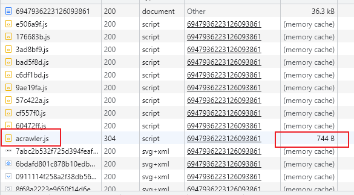
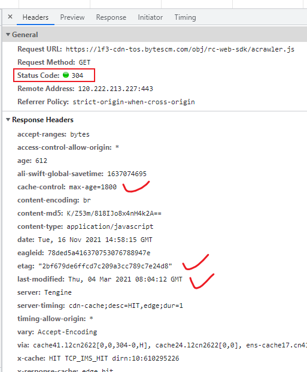
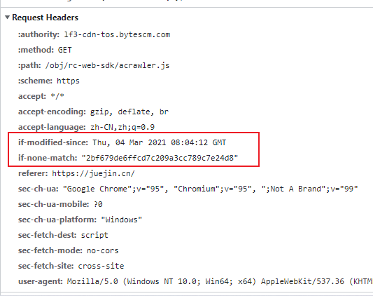

# 浏览器缓存

## 参考
[前端浏览器缓存知识](https://juejin.cn/post/6947936223126093861)

## 补充协商缓存介绍
协商缓存，服务器返回304
744 B transferred over network, resource size: 71.7 kB（744 B通过网络传输，资源大小：71.7 kB）

### 响应头

### 请求头

