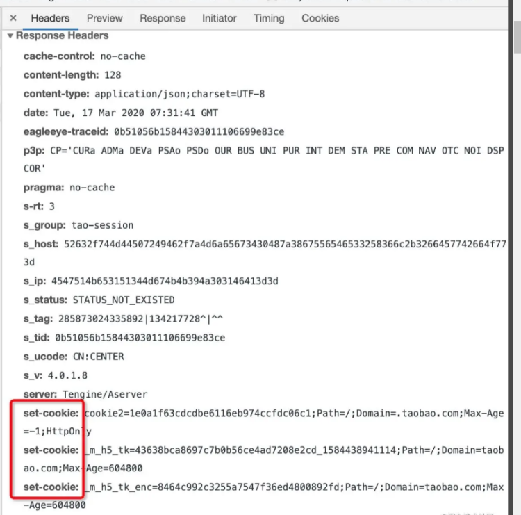
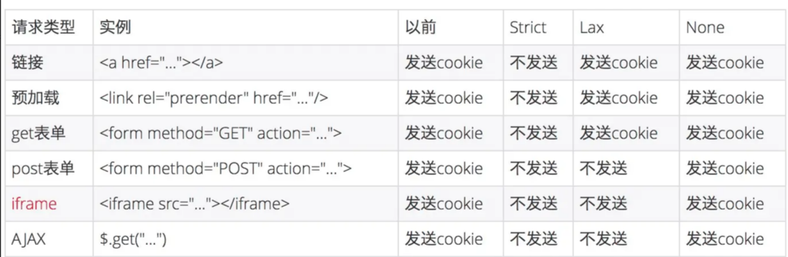
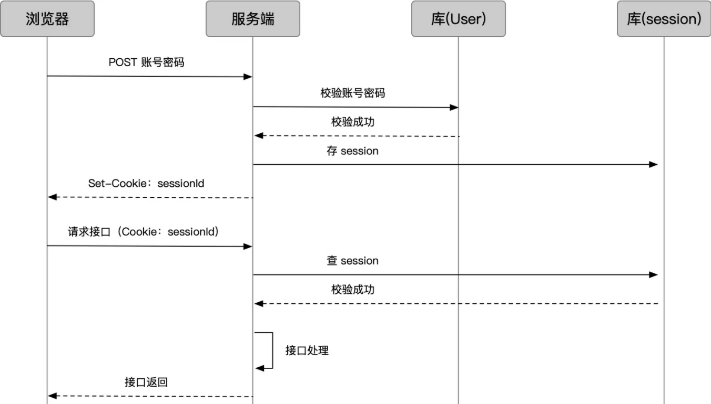
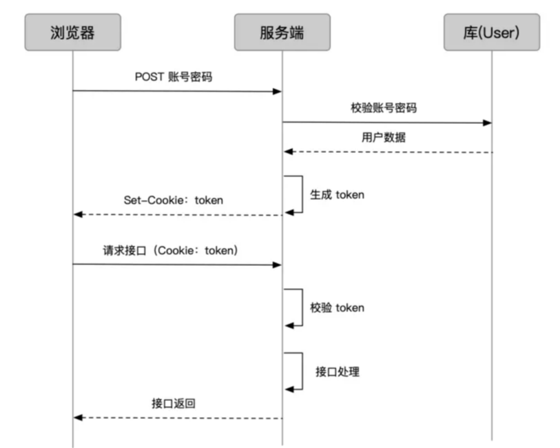

# 前端鉴权笔记

## 域名区别

- 顶级域名就是一级域名，比如 .com .org .cn。如 https://juejin.cn/ 中的.cn是顶级域名，也是一级域名，juejin.cn 是二级域名。
- https://www.yuque.com/ 中的 www.yuque.com 和 host.yuque.com 同为三级域名（只是人们习惯使用www为前缀的三级域名作为网站的主域名入口）

## 认证: Authentication

互联网中的认证：

- 用户名密码登录
- 邮箱发送登录链接
- 手机号接收验证码
- 数字验证码，滑动验证、图片文字验证码

## 授权: Authorization

- 实现授权的方式有：cookie、session、token、OAuth

## 凭证: Credentials

实现认证和授权的前提是需要一种媒介（证书）来标记访问者的身份

## 前端存储

1. 全局对象window，刷新页面就没了
2. localStorage、sessionStorage无论怎么刷新，只要浏览器没清掉或者过期，就一直拿着这个状态。
3. cookie: Response中返回头的set-cookie 直接存储到浏览器上（ Set-Cookie由服务器发送，它包含在响应请求的头部中），前端可以自己创建 cookie，如果服务端创建的 cookie 没加HttpOnly，那前端可以修改后端返回的 cookie。调用document.cookie可以创建、修改 cookie，和 HTTP 一样，一次document.cookie能且只能操作一个 cookie。
   浏览器发起请求时，会自动把 cookie 通过 HTTP 请求头的 Cookie 字段，带给接口
   （注意，只有cookie的 domain 和 path与 请求的URL匹配才会发送这个cookie）
   （默认跨域请求是不携带cookie）

- 一级域名相同，二级域名不相同，且cookie在一级域名下，可以设置document.domain = 一级域名，就可以携带cookie。
- 一级域名不同，可以配置XMLHttpRequest请求头的 withCredentials 为 true 来允许ajax请求时携带cookie。服务器server端要在 **响应的header** 中设置配置
  Access-Control-Allow-Credentials为true
  response.setHeader("Access-Control-Allow-Credentials", "true");
  当服务器端 Access-Control-Allow-Credentials = true时，
  参数Access-Control-Allow-Origin 的值不能为 '*' ，需要重新设置——**把请求的域Origin填写到响应的Header信息里（即谁访问我，我允许谁）**
  response.setHeader("Access-Control-Allow-Origin", request.getHeader("Origin"));
- Set-Cookie Header 响应头的格式如下所示：

```
Set-Cookie: <name>=<value>[; <name>=<value>]...
            [; expires=<date>][; domain=<domain_name>]
            [; path=<some_path>][; secure][; httponly][;SameSite]

```

- expires/max-age =`<date>`: 设置cookie的有效期，如果cookie 超过 date 所表示的日期时，cookie将失效。 如果没有设置这个选项，那么cookie将在浏览器关闭时失效。
  另外，浏览器根据本地时间，决定 Cookie 是否过期，由于本地时间是不精确的，所以没有办法保证 Cookie 一定会在服务器指定的时间过期。
- Max-Age：指定从现在开始 Cookie 存在的秒数，比如60 * 60 * 24 * 365（即一年）。过了这个时间以后，浏览器就不再保留这个 Cookie。
  如果同时指定了Expires和Max-Age，那么Max-Age的值将优先生效。
  如果Set-Cookie字段没有指定Expires或Max-Age属性，那么这个 Cookie 就是 Session Cookie，即它只在本次对话存在，一旦用户关闭浏览器，浏览器就不会再保留这个 Cookie。
- domain=<domain_name> : .taobao.com(a.taobao.com和b.taobao.com都可以访问)，但是不能设置成taobao.com，这样是不允许的携带cookies
- path=<some_path>: 一般是 /
  (注：临时cookie (没有expires参数的cookie) 不能带有domain选项。)
  当客户端发送一个http请求时，会将有效的cookie一起发送给服务器。
  如果一个cookie的domain和path参数和URL匹配，那么这个cookie就是有效的。
- secure: secure属性指定浏览器只有在加密协议 HTTPS 下，才能将这个 Cookie 发送到服务器。
  另一方面，如果当前协议是 HTTP，浏览器会自动忽略服务器发来的Secure属性。该属性只是一个开关，不需要指定值。如果通信是 HTTPS 协议，该开关自动打开。
- httponly : 表示cookie不能被客户端脚本获取到。HttpOnly属性指定该 Cookie 无法通过 JavaScript 脚本拿到，主要是Document.cookie属性、XMLHttpRequest对象和 Request API 都拿不到该属性。这样就防止了该 Cookie 被脚本读到，只有浏览器发出 HTTP 请求时，才会带上该 Cookie。
  （但还是能通过 Application 中手动修改 cookie，所以只是在一定程度上可以防止 XSS 攻击，不是绝对的安全）有助于避免 XSS 攻击。（防止通过srcipt标签里面的代码获取cookie）

```
Set-Cookie: 
username=jimu; domain=jimu.com; path=/blog; Expires=Wed, 21 Oct 2015 07:28:00 GMT; Secure; HttpOnly

```

一次性 set 多个cookie，多给几个Set-Cookie 头（一次 HTTP 请求中允许重复）

```
Set-Cookie: username=jimu; domain=jimu.com
Set-Cookie: height=180; domain=me.jimu.com
Set-Cookie: weight=80; domain=me.jimu.com
```


604800秒等于七天

- SameSite:  2020年2 月份发布的 Chrome 80 版本中默认屏蔽了第三方的 Cookie，SameSite默认为lax。SameSite 属性可以让 Cookie 在跨站请求时不会被发送，从而可以阻止跨站请求伪造攻击（CSRF），限制了一些第三方的广告。
  - Strict：仅允许一方请求携带 Cookie，即浏览器将只发送相同站点请求的 Cookie，即当前网页 URL 与请求目标 URL 完全一致。
  - Lax：允许部分第三方请求携带 Cookie
  - None无论是否跨站都会发送 Cookie，Chrome80以下默认是 None 的，Chrome80 后默认是 Lax。
  - SameSite带来的改变
    
    从上图可以看出，对大部分 web 应用而言，Post 表单，iframe，AJAX，Image 这四种情况从以前的跨站会发送三方 Cookie，变成了不发送。
    **Post表单**：应该的，学 CSRF 总会举表单的例子。
    **iframe**：iframe 嵌入的 web 应用有很多是跨站的，都会受到影响。
    **AJAX**：可能会影响部分前端取值的行为和结果。
    **Image**：图片一般放 CDN，大部分情况不需要 Cookie，故影响有限。但如果引用了需要鉴权的图片，可能会受到影响。
    除了这些还有 **script** 的方式，这种方式也不会发送 Cookie，像淘宝的大部分请求都是 jsonp，如果涉及到跨站也有可能会被影响。
    **需要注意的地方**：HTTP 接口不支持 SameSite=none如果你想加 SameSite=none 属性，那么该 Cookie 就必须同时加上 Secure 属性，表示只有在 HTTPS 协议下该 Cookie 才会被发送。需要 UA 检测，部分浏览器不能加 SameSite=none

### 跨域和跨站

首先要理解的一点就是跨站和跨域是不同的。同站(same-site)和跨站(cross-site)、第一方(first-party)和第三方(third-party)是等价的。但是与浏览器同源策略（SOP）中的「同源(same-origin)、跨域(cross-origin)」是完全不同的概念。

举几个例子，www.taobao.com 和 www.baidu.com 是跨站，www.a.taobao.com 和 www.b.taobao.com 是同站，a.github.io 和 b.github.io 是跨站(注意是跨站)。  **.com 和 .giuhub.io 是顶级域名**，a.github.io 和 b.github.io 是中的a、b是二级域名

## 服务端 session



- 浏览器登录发送账号密码(加密过的)，服务端查用户库，校验用户
- 服务端把用户登录状态存为 Session，生成一个 sessionId
- 通过登录接口返回，把 sessionId  **set-cookie** 到 cookie 上
- 此后浏览器再请求业务接口，sessionId 随 cookie 带上
- 服务端查 sessionId 校验 session
- 成功后正常做业务处理，返回结果

### Session 的存储方式

- Redis（推荐）：内存型数据库。以 key-value 的形式存，访问快。
- 内存/缓存：直接放到变量里。一旦服务重启，就全没了
- 数据库：普通数据库，性能不高。

Session 的过期和销毁很简单，只要把存储的session 数据销毁就可以。

#### 优点：

- 较安全：客户端每次请求时无需发送身份信息，只需发送 SessionID。
- 较高效：服务端无需每次处理请求时都要验证身份信息，只需通过 SessionID 查询 Session对象。

#### 缺点：

- 扩展性差，Session 对象保存在服务端，如果是保存在多个服务器上，有一致性问题，
  如果保存在单个服务器上，无法适应用户增长。
- 基于 Cookie 的 SessionID 不能跨域共享，同一用户的多个客户端（如浏览器客户端和 APP不能共享 SessionId。
- 基于 Cookie 的 SessionID 易被截获生成 CSRF 攻击。

## 应用方案：token，不存在数据库里面的

session 的维护给服务端造成很大困扰，我们必须找地方存放它，又要考虑分布式的问题，甚至要单独为了它启用一套 Redis 集群。有没有更好的办法？

token 的流程是这样的：token不一定放在cookie里面，可以放在localstorage里，拼接上。

- 用户登录，服务端校验账号密码，获得用户信息
- 把用户信息、token（秘钥） 配置编码成 token，通过 cookie set 到浏览器
- 此后用户请求业务接口，通过 cookie 携带 token
- 接口校验 token 有效性，进行正常业务接口处理

**客户端token的存储方式**：web 应用的主流方式仍是放在 cookie 里
**token 的过期**：如何控制 token 的有效期呢？把「过期时间」和数据一起塞进去，验证时判断就好。token的编码一般是base64
**防篡改**：将数据和秘钥一起用加密算法加密

基于token 的用户认证是一种服务端无状态的认证方式，服务端不用存放 token 数据。用解析 token 的计算时间换取 session 的存储空间，从而减轻服务器的压力，减少频繁的查询数据库

## JWT

JSON Web Token（简称 JWT）是目前最流行的**跨域认证**解决方案

- 用户输入用户名/密码登录，服务端认证成功后，会返回给客户端一个 JWT
- 客户端将 token 保存到本地（通常使用 localstorage，也可以使用 cookie）
- 当用户希望访问一个受保护的路由或者资源的时候，需要请求头的 Authorization 字段中使用Bearer 模式添加 JWT，其内容看起来是下面这样

```
Authorization: Bearer <token>
```

- 服务端的保护路由将会检查请求头 Authorization 中的 JWT 信息，如果合法，则允许用户的行为
- 因为 JWT 是自包含的（内部包含了一些会话信息），因此减少了需要查询数据库的需要
- 因为 JWT 并不使用 Cookie 的，所以你可以使用任何域名提供你的 API 服务而不需要担心跨域资源共享问题（CORS）
- 因为用户的状态不再存储在服务端的内存中，所以这是一种无状态的认证机制

### JWT 的使用方式

- 客户端收到服务器返回的 JWT，可以储存在 Cookie 里面，也可以储存在 localStorage

## 单点登录

但当我们业务线越来越多，就会有更多业务系统分散到不同域名（主域名）下，就需要「一次登录，全线通用」的能力，叫做「单点登录」。

### 虚假的单点登录（主域名相同）

简单的，如果业务系统都在同一主域名下，比如wenku.baidu.com（百度文库）、tieba.baidu.com（百度贴吧）。可以直接把 cookie的domain设置为主域名.baidu.com。

### 真实的单点登录（主域名不同）

比如滴滴这么潮的公司，同时拥有
didichuxing.com (滴滴出行)
xiaojukeji.com(小桔科技)
didiglobal.com(滴滴共享汽车) 等域名，种 cookie 是完全绕不开的。
这要能实现「一次登录，全线通用」，才是真正的单点登录。
这种场景下，我们需要独立的认证服务，通常被称为 SSO。

## 一次「从 A 系统引发登录，到 B 系统不用登录」的完整流程


- 用户进入 A 系统，没有登录凭证（ticket），A 系统给他跳到 SSO
- SSO 没登录过，也就没有 sso 系统下没有凭证（注意这个和前面 A ticket 是两回事），输入账号密码登录
- SSO 账号密码验证成功，通过接口返回做两件事：一是种下 sso 系统下凭证（记录用户在 SSO 登录状态）；二是下发一个 ticket
- 客户端拿到 ticket，保存起来，带着请求系统 A 接口
- 系统 A 校验 ticket，成功后正常处理业务请求
- 此时用户第一次进入系统 B，没有登录凭证（ticket），B 系统给他跳到 SSO
- SSO 登录过，系统下有凭证，不用再次登录，只需要下发 ticket
- 客户端拿到 ticket，保存起来，带着请求系统 B 接口

对浏览器来说，SSO 域下返回的数据要怎么存，才能在访问 A 的时候带上？浏览器对跨域有严格限制，cookie、localStorage 等方式都是有域限制的。
这就需要也只能由 A 提供 A 域下存储凭证的能力。一般我们是这么做的：

图中我们通过颜色把浏览器当前所处的域名标记出来。注意图中灰底文字说明部分的变化。

- 在 SSO 域下，SSO 不是通过接口把 ticket 直接返回，而是通过一个带 code 的 URL 重定向到系统 A 的接口上，这个接口通常在 A 向 SSO 注册时约定
- 浏览器被重定向到 A 域下，带着 code 访问了 A 的 callback 接口，callback 接口通过 code 换取 ticket
- 这个 code 不同于 ticket，code 是一次性的，暴露在 URL 中，只为了传一下换 ticket，换完就失效
- callback 接口拿到 ticket 后，在自己的域下 set cookie 成功
- 在后续请求中，只需要把 cookie 中的 ticket 解析出来，去 SSO 验证就好
- 访问 B 系统也是一样

## 总结

- HTTP 是无状态的，为了维持前后请求，需要前端存储标记
- cookie 是一种完善的标记方式，通过 HTTP 头或 js 操作，有对应的安全策略，是大多数状态管理方案的基石
- session 是一种状态管理方案，前端通过 cookie 存储 id，后端存储数据，但后端要处理分布式问题
- token 是另一种状态管理方案，相比于 session 不需要后端存储，数据全部存在前端，解放后端，释放灵活性
- token 的编码技术，通常基于 base64，或增加加密算法防篡改，jwt 是一种成熟的编码方案
- 在复杂系统中，token 可通过 service token、refresh token 的分权，同时满足安全性和用户体验
- session 和 token 的对比就是「用不用cookie」和「后端存不存」的对比
- 单点登录要求不同域下的系统「一次登录，全线通用」，通常由独立的 SSO 系统记录登录状态、下发 ticket，各业务系统配合存储和认证 ticket

### 参考

[前端鉴权](https://juejin.cn/post/6898630134530752520)
