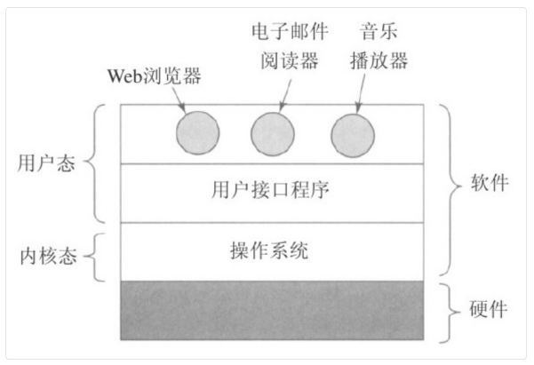

### 计算机运行模式

多数计算机有两种运行模式：内核态和用户态。
软件中最基础的部分是操作系统，它运行在内核态。这内核态模式下，操作系统具有对所有硬件的完全
访问权，可以执行机器能够运行的任何指令。软件的其余部分运行在用户态下，在用户态下，只能使用
机器指令中的一个子集。

### 用户与操作系统（内核态）的交互程序：shell

### 多路复用资源方式

在时间上复用：当一种资源在时间上复用时，不同的程序或用户轮流使用它。
在空间上复用：每个客户得到资源的一部分。

## 第二章 进程与线程

### 一、进程

#### 1. 进程模型

在进程模型中，计算机上所有可运行的软件（应用程序），通常也包括操作系统，被组织成若干顺序进程，简称**进程**。一个进程就是一个正在执行程序的实例，包括程序计数器、寄存器和变量的当前值。

### 二、线程

人们需要多线程的主要原因是，在许多应用中同时发生着多种活动。其中某些活动随着时间的推移会被阻塞。通过将这些应用程序分解成可以准并行运行的多个顺序线程，程序设计模型会变得更简单。
第二个关于需要多线程的理由是，由于线程比进程更轻量级，所以它们比进程更容易（即更快）创建， 也更容易撤销。在许多系统中，创建一个线程较创建一个进程要快10～100倍。需要多线程的第三个原因涉及性能方面的讨论。若多个线程都是 CPU 密集型的，那么并不能获得性能上的增强，但是如果存在着大量的计算和大量的 I/O 处理，拥有多个线程允许这些活动彼此重叠进行，从而会加快应用程序执行的速度。

#### 官方解释

进程是CPU资源分配的最小单位
线程是CPU调度的最小单位
进程是程序的一次运行活动，也是操作系统在分配调度资源的一个独立单位，
线程是进程的一个实体，一个进程至少有一个进程进程和线程是一对多的关系，
进程和线程的主要区别在于：进程是有独立的地址间，而线程是没有的
同一个进程下的线程是共享进程的地址空间的，切线程比切换进程的开销低，效率高

一个进程可以有很多线程，同一进程中的多个线程享该进程中的全部系统资源，同一进程中的多个线有各自的调用栈，线程本地存储。
浏览器是有多进程的

1. Browser进程 负责浏览器界面显示，资源的管理
2. 第三方插件进程 每种类型的插件对应一个进程仅当使用该插件时才创建
3. GPU进程 负责3D绘制
4. 浏览器内核：Render进程，内部是多线程的
   - GUI渲染引擎 线程 负责渲染浏览器界面，解析HTML，CSS，构建DOM树和RenderObject树，布局和绘制等
   - JS引擎 单线程  解析和执行Javascript来实现网页特效
   - 事件触发 线程
   - 定时器 线程
   - 异步http请求 线程
