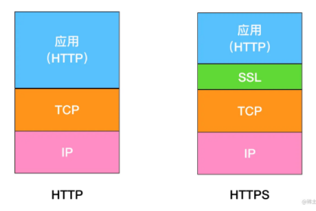
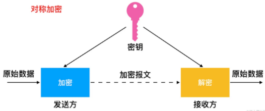
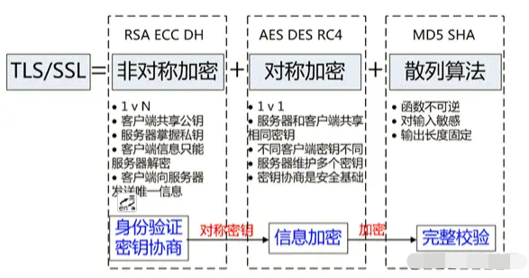
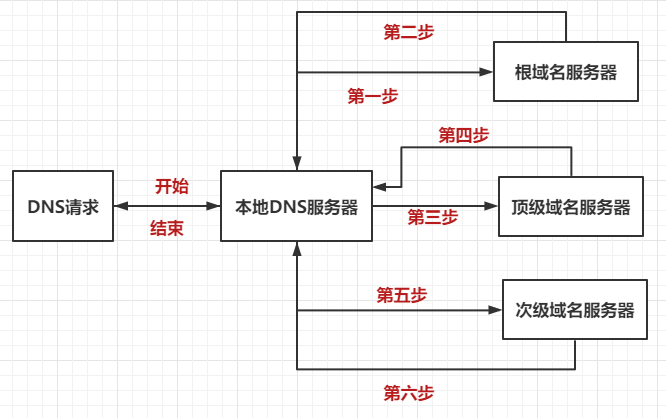
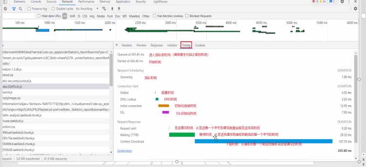

# http（笔记）

**常见应用层协议：**
- (1)、域名系统(Domain Name System，DNS)：用于实现网络设备名字到IP地址映射的网络服务。**(UDP)**
- (2)、文件传输协议(File Transfer Protocol，FTP)：用于实现交互式文件传输功能。**(TCP)**
- (3)、简单邮件传送协议(Simple Mail Transfer Protocol, SMTP)：用于实现电子邮箱传送功能。**(TCP)**
- (4)、超文本传输协议(HyperText Transfer Protocol，http)：用于实现WWW服务。**(TCP)**
- (5)、Websocket(ws)是一种持久链接的协议，只需一次握手，前后端之间可以随时交换数据 **(TCP)**

# 1、应用层

http默认80端口，https默认443端口，相互传递报文
## http 无状态
http 是一个无状态的协议，http 服务器不会保存关于客户的任何信息

## http的长链接和短链接
http 有两种连接模式，一种是持续(长)连接，一种非持续(短)连接。长连接下，TCP 连接默认不关闭，采用长连接的好处是可以避免每次建立 TCP 连接三次握手时所花费的时间。http 协议的长连接和短连接，实质上是 TCP 协议的长连接和短连接。

### http1.0 使用的短连接
请求头加上 Connection: keep-a live 来要求服务器不要关闭 TCP 连接。在当时，由于通信的文件比较小，而且每个页面的引用也不多，所以这种传输形式没什么大问题。但是随着浏览器普及，单个页面中的图片文件越来越多，有时候一个页面可能包含了几百个外部引用的资源文件，如果在下载每个文件的时候，都需要经历建立TCP连接、传输数据和断开连接这样的步骤，无疑会增加大量无谓的开销。 为了解决这个问题，http/1.1中增加了持久连接的方法，它的特点是在一个TCP连接上可以传输多个http 请求，只要浏览器或者服务器没有明确断开连接，那么该TCP连接会一直保持。
### http1.1 默认采用的是长连接
如果你不想要采用持久连接，可以在http请求头中加上`Connection: close（默认为Connection: keep-alive）`，目前chrome浏览器中对于同一个域名，默认允许同时建立6个TCP持久连接。

## http1.1对带宽的利用率却并不理想
带宽是指每秒最大能发送或者接收的字节数，http/1.1对带宽的利用率不理想，是因为http/1.1很难将带宽用满。比如我们常说的100M带宽， 实际的下载速度能达到12.5M/S。

### 第一个原因，TCP的慢启动

一旦一个TCP连接建立之后，就进入了发送数据状态，刚开始TCP协议会采用一个非常慢的速度去发送数据，然后慢慢加快发送数据的速度，直到发送数据的速度达到一个理想状态，我们把这个过程称为慢启动。（慢启动是TCP为了减少网络拥塞的一种策略，我们是没有办法改变的。）
### 第二个原因，http1.1的队头阻塞
持久链接，虽然能减少TCP的链接和断开次数，但是它需要等待前面的请求返回之后，才能进行下一次请求。如果TCP通道中的某个请求因为某些原因没有及时返回，那么就会阻塞后面的所有请求，这就是著名的队头阻塞的问题。

## 3.http请求报文

1. 请求行: GET  /path  HTTP/1.1   请求方法、请求路径、http版本
2. 请求头，设置一些参数
3. 空行：区分请求头和实体
4. 数据体：存放参数

## 4.http响应报文

1. 响应行 HTTP/1.0  200  OK   http版本、状态码、状态信息
2. 响应头，设置一些参数
3. 空行：区分请求头和实体
4. 数据体：返回数据

## 5.http2.0 二进制协议

http/1.1 版中，报文的头信息必须是文本，数据体可以是文本，也可以是二进制。
http/2 则是一个彻底的二进制协议，头信息和数据体都是二进制。

http/2的思路就是一个域名只使用一个TCP⻓连接来传输数据，这样整个页面资源的下载过程只 需要一次慢启动，同时也避免了多个TCP连接竞争带宽所带来的问题。 另外，就是队头阻塞的问题，等待请求完成后才能去请求下一个资源，这种方式无疑是最慢的，所以 http/2需要实现资源的并行请求，也就是任何时候都可以将请求发送给服务器，而并不需要等待其他请求的完成，然后服务器也可以随时返回处理好的请求资源给浏览器。
所以，http/2的解决方案可以总结为:**一个域名只使用一个TCP连接和消除队头阻塞问题**

1. **多路复用**，其实是复用 TCP 连接，客户端和服务器都可以同时发送多个请求或响应，而且不用按照顺序一一发送，这样就避免了**"队头堵塞**"的问题。

- http1.x 为了解决效率问题，可能会尽量多的发起并发的请求去加载资源，然而浏览器对于同一域名下的并发请求有限制，而优化的手段一般是将请求的资源放到不同的域名下来突破这种限制。
- 而 http2.0 支持的多路复用可以很好的解决这个问题，多个请求共用一个 TCP 连接，多个请求可以同时在这个 TCP 连接上并发，一个是解决了建立多个 TCP 连接的消耗问题，一个也解决了效率的问题。那么是什么原理支撑多个请求可以在一个 TCP 连接上并发呢？基本原理就是上面的二进制分帧，因为每一帧都有一个身份标识id，所以多个请求的不同帧可以并发的无序发送出去，在服务端会根据每一帧的身份标识id，将其整理到对应的 request 中。（二进制分帧层，就实现了http的多路复用技术）

（多路复用，基于二进制分帧层）
二进制分帧层

2. 头信息压缩，减少带宽浪费，加快请求、响应的速度
3. 服务器推送，http/2 允许服务器未经请求，主动向客户端发送资源，这叫做服务器推送。 http2 下服务器主动推送的是静态资源，和WebSocket推送是不同的。

http/2还可以直接将数据提前推送到浏览器。你可以想象这样一个场景，当用 戶请求一个HTML⻚面之后，服务器知道该HTML⻚面会引用几个重要的JavaScript文件和CSS文件，那么在 接收到HTML请求之后，附带将要使用的CSS文件和JavaScript文件一并发送给浏览器，这样当浏览器解析 完HTML文件之后，就能直接拿到需要的CSS文件和JavaScript文件，这对首次打开⻚面的速度起到了至关 重要的作用。

http/2中，多个请求是跑在一个TCP管道中的，如果其中任意一路数据流中出现了丢包的情况，那么就会阻塞该TCP连接中的所有请求。这不同于http/1.1，使用**http/1.1**时，**浏览器为每个域名开启了6个TCP连接**，如果其中的1个TCP连接发生了队头阻塞，那么其他的5个连接依然可以继续传 输数据。
（网络延迟：RTT）
（http2解决了同域名n多请求堵塞的问题，解决了预加载其他应用的问题。不丢包多项目应用提高几十倍的性能。）

## 了解http3：QUIC协议（全称Quick UDP Internet Connections，快速UDP互联网连接）

http/3是UDP协议，基于UDP实现了类似于 TCP的多路数据流、传输可靠性、流量控制、TLS加密功能、实现了快速握手功能等功能（QUIC协议是http3、是应用层协议）

为了解决传输层tcp队头阻塞问题（http2出现丢包，就会造成队头阻塞），http/3通过 QUIC 在每个连接中把数据分为单独的数据流，数据流是短暂的"子链接"，每个流处理自己的错误重试，每个http请求运行在单独的流上，因此数据包的丢失不会影响其它请求的传输

## 6.https 协议：加密的http

通过TLS/SSL 来对数据加密，加密(Encryption)， httpS 通过对数据加密来使其免被第三方对数据的监听
在 https 中，使用传输层安全性(TLS)或安全套接字层(SSL)对通信协议进行加密。
也就是 http + SSL(TLS) = https。


SSL 是一个独立的协议，不只有 http 可以使用，其他应用层协议也可以使用，比如 SMTP(电子邮件协议)、Telnet(远程登录协议) 等都可以使用。

对称加密(Symmetrical Encryption)顾名思义就是指**加密和解密时使用的密钥都是同样的密钥**。


https 协议的主要功能基本都依赖于 TLS/SSL 协议，TLS/SSL 的功能实现主要依赖于三类基本算法：散列函数 、对称加密和非对称加密，其利用非对称加密实现身份认证和密钥协商，对称加密算法采用协商的密钥对数据加密，基于散列函数验证信息的完整性。


### TLS 握手过程

1. 第一步，客户端向服务器发起请求，请求中包含使用的**TLS协议版本号**、生成的**一个随机数**、以及**客户
   端支持的加密方法**。
2. 第二步，服务器端接收到请求后，**确认**双方使用的**加密方法**、并给出**服务器的安全证书**、以及**一个服务器生成的随机数**。
3. 第三步，客户端确认**服务器的数字证书**有效后，生成一个**新的随机数**，并使用**数字证书中的公钥，加密这个随机数**，然后发给服务器（并且还会提供一个前面所有内容的 hash 的值，用来供服务器检验）
4. 第四步，**服务器使用自己的私钥，来解密客户端发送过来的随机数**。（并提供前面所有内容的 hash
   值来供客户端检验。）
5. 第五步，客户端和服务器端根据**约定的加密方法使用**前面的**三个随机数**，**生成对话秘钥**，以后的对
   话过程都使用这个对话**秘钥**来加密信息。

TLS 的握手过程主要用到了三个方法来保证传输的安全。

1. 首先是对称加密的方法，对称加密的方法是，双方使用同一个秘钥对数据进行加密和解密。但是对称加密的存在一个问题，就是如何保证秘钥传输的安全性，因为秘钥还是会通过网络传输的，一旦秘钥被其他人获取到，那么整个加密过程就毫无作用了。 这就要用到非对称加密的方法。
2. 非对称加密的方法是，我们拥有两个秘钥，一个是公钥，一个是私钥。公钥是公开的，私钥是保密的。用私钥加密的数据，只有对应的公钥才能解密，用公钥加密的数据，只有对应的私钥才能解密。我们可以将公钥公布出去，任何想和我们通信的客户，都可以使用我们提供的公钥对数据进行加密，这样我们就可以使用私钥进行解密，这样就能保证数据的安全了。但是非对称加密有一个缺点就是加密的过程很慢，因此如果每次通信都使用非对称加密的方式的话，反而会造成等待时间过长的问题。
3. 因此我们可以**使用对称加密和非对称加密结合的方式**，因为对称加密的方式的缺点是无法保证秘钥的安全传输，因此我们可以**用非对称加密的方式来对 **对称加密的秘钥进行传输，然后以后的通信使用对称加密的方式来加密，这样就解决了两个方法各自存在的问题。

### 添加数字证书

对称和非对称混合方式，完美地实现了数据的加密传输。

不过这种方式依然存在着问题，比如我要打开百度的官网，但是黑客通过 DNS 劫持将百度官网的 IP 地址替换成了黑客的 IP 地址，这样我访问的其实是黑客的服务器了，黑客就可以在自己的服务器上实现公钥和私钥，而对浏览器来说，它完全不知道现在访问的是个黑客的站点。

所以我们还需要服务器向浏览器提供证明“我就是我”，那怎么证明呢？
使用权威机构（CA）颁发的证书————数字证书(Digital Certificate)。

对于浏览器来说，数字证书有两个作用：一个是通过数字证书向浏览器证明服务器的身份，另一个是数字证书里面包含了服务器公钥。

相较于(对称和非对称混合方式)，这里主要有两点改变：

- 服务器没有直接返回公钥给浏览器，而是返回了数字证书，而公钥正是包含在数字证书中的；
- 在浏览器端多了一个证书验证的操作，验证了证书之后，才继续后续流程。

通过引入数字证书，我们就实现了服务器的身份认证功能，这样即便黑客伪造了服务器，但是由于证书是没有办法伪造的，所以依然无法欺骗用户。
(有了数字证书，黑客就无法欺骗用户)

### 如何申请数字证书

如何向 CA 申请证书。比如百度需要向某个 CA 去申请数字证书

- 首先百度需要准备一套私钥和公钥，私钥留着自己使用；
- 然后百度向 CA 机构提交公钥、公司、站点等信息并等待认证，这个认证过程可能是收费的；
- CA 通过线上、线下等多种渠道来验证百度所提供信息的真实性，如公司是否存在、企业是否合法、域名是否归属该企业等；
- 如信息审核通过，CA 会向百度签发认证的数字证书，包含了百度的公钥、组织信息、CA 的信息、有效时间、证书序列号等，这些信息都是明文的，同时包含一个 **CA 生成的数字签名**。

### 数字签名的过程：

首先 CA 使用 **Hash 函数**来处理百度提交的明文信息，并得出数据信息；然后 CA 再使用CA自己的私钥对数据信息进行加密，加密后的密文就是 CA 颁给百度的数字签名。

### 浏览器如何验证数字证书

当浏览器向极客时间服务器发出请求时，服务器会返回数字证书给浏览器。

浏览器接收到数字证书之后，会对数字证书进行验证。

- 首先浏览器读取服务器返回的证书中相关的明文信息，采用 CA 签名时相同的 Hash 函数来计算并得到信息摘要 A；
- 然后再利用**对应 CA 的公钥**解密**数字签名**数据，得到信息摘要 B；对比信息摘要 A 和信息摘要 B，如果一致，则可以确认证书是合法的，即证明了这个服务器是百度的；同时浏览器还会验证证书相关的域名信息、有效时间等信息。

### https总结

1. 对称加密传输（协商秘钥的过程容易被窃取）
2. 非对称加密传输（服务端用私钥加密的内容，可以通过它的公钥进行解密）
3. 非对称加密交换秘钥、对称加密传输内容（DNS劫持，如何保证服务器是可信的）
4. 引入CA权威机构保证服务器可信性。

## 7.DNS协议，域名解析

DNS 协议基于 UDP 协议，使用 53 号端口。 域名结构：**主机名.次级域名.顶级域名.根域名**
DNS**查询过程**
DNS 的查询过程一般为，将 DNS 请求发送到**本地 DNS 服务器**，由本地 DNS 服务器来代为请求。


DNS请求——本地DNS（递归查询） 本地NDS——其他域名服务器(迭代查询)
**递归查询和迭代查询 **
递归查询指的是查询请求发出后，域名服务器代为向下一级域名服务器发出请求，最后向用户返回查询
的最终结果。使用递归查询，用户只需要发出一次查询请求。
迭代查询指的是查询请求后，域名服务器返回单次查询的结果。下一级的查询由用户自己请求。使用迭
代查询，用户需要发出多次的查询请求。
**一般我们向本地 DNS 服务器发送请求的方式就是递归查询**，因为我们只需要发出一次请求，然后本地
DNS 服务器返回给我们最终的请求结果。而**本地 DNS 服务器向其他域名服务器请求的过程是迭代查询的过程**，因为每一次域名服务器只返回单次查询的结果，下一级的查询由本地 DNS 服务器自己进行。

DNS预解析dns-prefetch提升页面载入速度优化前端性能

```css
DNS Prefetch 应该尽量的放在网页的前面，推荐放在 <meta charset="UTF-8"> 后面。
<meta http-equiv="x-dns-prefetch-control" content="on">
<link rel="dns-prefetch" href="//www.zhix.net">
<link rel="dns-prefetch" href="//api.share.zhix.net">
<link rel="dns-prefetch" href="//bdimg.share.zhix.net">
预解析的实现：

1、用meta信息来告知浏览器, 当前页面要做DNS预解析:
<meta http-equiv="x-dns-prefetch-control" content="on" />

2、在页面header中使用link标签来强制对DNS预解析: 
<link rel="dns-prefetch" href="http://bdimg.share.baidu.com" />

注：dns-prefetch需慎用，多页面重复DNS预解析会增加重复DNS查询次数。

需要注意的是，虽然使用 DNS Prefetch 能够加快页面的解析速度，
但是也不能滥用，因为有开发者指出 禁用DNS 预读取能节省每月100亿的DNS查询。
如果需要禁止隐式的 DNS Prefetch，可以使用以下的标签：
<meta http-equiv="x-dns-prefetch-control" content="off">
```

不同的浏览器对单个域名的最大并发连接数有一定的限制，比如谷歌是6个

```css
提高浏览器并发连接数：
不同的浏览器对单个域名的最大并发连接数有一定的限制，http/1.0 和 http/1.1 也不相同。
这个时候，如果浏览器同时对某一域名发起多个请求，超过了限制就会出现等待，也就是阻挡。

那么为了解决阻挡这一问题，我们可以对某些URL的域名分散处理，比如我们的图片域名，
一般用类似img.yolo.com的域名，当一个页面包含20多张图片的时候，那至少有10几个请求会被阻挡，
而如果我们分散到img0.yolo.com/img1.yolo.com/img2.yolo.com/…等不同域名的时候，
至少这20个图片请求会并发进行，网站打开速度会明显提升很多。
```

## 2、传输层

**多路复用:  **将封装好的报文段传递到网络层
**多路分解:  **报文段中的数据交付到正确应用层

#### 2(1)  UDP 协议   无连接，不可靠

UDP 是一种无连接的，不可靠的传输层协议。UDP不需要握手，不保证数据一定会发送到对方。
UDP 支持一对一，一对多，多对一，多对多通信。

#### 2(2) TCP 协议   面向连接，可靠

TCP 协议是面向连接的，提供可靠数据传输服务的传输层协议。TCP 协议提供的是点对点（一对一）的服务，即它是在单个发送方和单个接收方之间的连接。
TCP 协议提供的是全双工的服务，也就是说连接的双方的能够向对方发送和接收数据。

TCP 提供了拥塞控制机制，在网络拥塞的时候会控制发送数据的速率，有助于减少数据包的丢失和
减轻网络中的拥塞程度。
TCP 提供了流量控制机制，保证了通信双方的发送和接收速率相同。如果接收方可接收的缓存很小
时，发送方会降低发送速率，避免因为缓存填满而造成的数据包的丢失。

ARQ 协议指的是自动重传请求，它通过**超时**和**重传**来保证数据的可靠交付
它分为停止等待 ARQ 协议和连续 ARQ 协议。

停止等待 ARQ 协议是啥呢？发送方发送一个分组，开启一个定时器，收到回答了就清除定时器，继续发送下一个分组。如果超时，则重新发送上一个分组。
**停止等待 ARQ 协议的缺点**是每次发送分组必须等到分组确认后才能发送下一个分组，这样会造成信
道的利用率过低。

连续 ARQ 协议是为了解决停止等待 ARQ 协议对于信道的利用率过低的问题。它是连续发送一组分
组。
连续 ARQ 协议如何处理分组差错？ 滑动窗口和选择重传

**TCP 的可靠运输机制**是基于连续 ARQ 协议的滑动窗口协议
**TCP 的流量控制机制 ：控制发送方的发送速率，保证接收方来得及接收**。
因为一旦发送的速率大于接收方所能接收的速率，就会造成报文段的丢失。接收方主要是通过接收窗口来告诉发送方自己所能 接收的大小，发送方根据接收方的接收窗口的大小来调整发送窗口的大小，以此来达到控制发送速率的目的。
**TCP 的拥塞控制机制 ：**根据网络中的拥塞情况来控制发送方数据的发送速率，如果网络处于拥塞的状态，发送方就减小发送的速率，这样一方面是为了避免继续增加网络中的拥塞程度，另一方面也是为了避免网络拥塞可能造成的报文段丢失。
TCP 的拥塞控制主要使用了四个机制，分别是慢启动（慢开始）、拥塞避免、快速重传和快速恢复。

## 3、网络层

## 4、数据链路层

## 5、物理层

## 从浏览器输入url按下回车的整个过程

(1)**缓存**: 浏览器会判断 url 请求的资源是否在缓存里，如果请求的资源在缓存里并且没有失效，那么就直接使用，否则向服务器发起新的请求
(2) **DNS域名的解析**：浏览器会判断本地是否有该域名的 IP 地址的缓存，如果有则使用，如果没有则向本地 DNS 服务器发起请求。。。。
(3) TCP 建立连接的**三次握手**的过程。
(4) 如果使用的是 httpS 协议，在通信前还存在** TLS 的一个四次握手**的过程。
(5) **html解析**：当页面请求发送到服务器端后，服务器端会返回一个 html 文件，浏览器接收到响应后，开始对 html 文件进行解析，开始页面的渲染过程。构建DOM数、CSS规则数、渲染树、重排、重绘。
(6) TCP 断开连接的**四次挥手**过程。

## 正向代理和反向代理？

```javascript
正向代理:服务端不知道真实的客户端是谁，客户端请求的服务都被代理服务器 代替转发
反向代理：当我们请求一个网站的时候，反向代理服务器 会帮我们把请求转发到 真实的服务器那里去。
反向代理器一般用来实现负载平衡。
```

## http 请求方法 options 方法有什么用？预检请求

判断是否有对指定资源的访问权限

```javascript
用于客户端查看服务器的性能、请求服务器返回该资源所支持的所有 http 请求方法、
可以测试服务器功能是否正常、判断是否有对指定资源的访问权限。
```



http劫持：
http劫持分两种，一种是DNS劫持（域名劫持）、运营商http劫持（本质是TCP会话劫持。）

### 一、DNS劫持（域名劫持）

在可劫持的网络范围内，拦截 域名解析 的请求，分析其域名，把拦截条件范围外的放行，范围内的返回篡改后的ip或失去响应。

#### 效果：使特定网络无法响应或返回假地址。

#### 本质：对DNS解析服务器做手脚或使用伪造的DNS解析器。

#### 非劫持过程：（DNS解析）

1. 客户端发起域名请求到DNS解析服务器（一般是LocalDNS）；
2. DNS服务器将域名转换为公网ip（在ip运营商处查询），将请求转发给目标服务器；
3. 目标服务器响应后将数据信息回传给DNS服务器；
4. DNS服务器将响应信息转发回客户端。

#### 劫持过程：被攻击篡改后的DNS解析服务器将请求转发给虚假服务器，

1. 客户端发起域名请求到DNS解析服务器（一般是LocalDNS），但此时DNS解析服务器被攻击篡改；
2. 被攻击篡改后的DNS解析服务器将请求转发给虚假服务器；
3. 虚假服务器返回响应信息给被攻击篡改后的DNS解析服务器（也可能直接不响应）；
4. 被攻击篡改后的DNS解析服务器将虚假的响应信息转发回客户端。

#### 解决办法：

#### DNS劫持的本质

是运营商的DNS解析服务器被攻击篡改，所以可以使用自己的解析服务器代替或在客户端直接以ip的形式将请求发出去，绕过运营商的DNS解析服务器，从而避免被劫持。

### 二、内容劫持（运营商http劫持，本质：TCP会话劫持）

#### 最初出发点：

运营商为了加快用户的访问速度同时减少自己的流量损耗而做的一个劫持会话后的缓存机制，所以负载能力弱的链路上的流量，会出现劫持的现象。

#### 劫持流程：

1. 客户端发起资源请求到运营商处；
2. 运营商收到请求先检索缓存池，若有相关缓存，直接返回；若无数据，将请求转发给目标服务器；
3. 目标服务器响应并回传数据，运营商劫持了会话及其中回传数据，存入缓存，并返回给客户端。

#### 注意：

此时如果有人恶意篡改了缓存池，或者，直接劫持了会话，在真正的服务器响应之前回传了虚假的数据，那么客户端将得到错误的响应信息，同时真正的服务器响应数据将被丢弃。

#### 解决办法:

使用https加密协议，https=http + ssl(tls)。

### DNS解析过程：

1. 请求发起时，操作系统将检查浏览器缓存中是否存在该域名对应的、解析过的ip，若存在，停止解析。
2. 若不存在，浏览器将检查操作系统的host文件中是否存在对应的ip域名映射，若存在，则使用并停止解析。
3. 若不存在，操作系统将域名发送给host文件中配置的LocalDNS(即本地区域名服务器，此服务器提供本地互联网接入的DNS解析服务，性能良好，一般会缓存域名解析结果)，90%域名解析到此完成。
4. 若LDNS未命中，就进入Root Server域名服务器请求解析。
5. root server服务器给LDNS返回所查域名的主域名服务器地址(gTLD server，国际顶级域名服务器，全球13台)。
6. LDNS再向gTLD server发起请求。
7. 收到请求后，gTLD服务器查找并返回该域名对应的Name Server域名服务器的地址，这个Name Server就是注册域名服务器。
8. Name Server服务器查询存储中域名、ip的映射表，将对应ip和ttl值返回给LDNS。
9. LDNS缓存域名和ip的对应关系及ttl值。
10. LDNS将结果返回给客户端。

