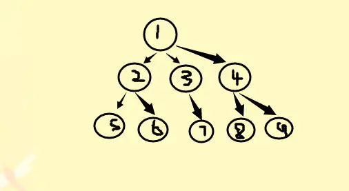
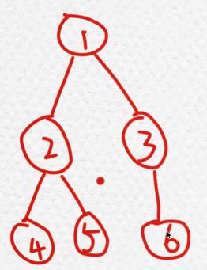
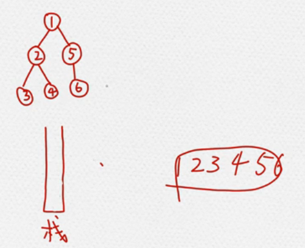

## 广度优先遍历(BFS)
按照这个顺序进行广度优先遍历，明显是队列可以完美配合整个过程：
1. 1进队列 [1]
2. 取出队列第一个元素1，将1的子节点234按顺序加入队列后面 [2, 3, 4]
3. 取出队首元素2，将他的子节点按顺序加入队列 [3，4，5，6]
4. 取出3，将子节点7加入 [4, 5, 6, 7]
5. 取出4，将子节点89加入[5, 6, 7, 8, 9]
6. 取出5，没有子节点，没有什么干
7. 继续一个个取出
到了最后，队列清空，树也遍历了一次。


### BFS例子

如上图，其树形结构如下：
```javascript
let tree = {
	value: 1,
	childLeft: {
		value: 2,
		childLeft: {
			value: 4
		},
		childRight: {
			value: 5
		}
	},
	childRight: {
		value: 3,
		childRight: {
			value: 6
		}
	}
}

// 
function bfs(tree) {
	let list = [],queue = [tree]
  // 队列不为空，一直while循环
	while (queue.length!=0) {
    // 从队列头部中取出
		let target = queue.shift()
    // 将结果放到list
		list.push(target.value)
    // 判断target是否存在左右子元素，存在就将子元素放到队列中
		if (target.childLeft) {
			queue.push(target.childLeft)
		}
		if(target.childRight) {
			queue.push( target.childRight) 
		}
	}
	return list
}
// test
console.log(bfs(tree)) // [ 1, 2, 3, 4, 5, 6 ]
```
## 深度优先遍历(DFS)
1. 从根节点开始，把根节点1压入栈。1没有兄弟节点，再把1出栈。
2. 从右往左，将1的子节点5，2入栈，将2出栈。
3. 将2的子节点4，3入栈。再将3出栈。
4. 3没有子节点，将4出栈。
5. 此时栈中只有5，5出栈，将6入栈，最后6出栈。


```js
// dfs
function dfs(root) {
  if ([满足特定条件]) {
    // 返回结果 or 退出搜索空间
  }
  dfs(root.left)
  dfs(root.right)
}
```
```javascript
let tree = {
    value: 1,
    childLeft: {
        value: 2,
        childLeft: {
        		value: 3
        },
        childRight: {
        		value: 4
        }
    },
    childRight: {
        value: 5,
        childLeft: {
        	value: 6
        }
	}  
}
  
function dfs(tree) {
	let list = [], stack = [tree];
  	// 栈不为空，一直while循环
	while (stack.length!=0) {
		// 从栈顶（数组后面）取出
		let target = stack.pop();
		// 将结果放到list
		list.push(target.value);
		// 判断target是否存在左右子元素，存在就将子元素放到栈中
		if (target.childRight) {
			stack.push(target.childRight);
		}
		if(target.childLeft) {
			stack.push(target.childLeft); 
		}
	}
	return list;
}
console.log(dfs(tree)) // [ 1, 2, 3, 4, 5, 6 ]
```