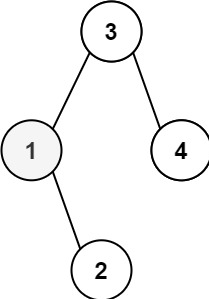
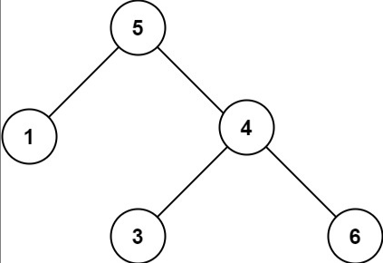

# 二叉搜索树

## 1、二叉搜索树的第k大节点

给定一棵二叉搜索树，请找出其中第 `k` 大的节点的值。

```javascript
输入: root = [3, 1, 4, null, 2], k = 1
   3
  / \
 1   4
  \
   2
输出: 4
```

### 题解：二叉搜索树，中序遍历出来的值是从小到大的

```javascript
// 二叉搜索树，中序遍历出来的值是从小到大的
var kthLargest = function(root, k) {
    // 反中序遍历，记录数值到数组，获取第k -1 个
    let setArray = []
    const dfs = function(node) {
        if (node === null) {
            return;
        }
        dfs(node.right);
        setArray.push(node.val);
        dfs(node.left); 
    }
    dfs(root);
    return setArray[k - 1];
};
// 递归：将所有的值放到数组中，排序后返回第k大的节点的值
var kthLargest = function(root, k) {
    let res = [];
    if(!root){
        return 0;
    }
    const dfs = function(root){
        if(root){
            res.push(root.val);
        }
        if(root.left) dfs(root.left);
        if(root.right) dfs(root.right);
    }
    dfs(root);
    return res.sort((a, b) => a - b)[res.length - k];
};
// 迭代
var kthLargest= function (root, k) {
    if (!root) return 0;
    let res = [], queue = [root];
    while (queue.length) {
        let node = queue.shift();
        res.push(node.val);
        if (node.left) queue.push(node.left);
        if (node.right) queue.push(node.right);
    }
    return res.sort((a, b)=> a - b)[res.length - k];
}
```

## 2、二叉搜索树的第k小的元素

给定一个二叉搜索树的根节点 `root` ，和一个整数 `k` ，请你设计一个算法查找其中第 `k` 个最小元素（从 1 开始计数）。



```javascript
输入：root = [3,1,4,null,2], k = 1
输出：1
```

### 题解：

```javascript
var kthSmallest = function(root, k) {
    let res = [];
    const dfs = (root) => {
        if(!root){
            return root; 
        }
        res.push(root.val);
        root.left && dfs(root.left)
        root.right && dfs(root.right)
    }
    dfs(root);
    return res.sort((a, b) => a - b)[k - 1]
};
// 考察二叉搜索树的  中序遍历的特性
// 二叉搜索树  中序遍历: 从最小的元素开始遍历
var kthSmallest = function(root, k) {
    const res = [];
    function dfs(root){
      if(!root){
        return null;
      }
      // 中序遍历
      dfs(root.left);
      res.push(root.val);
      dfs(root.right);
    }
    dfs(root);
    return res[k-1]
};
```

## 3、验证二叉搜索树

给你一个二叉树的根节点 root ，判断其是否是一个有效的二叉搜索树。

有效 二叉搜索树定义如下：

* 节点的左子树只包含 小于 当前节点的数。
* 节点的右子树只包含 大于 当前节点的数。
* 所有左子树和右子树自身必须也是二叉搜索树。



```javascript
输入：root = [5,1,4,null,null,3,6], 输出：false
解释：根节点的值是 5 ，但是右子节点的值是 4 。
```

### 题解：

```javascript
var isValidBST = function(root) {
    const helper = (root, lower, upper) => {
        if (root === null) {
            return true;
        }
        if (root.val <= lower || root.val >= upper) {
            return false;
        }
        return helper(root.left, lower, root.val) && helper(root.right, root.val, upper);
    }
    return helper(root, -Infinity, Infinity);
};
```
