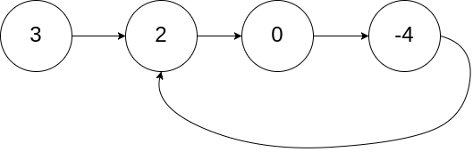
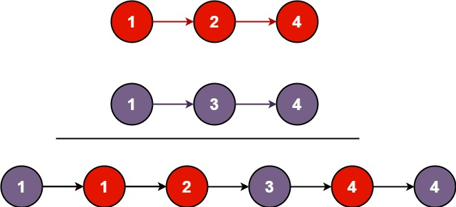
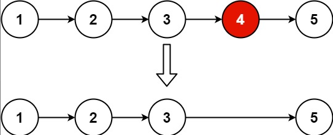
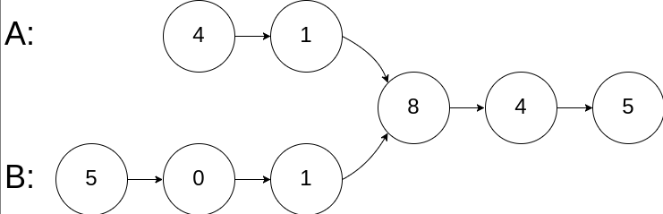
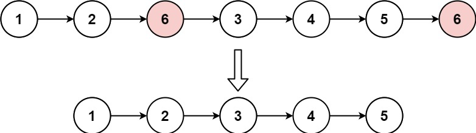
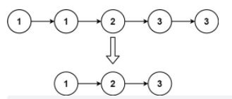

# 单链表

## 1、从尾到头打印链表

输入一个链表的头节点，从尾到头反过来返回每个节点的值（用数组返回）

```javascript
输入：head = [1,3,2]
输出：[2,3,1]
```

### 题解：

```javascript
// 迭代
var reversePrint = function(head) {
    let curr = head;
    let res = [];
    while(curr){
        res.unshift(curr.val); //每一次往数组前面添加元素
        curr = curr.next
    }
    return res
};
// 递归
var reversePrint = function (head) {
    let res = []
    const helper = function (head) {
        if (head !== null) {
            helper(head.next)
            res.push(head.val)
        }
    };
    helper(head)
    return res;
}
```

## 2、环形链表

给你一个链表的头节点 head ，判断链表中是否有环。如果链表中有某个节点，可以通过连续跟踪 next 指针再次到达，则链表中存在环。 为了表示给定链表中的环，评测系统内部使用整数 pos 来表示链表尾连接到链表中的位置（索引从 0 开始）。注意：pos 不作为参数进行传递 。仅仅是为了标识链表的实际情况。如果链表中存在环 ，则返回 true 。 否则，返回 false 。



```javascript
输入：head = [3,2,0,-4], pos = 1
输出：true
解释：链表中有一个环，其尾部连接到第二个节点。
```

### 题解：快慢指针

```javascript
var hasCycle = function(head) {
  // 快慢指针初始化指向 head
  let slow = head;
  let fast = head;
  // 快指针走到末尾时停止
  while (fast && fast.next) {
    // 慢指针走一步，快指针走两步
    slow = slow.next;
    fast = fast.next.next;
    // 快慢指针相遇，说明含有环
    if (slow == fast) {
      return true;
    }
  }
  // 不包含环
  return false;
};
```

## 3、环形链表Ⅱ

给定一个链表的头节点  `head` ，返回链表开始入环的第一个节点。 *如果链表无环，则返回 `null`。*

```javascript
输入：head = [3,2,0,-4], pos = 1
输出：返回索引为 1 的链表节点
解释：链表中有一个环，其尾部连接到第二个节点。
```

### 题解：

```javascript
var detectCycle = function(head) {
  // 快慢指针初始化指向 head
  let slow = head;
  let fast = head;
  // 快指针走到末尾时停止
  while (fast && fast.next) {
    // 慢指针走一步，快指针走两步
    slow = slow.next;
    fast = fast.next.next;
    // 快慢指针相遇，说明含有环
    if (slow == fast) {
      // 任一一节点指向头节点
      fast = head;
      // 同步向前进  两者相等即为环的第一个节点
      while (fast != slow) {
        fast = fast.next;
        slow = slow.next;
      }
      // 返回入口节点
      return fast;
    }
  }
  // 不包含环
  return null;   
};

// 哈希表  环形链表 II
var detectCycle = function(head) {
  //建立一个Set，如果有重复的，就说明是环。
  const memo = new Set();
  while(head){
    if(memo.has(head)){
      return head;
    }else{
      memo.add(head);
    }
    head = head.next;
  }

  return null;
};
```

## 4、合并两个有序链表

将两个升序链表合并为一个新的 **升序** 链表并返回。新链表是通过拼接给定的两个链表的所有节点组成的。



```javascript
输入：l1 = [1,2,4], l2 = [1,3,4]
输出：[1,1,2,3,4,4]
```

### 题解：

```javascript
// l1,l2 是有序的
// curr 创建新的链表节点， dummy保存新链表的头节点
// 若l1与l2都未遍历完毕，将较小的节点接在新链表上
// 若一方遍历完毕则将另一方接上
// 返回新链表头节点的next
var mergeTwoLists = function(l1, l2) {
    // 创建新的链表节点
    var curr = new ListNode(0);  // dummy
    // dummy 保存新链表的头节点   
    var dummy = curr; // 作为链表的头结点
    // 如果 l1 和 l2 都没遍历完，都不为null
    while(l1 && l2){

        if(l1.val < l2.val){
            // 把l1 保存到curr中
            curr.next = l1;
            l1 = l1.next;
        }else{
            // 把l2 保存到curr中
            curr.next = l2;
            l2 = l2.next;
        }
        // 记得更新curr
        curr = curr.next;
    }
    // l2 有一个为null，将 l1 拼接上
    if(l1) {
        curr.next = l1;
    }
    // l1 有一个为null，将 l2 拼接上
    if(l2) {
        curr.next = l2;
    }
    // 返回的时候  只返回 dummy.next
    return dummy.next;
};

var mergeTwoLists = function(l1, l2) {
    // 递归
    // 当其中有null 则返回有效值
    if (!l1 || !l2) return l1 || l2;
    // 进行大小对比
    if (l1.val < l2.val) {
        l1.next = mergeTwoLists(l1.next, l2)
        return l1
    } else {
        l2.next = mergeTwoLists(l1, l2.next)
        return l2
    }
}
```

## 5、链表中倒数第k个节点

输入一个链表，输出该链表中倒数第k个节点。例如，一个链表有 `6` 个节点，从头节点开始，它们的值依次是 `1、2、3、4、5、6`。这个链表的倒数第 `3` 个节点是值为 `4` 的节点。

```javascript
给定一个链表: 1->2->3->4->5, 和 k = 2.
返回链表 4->5.
```

### 题解：快慢指针

```javascript
 // 链表中倒数第k个节点
var getKthFromEnd = function(head, k) {
    let slow = head;
    let fast = head;
    // 让快指针fast 先跑 k步 
    while(k){
        fast = fast.next;
        k--;
    }
    // 当 快指针 fast为null时  slow即为倒数第k个节点
    while(fast){
        slow = slow.next;
        fast = fast.next;
    }
    return slow;
};
```

## 6、删除链表的倒数第 N 个结点

给你一个链表，删除链表的倒数第 `n` 个结点，并且返回链表的头结点。



```javascript
输入：head = [1,2,3,4,5], n = 2, 输出：[1,2,3,5]
输入：head = [1,2], n = 1, 输出：[1]
```

### 题解：快慢指针

```javascript
var removeNthFromEnd = function(head, n) {
    let slow = head;
    let fast = head;
    while(n--){
        fast = fast.next;
    };
    // 处理 n等于链表长度的异常。
    if(!fast){
        return head.next; 
    }
    while(fast.next){
        fast = fast.next;
        slow = slow.next;
    }
    // 此时的slow就是 倒数第N个节点
    slow.next = slow.next.next;
    return head;
};
```

## 7、删除链表的节点

给定单向链表的头指针和一个要删除的节点的值，定义一个函数删除该节点。返回删除后的链表的头节点。

```javascript
输入: head = [4, 5, 1, 9], val = 5, 输出: [4, 1, 9]
解释: 给定你链表中值为 5 的第二个节点，那么在调用了你的函数之后，该链表应变为 4 -> 1 -> 9.
```

### 题解：

```javascript
//  删除链表的节点: 单指针
//  删除一个链表的核心是: 知道要删除节点的 prev 上一个节点
//  所以用 cur.next 作比较
function deleteNode(head, val) {  // head = [4,5,1,9], val = 5
   // 排除第一个 是要删除的节点 
  if (head.val == val){
      return head.next; 
  } 
  let cur = head;
  while (cur.next) {
    // 两者相等
    if (cur.next.val == val) {
      cur.next = cur.next.next;
      return head;
    }
    cur = cur.next;
  }
  return head;
}

//递归, 链表用递归
var deleteNode = function(head, val) {
    // 排除第一个 是要删除的节点
    if(head.val == val) {
        return head.next;
    }
    head.next = deleteNode(head.next, val);
    return head;
};
```

## 8、链表相交

给你两个单链表的头节点 `headA` 和 `headB` ，请你找出并返回两个单链表相交的起始节点。如果两个链表没有交点，返回 `null` 。



```javascript
输入：intersectVal = 8, listA = [4,1,8,4,5], listB = [5,0,1,8,4,5], skipA = 2, skipB = 3
输出：Intersected at '8'
解释：相交节点的值为 8 （注意，如果两个链表相交则不能为 0）。
从各自的表头开始算起，链表 A 为 [4,1,8,4,5]，链表 B 为 [5,0,1,8,4,5]。
在 A 中，相交节点前有 2 个节点；在 B 中，相交节点前有 3 个节点。
```

### 题解：

```javascript
// 1、如果链表一样长且有交点，则第一次遍历就能找到相同交点，返回
// 2、如果不一样长且有交点，则指针遍历一条链表后，遍历另一条链表
// 如：A链表的指针遍历完A了，下一步继续遍历B链表。B链表的指针遍历完B了，下一步继续遍历A链表。
// 3、如果没有交点，则第二次遍历结束都是null，遍历结束，返回null
var getIntersectionNode = function(headA, headB) { // 双指针
    var p1 = headA;
    var p2 = headB;
    while (p1 != p2) {
        // A链表的指针遍历完A了，下一步继续遍历B链表。
        p1 = p1 ? p1.next : headB;
        // B链表的指针遍历完B了，下一步继续遍历A链表。
        p2 = p2 ? p2.next : headA;
    }
    return p1;
};
```

## 9、回文链表

给你一个单链表的头节点 `head` ，请你判断该链表是否为回文链表。如果是，返回 `true` ；否则，返回 `false` 。

```javascript
输入：head = [1,2,2,1], 输出：true
输入：head = [1,2], 输出：false
```

### 题解：

```javascript
 // 回文链表:  将值放到数组中后，用双指针法
var isPalindrome = function(head) {
    const arr = [];
    while (head !== null) {
        arr.push(head.val);
        head = head.next;
    }
    for (let i = 0, j = arr.length - 1; i < j; ++i, --j) {
        if (arr[i] !== arr[j]) {
            return false;
        }
    }
    return true;
};
var isPalindrome = function(head) {
    let a = '', b = '';
    while(head != null){
        a = a + head.val;
        b = head.val + b;
        head = head.next;
    }
  return a === b;
};
```

## 10、移除链表元素

给你一个链表的头节点 `head` 和一个整数 `val` ，请你删除链表中所有满足 `Node.val == val` 的节点，并返回 **新的头节点** 。统计一个数字在排序数组中出现的次数



```javascript
输入：head = [1,2,6,3,4,5,6], val = 6, 输出：[1,2,3,4,5]
输入：head = [7,7,7,7], val = 7, 输出：[]
```

### 题解：

```javascript
// 只需要判断当前节点的值是否与目标值相等 
// 如果相等那就略过此节点 否则保存此节点，
// 并将next指向下一次递归返回的节点，当next为null时结束，
// 此时从后往前依次将指针连接，return head即为所求
var removeElements = function(head, val){
    if(head === null){
        return null;
    }
    while(head){
        if(head.val === val){
            head = removeElements(head.next, val);
        } else {
            head.next = removeElements(head.next, val);
        }
        return head;
    }
}
var removeElements = function(head, val){
    let curr = head;
    while(curr){  
        if(curr.next && curr.next.val === val){
            // 直接删除
            curr.next = curr.next.next;  
        }else{
            //不相等，继续遍历
            curr = curr.next;
        }
    }
    //  最后才 判断第一个元素
    if(head && head.val === val){
        return head.next;
    }
    return head;
}
```
## 11、删除排序链表中的重复元素

给定一个已排序的链表的头 head ， 删除所有重复的元素，使每个元素只出现一次 。返回 已排序的链表 。



```javascript
输入：head = [1,1,2,3,3]
输出：[1,2,3]
```

### 题解：

```javascript
 // 前提 按升序排列的链表
var deleteDuplicates = function(head) {
    var cur = head; 
    // 同时判断 cur && cur.next 存在
    while(cur && cur.next) {
        // 前一个 和后一个相等
        if(cur.val === cur.next.val) {
            cur.next = cur.next.next;
        } else {
            cur = cur.next;
        }
    }
    return head;
};
```
## 12、反转链表
定义一个函数，输入一个链表的头节点，反转该链表并输出反转后链表的头节点。
```js
输入: 1->2->3->4->5->NULL
输出: 5->4->3->2->1->NULL
```
### 题解：

```javascript
// 链表的题90 % 基本上就是玩指针
// 单向链表回不去
// 迭代
var reverseList = function (head) {
  //  head就是第一个节点
  //   prev永远是curr的前一个
  //  prev curr next都是节点
  let prev = null;
  let curr = head;
  while (curr !== null) {
    const temp = curr.next;
    curr.next = prev;
    prev = curr;
    curr = temp;
  }
  return prev;
};
// 递归
var reverseList = function (head) {
  if (head == null || head.next == null) {
    return head;
  }
  const newHead = reverseList(head.next);
  head.next.next = head;
  head.next = null;
  return newHead;
};
```