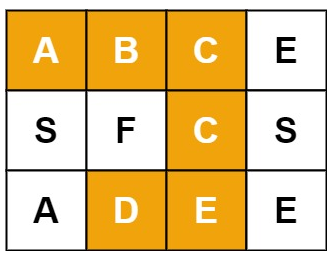

# 数组

## 1、三数之和

给你一个包含 n 个整数的数组 nums，判断 nums 中是否存在三个元素 a，b，c ，使得 a + b + c = 0 ？请你找出所有和为 0 且不重复的三元组。（结果不可以包含重复的三元组）

```javascript
输入：nums = [-1, 0, 1, 2, -1, -4], 输出：[[-1, -1, 2],[-1, 0, 1]]
```

### 题解：

```javascript
// 思路
// 外层循环：指针 i 遍历数组。
// 内层循环：用双指针，去寻找满足三数之和 == 0 的元素
// 先排序的意义
// 便于跳过重复元素，如果当前元素和前一个元素相同，跳过。
// 双指针的移动时，避免出现重复解
// 找到一个解后，左右指针同时向内收缩，为了避免指向重复的元素，需要：
// 左指针在保证left < right的前提下，一直右移，直到指向不重复的元素
// 右指针在保证left < right的前提下，一直左移，直到指向不重复的元素
// 小优化
// 排序后，如果外层遍历的数已经大于0，则另外两个数一定大于0，sum不会等于0，直接break。
var threeSum = (nums) => {
  nums.sort((a, b) => a - b); // 排序    升序
  const res = [];
  for (let i = 0; i < nums.length - 2; i++) { // 外层遍历
    let n1 = nums[i];
    if (n1 > 0) break; // 如果已经爆0，不用做了，break
    if (i - 1 >= 0 && n1 == nums[i - 1]) continue; // 遍历到重复的数，跳过  

    let left = i + 1;            // 左指针
    let right = nums.length - 1; // 右指针
    while (left < right) {
      let n2 = nums[left], n3 = nums[right];
      if (n1 + n2 + n3 === 0) {  // 三数和=0，加入解集res
        res.push([n1, n2, n3]);
        while (left < right && nums[left] == n2) left++; // 直到指向不一样的数
        while (left < right && nums[right] == n3) right--; // 直到指向不一样的数
      } else if (n1 + n2 + n3 < 0) { // 三数和小于0，则左指针右移
        left++;
      } else {      // 三数和大于0，则右指针左移
        right--;
      }
    }
  }
  return res;
};
```

## 2、合并区间

以数组 intervals 表示若干个区间的集合，其中单个区间为 intervals[i] = [starti, endi] 。请你合并所有重叠的区间，并返回 一个不重叠的区间数组，该数组需恰好覆盖输入中的所有区间 。

```javascript
输入：intervals = [[1, 3],[2, 6],[8, 10],[15, 18]], 输出：[[1, 6],[8, 10],[15, 18]]
解释：区间 [1, 3] 和 [2, 6] 重叠, 将它们合并为 [1, 6].

输入：intervals = [[1, 4],[4, 5]], 输出：[[1, 5]]
解释：区间 [1, 4] 和 [4, 5] 可被视为重叠区间。
```

### 题解：

```javascript
// prev 初始为第一个区间，cur 表示当前的区间，res 表示结果数组

// 开启遍历，尝试合并 prev 和 cur，合并后更新到 prev
// 合并后的新区间还可能和后面的区间重合，继续尝试合并新的 cur，更新给 prev
// 直到不能合并 —— prev[1] < cur[0]，此时将 prev 区间推入 res 数组
// 合并的策略
// 原则上要更新prev[0]和prev[1]，即左右端:
// prev[0] = min(prev[0], cur[0])
// prev[1] = max(prev[1], cur[1])
// 但如果先按区间的左端排升序，就能保证 prev[0] < cur[0]
// 所以合并只需这条：prev[1] = max(prev[1], cur[1])
// 易错点
// 我们是先合并，遇到不重合再推入 prev。
// 当考察完最后一个区间，后面没区间了，遇不到不重合区间，最后的 prev 没推入 res。
// 要单独补上。
var merge = function (intervals) {
  let res = [];
  intervals.sort((a, b) => a[0] - b[0]);
  let prev = intervals[0]; // arr
  for (let i = 1; i < intervals.length; i++) {
    let cur = intervals[i];
    if (prev[1] >= cur[0]) { // 有重合   更新 prev[1]
        prev[1] = Math.max(cur[1], prev[1]); 
    } else {       // 不重合，prev推入res数组 
        res.push(prev);
        prev = cur;  // 更新 prev
    }
  }
  res.push(prev);
  return res;
};
```

## 3、旋转图像

给定一个 n × n 的二维矩阵 matrix 表示一个图像。请你将图像顺时针旋转 90 度。你必须在 原地 旋转图像，这意味着你需要直接修改输入的二维矩阵。

```javascript
//  首页将输入
// 1 2 3
// 4 5 6
// 7 8 9

// 通过交换matrix[i][j], matrix[j][i] 得到
// 1 4 7
// 2 5 8
// 3 6 9

// 最后将得到每组数组倒序排列即可
// 7 4 1
// 8 5 2
// 9 6 3
```

### 题解：

```javascript
var rotate = function(matrix) {
    let martrixLength = matrix.length;
    for(let i = 0; i < martrixLength; i++) {
        for(let j = i; j < martrixLength; j++) {
            let temp = matrix[i][j];
            matrix[i][j] = matrix[j][i];
            matrix[j][i] = temp;
        }
    }
    return matrix.map(item => item.reverse());
};
```

## 4、把数组排成最小的数

输入一个非负整数数组，把数组里所有数字拼接起来排成一个数，打印能拼接出的所有数字中最小的一个。

```javascript
输入: [10,2], 输出: "102"
输入: [3,30,34,5,9], 输出: "3033459"
```

### 题解：

```javascript
var minNumber = function(nums) {
    return nums.sort((a, b) => `${a}${b}` - `${b}${a}`).join('');
};

var minNumber = function(nums) {
    nums = nums.map(item => item + ""); // 转字符串
    nums.sort((a, b) => {
        let x = a + b;
        let y = b + a;
        return x - y;
    })
    return nums.join('')
};
```

## 5、移除元素

给你一个数组 nums 和一个值 val，你需要原地移除所有数值等于 val 的元素，并返回移除后数组的新长度。不要使用额外的数组空间，必须仅使用 O(1) 额外空间并原地修改输入数组。元素的顺序可以改变，不需要考虑数组中超出新长度后面的元素。

```javascript
输入：nums = [3,2,2,3], val = 3, 输出：2, nums = [2,2]
解释：函数应该返回新的长度 2, 并且 nums 中的前两个元素均为 2。你不需要考虑数组中超出新长度后面的元素。
例如，函数返回的新长度为 2 ，而 nums = [2,2,3,3] 或 nums = [2,2,0,0]，也会被视作正确答案。
```

### 题解：

```javascript
var removeElement = function(nums, val) {
    let res = 0;
    for(let i = 0; i < nums.length; i++){
        if(nums[i] !== val) {
            nums[res] = nums[i];
            res++;
        }
    }
    return res;
};
// res 为 2
// nums 为 [2, 2, 2, 3]  系统取前两个元素
```

## 6、滑动窗口最大值

给定一个数组 `nums` 和滑动窗口的大小 `k`，请找出所有滑动窗口里的最大值。

```javascript
输入: nums = [1,3,-1,-3,5,3,6,7], 和 k = 3, 输出: [3,3,5,5,6,7] 
  滑动窗口的位置                最大值
---------------               -----
[1  3  -1] -3  5  3  6  7       3
 1 [3  -1  -3] 5  3  6  7       3
 1  3 [-1  -3  5] 3  6  7       5
 1  3  -1 [-3  5  3] 6  7       5
 1  3  -1  -3 [5  3  6] 7       6
 1  3  -1  -3  5 [3  6  7]      7
```

### 题解：

```javascript
 // 滑动窗口的最大值   暴力法
var maxSlidingWindow = function(nums, k) {
    // 数组长度为零
    if(nums.length === 0){
        return []
    }
    let res = []; // 存放结果
    // for循环的 循环次数
    let len = nums.length - k; 
    for(let i = 0; i <= len; i++){
        let tempArr = nums.slice(i,i + k)
        res.push(Math.max(...tempArr))
    }
    return res
};

// 暴力法
var maxSlidingWindow = function(nums, k) {
    if (k <= 1) return nums;
    const res = [];
    for (let i = 0; i < nums.length - k + 1; i++) {
        res.push(Math.max(...nums.slice(i, i + k)));
    }
    return res;
};
```


## 7、在排序数组中查找数字 I

统计一个数字在排序数组中出现的次数。

```javascript
输入: nums = [5,7,7,8,8,10], target = 8, 输出: 2
输入: nums = [5,7,7,8,8,10], target = 6, 输出: 0
```

### 题解：

```javascript
 // 哈希
var search = function(nums, target) {
    let map = new Map();
    for(let i = 0; i < nums.length; i++){
        if(map.has(nums[i])){
            map.set(nums[i], map.get(nums[i])+1)
        }else{
            map.set(nums[i], 1);
        }
    }
    return map.get(target) || 0;
};

var search = function(nums, target) {
    let count = 0;
    for(let i = 0; i < nums.length; i++){
        if(nums[i] === target){
            count++
        }
    }
    return count;
};
```


## 8、数组中出现次数超过一半的数字在排序数组中查找数字

数组中有一个数字出现的次数超过数组长度的一半，请找出这个数字。统计一个数字在排序数组中出现的次数

```javascript
输入: [1, 2, 3, 2, 2, 2, 5, 4, 2], 输出: 2
```

### 题解：

```javascript
 // 哈希
var majorityElement = function(nums) {
    let len = nums.length /2;
    let obj = {}
    for(let i = 0; i < nums.length; i++){
        // if(obj[`${nums[i]}`]){
        //     obj[`${nums[i]}`] = obj[`${nums[i]}`] + 1 
        // }else{
        //     obj[`${nums[i]}`] = 1;
        // }
        obj[`${nums[i]}`] = (obj[`${nums[i]}`] || 0) + 1;
    }
    for(let key in obj){
        if(obj[key] > len){
            return key;
        }
    }
};
// obj[str] = (obj[str] || 0) + 1;
```

## 9、II. 0～n-1中缺失的数字

一个长度为n-1的递增排序数组中的所有数字都是唯一的，并且每个数字都在范围0～n-1之内。在范围0～n-1内的n个数字中有且只有一个数字不在该数组中，请找出这个数字。

```javascript
输入: [0,1,3], 输出: 2
输入: [0,1,2,3,4,5,6,7,9], 输出: 8
```

### 题解：

```javascript
//  0～n-1中缺失的数字 二分法
// 找一个中间元素，它左边没有缺失的话，就会满足 i==nums[i]
// 如果不满足，则缺失的数在右边
var missingNumber = (nums) => {
  let left = 0;
  let right = nums.length - 1;
  while (left <= right) {
    // let mid = left + ((right - left) >>> 1);
    // 向下取整后，
    mid = Math.floor((left + right)/2)
    if (mid == nums[mid]) { // 缺失的元素在右边
      left = mid + 1;
    } else {                // 缺失的元素在左边
      right = mid - 1;
    }
  }
  return left;
};
```

## 10、打印从1到最大的n位数

输入数字 `n`，按顺序打印出从 1 到最大的 n 位十进制数。比如输入 3，则打印出 1、2、3 一直到最大的 3 位数 999。一个长度为n-1的递增排序数组中的所有数字都是唯一的，并且每个数字都在范围0～n-1之内。在范围0～n-1内的n个数字中有且只有一个数字不在该数组中，请找出这个数字

```javascript
输入: n = 1, 输出: [1,2,3,4,5,6,7,8,9]
```

### 题解：

```javascript
var printNumbers = function (n) {
    let res = [];
    // n=1, Math.pow(10, 1) = 10
    // n=2, Math.pow(10, 2) = 100
    // n=3, Math.pow(10, 3) = 1000
    for (let i = 1; i < Math.pow(10, n); i++) {
        res.push(i);
    }
    return res;
};
```

## 11、单调数列

如果数组是单调递增或单调递减的，那么它是 单调 的。如果对于所有 i <= j，nums[i] <= nums[j]，那么数组 nums 是单调递增的。 如果对于所有 i <= j，nums[i]> = nums[j]，那么数组 nums 是单调递减的。当给定的数组 nums 是单调数组时返回 true，否则返回 false。

```javascript
输入：nums = [1,2,2,3], 输出：true
输入：nums = [6,5,4,4], 输出：true
输入：nums = [1,3,2], 输出：false
```

### 题解：

```javascript
// 一次遍历
// 初始化 inc 单调递增 和 desc 单调递减 为 true
// 使用 inc 标记数组是否单调上升的，如果有下降，则将其置为 false
// 使用 dec 标记数组是否单调递减的，如果有上升，则将其置为 false
// 如果数列为单调 必有inc与desc 一个为true 一个为false
// 如果数列不是单调数列 则inc 与 desc均为false
var isMonotonic = function(A) {
    let [inc, dec] = [true, true];
    for (let i = 0; i < A.length - 1; i++) {
        if (A[i] > A[i + 1]) {
            inc = false;
        }
        if (A[i] < A[i + 1]) {
            dec = false;
        }
    }
    return inc || dec;
};
```

## 12、分发饼干

假设你是一位很棒的家长，想要给你的孩子们一些小饼干。但是，每个孩子最多只能给一块饼干。对每个孩子 i，都有一个胃口值 g[i]，这是能让孩子们满足胃口的饼干的最小尺寸；并且每块饼干 j，都有一个尺寸 s[j] 。如果 s[j] >= g[i]，我们可以将这个饼干 j 分配给孩子 i ，这个孩子会得到满足。你的目标是尽可能满足越多数量的孩子，并输出这个最大数值。

```javascript
输入: g = [1,2,3], s = [1,1], 输出: 1
解释: 
你有三个孩子和两块小饼干，3个孩子的胃口值分别是：1,2,3。
虽然你有两块小饼干，由于他们的尺寸都是1，你只能让胃口值是1的孩子满足。
所以你应该输出1。

输入: g = [1,2], s = [1,2,3], 输出: 2
解释: 
你有两个孩子和三块小饼干，2个孩子的胃口值分别是1,2。
你拥有的饼干数量和尺寸都足以让所有孩子满足。
所以你应该输出2.
```

### 题解：

```javascript
// 双指针：
// 解题思路
// 1，先按从小到大排序g(胃口值)和s(饼干尺寸)；
// 2，遍历g,s，相同坐标下的s[i] >= g[i] 则max(满足的孩子) +1；
// 3，当max已经等于s.length(饼干数量)了，则直接返回max；
var findContentChildren = function (g, s) {
    g.sort((a, b) => a - b);// g孩子的胃口
    s.sort((a, b) => a - b);// s是饼干的大小
    // s[i] 大于 g[i] 才能喂饱 孩子
    let child = 0, // 能喂饱的孩子数
        cookie = 0; // 

    while (cookie < s.length && child < g.length) {
        // 发现满足条件的饼干，喂饱一个孩子
        if (s[cookie] >= g[child]) {
            child++;
        }
        // 继续找下一块饼干
        cookie++;
    }
    return child;
};
```

## 13、扑克牌中的顺子

从若干副扑克牌中随机抽 5 张牌，判断是不是一个顺子，即这5张牌是不是连续的。2～10为数字本身，A为1，J为11，Q为12，K为13，而大、小王为 0 ，可以看成任意数字。A 不能视为 14。

```javascript
输入: [1,2,3,4,5], 输出: True
输入: [0,0,1,2,5], 输出: True
```

### 题解：

```javascript
// 解题思路
// 分治思想 五张牌构成顺子的充分条件需要满足
// 1. 不重复 使用Set去重
// 2. max - min < 5 最大牌值 减去 最小牌值 小于5 且跳过大小王

var isStraight = function(nums) {
    /* 
       分治思想 五张牌构成顺子的充分条件需要满足
       1. 不重复 使用Set去重
       2. max - min < 5 最大牌值 减去 最小牌值 小于5 且跳过大小王
    */
    const set = new Set();
    let min = 14, max = 0 //  min和max的初始值是两个边界值[0, 13]
    for(let i = 0; i < nums.length; i++){
        // 遇到大小王 跳过
        if (!nums[i]) continue;
        // 遇到重复则直接 返回false
        if (set.has(nums[i])) {
            return false;
        }
        set.add(nums[i])
        // 迭代更新 min和max 以及set
        min = Math.min(min, nums[i]);
        max = Math.max(max, nums[i]);
    }
    return max - min < 5;
};

var isStraight = function(nums) {
    //从小到大排序
    const minSort = nums.sort((a, b) => a - b);
    //记录每个数字之间大差值，反正不能大于4
    let sum = 0;
    //不能超过4
    for(let i = 0; i < 4; i++){
        //忽略0也就是王
        if(minSort[i] === 0){
            continue
        }
        //如果扑克牌（非0）重复，说明不是顺子
        else if(nums[i] === nums[i + 1]){
            return false
        }else{
            //差值记录
            sum = sum + nums[i + 1] - nums[i]
        }
    }
    //如果超过4，说明不是顺子。
    return sum < 5
};
```

## 14、矩阵中的路径

给定一个 m x n 二维字符网格 board 和一个字符串单词 word 。如果 word 存在于网格中，返回 true ；否则，返回 false 。
单词必须按照字母顺序，通过相邻的单元格内的字母构成，其中“相邻”单元格是那些水平相邻或垂直相邻的单元格。同一个单元格内的字母不允许被重复使用。



```javascript
输入：
    board = [
        ["A","B","C","E"],
        ["S","F","C","S"],
        ["A","D","E","E"]
    ], 
    word = "ABCCED"
输出：true
```

### 题解：

```javascript

// 解题思路
// 典型的dfs算法，第一步先遍历一遍board，寻找第一个符合的位置，然后再使用dfs递归，因为寻找路径，要记录一下路径，防止每次递归会回到之前的路径
var exist = function(board, word) {
    var row = board.length;
    var col = board[0].length;

    var dfs = function(i, j, board, word, index){
        // 判断不符合条件
        if(i < 0 || i >= row || j < 0 || j > col || board[i][j] !== word[index]) {
            return false; 
        }
        if(index === word.length - 1) {
             // word遍历完了
            return true; 
        }
        // 记录到board的值
        var tmp = board[i][j];  
        // 锁上，因为后续的递归是4个方向上的，无法保证上一个方向的值
        board[i][j] = '-'      
        var res =  
            dfs(i - 1, j, board, word, index + 1) || 
            dfs(i + 1, j, board, word, index + 1) || 
            dfs(i, j - 1, board, word, index + 1) || 
            dfs(i, j + 1, board, word, index + 1);
        // 恢复现场
        board[i][j] = tmp;   
        return res; 
    }

    // for循环作用 ： 遍历整个board，找到初始位置点
    for(var i = 0;i < row; i++){
        for(var j = 0; j < col; j++){
            if(dfs(i, j, board, word, 0)) {
                return true;
            }
        }
    }
    // 没找到
    return false;
};

//  思路   有点类似岛屿数量
// 先从头遍历矩阵，找到第一个符合的字符，开始深度优先遍历
// 深度优先遍历：
// 定义index代表索引，或者说已经匹配了多少个字符
// 要写递归的出口：i、j越界或者字符不匹配
// 匹配成功：index等于word.length - 1，匹配成功，直接返回true
// 为了同一个单元格内的字母不允许被重复使用，遍历到某字符后，将当前字符设置为''，防止四个方向dfs再次遍历到
// 四个方向遍历完毕后，再恢复这个字符
// 最后若一直匹配失败，返回false

// 排除法
var exist = (board, word) => {
    const [m, n] = [board.length, board[0].length];
    // index 是word的下标
    const dfs = (i, j, index) => {
        // 越界、或者字符不匹配
        if (i < 0 || i >= m || j < 0 || j >= n || board[i][j] !== word[index]) {
            return false;
        }
        // 索引等于 单词长度-1，说明全匹配上了
        if (index === word.length - 1) {
            return true;
        }
        // 保存当前字符
        const temp = board[i][j];
        // 将当前字符设置为空，防止四个方向dfs再次遍历到
        board[i][j] = '';
        // 四个方向遍历  res是布尔值
        const res =
            dfs(i + 1, j, index + 1) ||
            dfs(i, j + 1, index + 1) ||
            dfs(i - 1, j, index + 1) ||
            dfs(i, j - 1, index + 1);
        // 恢复当前字符
        board[i][j] = temp;
        return res;
    };
    // 从第一个匹配的字符处开始dfs
    for (let i = 0; i < m; i++) {
        for (let j = 0; j < n; j++) {
            if (dfs(i, j, 0)) {
                return true;
            }
        }
    }
    return false;
};
```

## 15、寻找两个正序数组的中位数

```javascript
输入：nums1 = [1, 3], nums2 = [2]
输出：2.00000
解释：合并数组 = [1, 2, 3]，中位数 2

输入：nums1 = [1, 2], nums2 = [3, 4]
输出：2.50000
解释：合并数组 = [1, 2, 3, 4]，中位数(2 + 3) / 2 = 2.5
```

### 题解：

```javascript
function findMedian(nums1, nums2) {
    //let num = nums1.concat(nums2);
    let num = [...nums1, ...nums2].sort((a, b) => a - b);
    //num = num.sort((a, b) => a - b);
    let length = num.length;
    if (length > 0 && length % 2 === 0) {
        return (num[length / 2 - 1] + num[length / 2]) / 2;
    } else {
        return num[(length - 1) / 2];
    }
};
```
## 16、矩阵的转置
给定一个矩阵 A， 返回 A 的转置矩阵。
矩阵的转置是指将矩阵的主对角线翻转，交换矩阵的行索引与列索引。 
```javascript
输入：[[1,2,3],[4,5,6],[7,8,9]]
输出：[[1,4,7],[2,5,8],[3,6,9]]

输入：[[1,2,3],[4,5,6]]
输出：[[1,4],[2,5],[3,6]]
```

### 题解：

```javascript
function transpose(A) {
    let B = [];
    for (let i = 0;i < A.length; i++) {
        for (let j = 0;j < A[i].length; j++) {
            if (!B[j]) {
                B[j] = [];
            }
            B[j][i] = A[i][j];
        }
    }
    return B;
}
```
## 17、两数之和
给定一个整数数组 nums 和一个整数目标值 target，请你在该数组中找出 和为目标值 target  的那 两个 整数，并返回它们的数组下标。 
```javascript
输入：nums = [2,7,11,15], target = 9, 输出：[0,1]
解释：因为 nums[0] + nums[1] == 9 ，返回 [0, 1] 。

输入：nums = [3,2,4], target = 6
输出：[1,2]
```

### 题解：

```javascript
// 数组是有序的，则用双指针
var twoSum = function(numbers, target) {
    let low = 0;
    let high = numbers.length - 1;
    while (low < high) {
        let sum = numbers[low] + numbers[high];
        if (sum == target) {
            return [low + 1, high + 1];
        } else if (sum > target) {
            high--;
        } else {
            low++;
        }
    }
    return ("No such two value!");
};

// 方法二
// 如果数组不是有序的，不能用双指针，用哈希表
var twoSum = function(arr, target) {
    let map = new Map();
    let len = arr.length;
    for(let i = 0, i < len; i++){
        let num = target - arr[i];
        if(map.has(num)){
            return [map.get(num), i];
        }else{
            map.set(nums[i], i);
        }
    }
    return [];
}
```

## 18、合并两个有序数组
给你两个按 非递减顺序 排列的整数数组 nums1 和 nums2，另有两个整数 m 和 n ，分别表示 nums1 和 nums2 中的元素数目。
请你 合并 nums2 到 nums1 中，使合并后的数组同样按 非递减顺序 排列。


```javascript
输入：nums1 = [1,2,3,0,0,0], m = 3, nums2 = [2,5,6], n = 3
输出：[1,2,2,3,5,6]
解释：需要合并 [1,2,3] 和 [2,5,6] 。
合并结果是 [1,2,2,3,5,6] ，其中斜体加粗标注的为 nums1 中的元素。

输入：nums1 = [0], m = 0, nums2 = [1], n = 1
输出：[1]
解释：需要合并的数组是 [] 和 [1] 。
合并结果是 [1] 。
注意，因为 m = 0 ，所以 nums1 中没有元素。nums1 中仅存的 0 仅仅是为了确保合并结果可以顺利存放到 nums1 中。
```

### 题解：

```javascript
// 有序非递减  后面的元素大于等于前面的
var merge = function(nums1, m, nums2, n) {
    let len1 = m - 1, len2 = n - 1, k = m + n - 1;
    while (len1 >= 0 || len2 >= 0) {
        if(len1 < 0) {
            nums1[k--] = nums2[len2--];
        }else if(len2 < 0) {
            nums1[k--] = nums1[len1--];
        }else if(nums1[len1] < nums2[len2]) {
            // 比较nums1 和 nums2 最后面的 元素大小
            nums1[k--] = nums2[len2--];
        }else {
            nums1[k--] = nums1[len1--];
        }
    }
    return nums1;
};
// 归并排序法
function mergeSort(left,right){
	let result = []
	while(left.length > 0 && right.length > 0){
		if (left[0] < right[0]) {
        result.push(left.shift())
      }else{
        result.push(right.shift())
      }
	}
	//只要left,right数组其中一个长度为0，则将另外数组剩余的元素直接添加到result数组后面
  return [...result, ...left, ...right];
}
```

## 19、和为s的连续正数序列
输入一个正整数 target ，输出所有和为 target 的连续正整数序列（至少含有两个数）。
序列内的数字由小到大排列，不同序列按照首个数字从小到大排列。
```javascript
输入：target = 9
输出：[[2,3,4],[4,5]]

输入：target = 15
输出：[[1,2,3,4,5],[4,5,6],[7,8]]
```

### 题解：

```javascript
// 这里的题意隐藏条件 没有给定具体的数组num 我们可以通过下标关联[1,2,3,4,5,6,7....]
// 没有参照物数组 但是可以根据下标
// 滑动窗口（双指针） 
var findContinuousSequence = function(target) {
    if(target <= 2) return;
    let left = 1;
    let right = 2;
    let sum = 3;
    let res = [];
    // 滑动窗口框架 
    // 左指针小于 右指针
    while(left < right){
        if(sum === target){
            let ans = [];
            // 通过下标关联[1,2,3,4,5,6,7....]
            for(let k = left; k <= right; k++){
                ans[k - left] = k; // 下标 0,1,2
            }
            res.push(ans);
            // 等于的情况 我们可以继续窗口往右搜索 同时缩小左边的
            sum = sum - left;
            left++;
        } else if(sum > target){
            // 大于的条件 缩小窗口，缩小左边的   sum已经加过了
            sum = sum - left;
            left++;
        } else {
            // 小于的情况 滑动窗口继续扩大，不用减，往右加数字
            right++;
            sum = sum + right;
        }
    }
    // 连续正整数序列（至少含有两个数）。
    // 序列内的数字由小到大排列，不同序列按照首个数字从小到大排列。
    return res;
};
```
## 20、数组乱序（洗牌算法）
洗牌算法是将原来的数组进行打散，使原数组的某个数在打散后的数组中的每个位置上等概率的出现，即为乱序算法。
```javascript
 // Fisher - Yates
// 先看最经典的 Fisher - Yates的洗牌算法
// 其算法思想就是从原数组中随机抽取一个元素放入新数组
// 从原数组（假如长度为n）中，随机生成一个索引 random
// 从原数组中删除第 random 个元素并将其push到新数组
// 重复第2步直到所有元素取完
// 最终得到一个新的打乱的数组
// 按步骤一步一步来就很简单的实现。
const shuffle1 = arr => {
    let res = [], random
    while (arr.length > 0) {
        random = parseInt(Math.random() * arr.length);
        // arr.splice(random, 1) 返回的是一个被删除的元素数组，我们删除多少个元素，数组里就有元素
        let el = arr.splice(random, 1)[0];
        res.push(el);
    }
    return res
}
shuffle1([2, 3, 6, 2, 6, 2]) // [6, 3, 2, 2, 2, 6]
// Knuth - Durstenfeld ShuffleFisher - Yates
// 洗牌算法的一个变种是 Knuth Shuffle
// 每次从原数组中随机取一个元素，然后把该元素跟最后个元素交换，即数组的尾部放的是已经处理过的元素
// 这是一种原地打乱的算法，不会产生新的数组，每个元随机概率也相等，时间复杂度从 Fisher 算法的 O(n2)提升了 O(n)
// 假设原数组长度为n，生成一个0～n - 1的随机random，然后将第random个元素跟数组最后一个元素交换
// 生成一个0～n - 2的随机数random，然后将第random个素跟数组倒数第二个元素交换
// 以此类推，直到交换结束为止
const shuffle2 = arr => {
    let n = arr.length,
        tmp,
        random
    while (n != 0) {
        random = parseInt(Math.random() * n)
        n-- // n减一，方便下一趟循环继续交换
        // 交换
        tmp = arr[length]
        arr[length] = arr[random]
        arr[random] = tmp
    }
    return arr;
}
shuffle2([2, 3, 6, 2, 6, 2]) // [6, 3, 2, 2, 6, 2]
```
