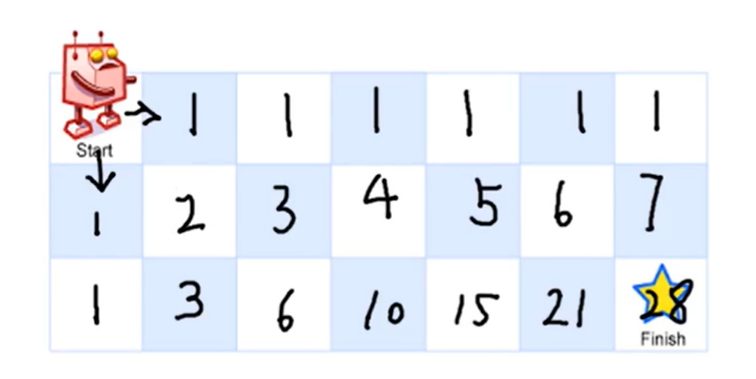
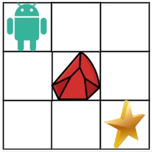
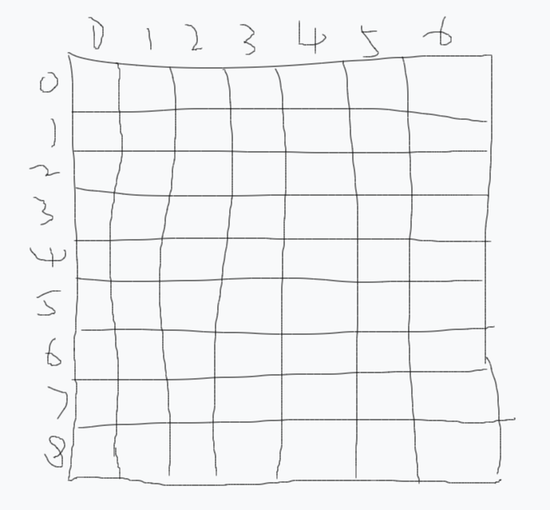

# 机器人运动: 机器人每次只能向下或者向右移动一步

## 1、不同路径

给你一个单链表的头节点 `head` ，请你判断该链表是否为回文链表。如果是，返回 `true` ；否则，返回 `false` 。一个机器人位于一个 m x n 网格的左上角 （起始点在下图中标记为 “Start” ）。机器人每次只能向下或者向右移动一步。机器人试图达到网格的右下角（在下图中标记为 “Finish” ）。问总共有多少条不同的路径？



```javascript
输入：m = 3, n = 7, 输出：28
```

### 题解：

```javascript
//  思路:由于在每个位置只能向下或者向右， 所以每个坐标的路径和等于上一行相同位置和
// 上一列相同位置不同路径的总和，状态转移方程：f[i][j] = f[i - 1][j] + f[i][j - 1];
//生成二维数组 Array.from(Array(3), () => Array(7).fill(1))
// Array.from(Array(m), () => Array(n).fill(1))
 var uniquePaths = function (m, n) {
    const f = new Array(m).fill(0).map(() => new Array(n).fill(0)); //初始dp数组
    for (let i = 0; i < m; i++) {
        //初始化列
        f[i][0] = 1;
    }
    for (let j = 0; j < n; j++) {
        //初始化行
        f[0][j] = 1;
    }
    for (let i = 1; i < m; i++) {
        for (let j = 1; j < n; j++) {
            f[i][j] = f[i - 1][j] + f[i][j - 1];
        }
    }
    return f[m - 1][n - 1];
};

// 状态压缩
 var uniquePaths = function(m, n) {
  let dp = Array.from({length: n}).fill(1)
  for (let i = 1; i < m; i++) {
    for (let j = 1; j < n; j++) {
      dp[j] = dp[j] + dp[j - 1];
    }
  }
  return dp[n - 1];
 }
```

## 2、不同路径II: 现在考虑网格中有障碍物

一个机器人位于一个 m x n 网格的左上角 （起始点在下图中标记为 “Start” ）。机器人每次只能向下或者向右移动一步。机器人试图达到网格的右下角（在下图中标记为 “Finish”）。现在考虑网格中有障碍物。那么从左上角到右下角将会有多少条不同的路径？网格中的障碍物和空位置分别用 1 和 0 来表示。



```javascript
输入：obstacleGrid = [[0,0,0],[0,1,0],[0,0,0]], 输出：2
解释：3x3 网格的正中间有一个障碍物。
从左上角到右下角一共有 2 条不同的路径：
1. 向右 -> 向右 -> 向下 -> 向下
2. 向下 -> 向下 -> 向右 -> 向右
```

### 题解：

```javascript
// 现在考虑网格中有障碍物
var uniquePathsWithObstacles = function (obstacleGrid) {
    const m = obstacleGrid.length;
    const n = obstacleGrid[0].length;
    const dp = Array(m).fill().map((item) => Array(n).fill(0)); //初始dp数组
    for (let i = 0; i < m && obstacleGrid[i][0] === 0; ++i) {
        //初始列
        dp[i][0] = 1;
    }
    for (let i = 0; i < n && obstacleGrid[0][i] === 0; ++i) {
        //初始行
        dp[0][i] = 1;
    }
    for (let i = 1; i < m; ++i) {
        for (let j = 1; j < n; ++j) {
            //遇到障碍直接返回0
            dp[i][j] = obstacleGrid[i][j] === 1 ? 0 : dp[i - 1][j] + dp[i][j - 1];
        }
    }

    return dp[m - 1][n - 1];
};

//状态压缩
var uniquePathsWithObstacles = function (obstacleGrid) {
    let m = obstacleGrid.length;
    let n = obstacleGrid[0].length;
    let dp = Array(n).fill(0); //用0填充，因为现在有障碍物，当前dp数组元素的值还和obstacleGrid[i][j]有关
    dp[0] = 1; //第一列 暂时用1填充
    for (let i = 0; i < m; i++) {
        for (let j = 0; j < n; j++) {
            if (obstacleGrid[i][j] == 1) {
                //注意条件，遇到障碍物dp[j]就变成0，这里包含了第一列的情况
                dp[j] = 0;
            } else if (j > 0) {
                //只有当j>0 不是第一列了才能取到j - 1
                dp[j] += dp[j - 1];
            }
        }
    }
    return dp[n - 1];
};
```

## 3、机器人的运动范围

地上有一个m行n列的方格，从坐标 [0,0] 到坐标 [m-1,n-1] 。一个机器人从坐标 [0, 0] 的格子开始移动，它每次可以向左、右、上、下移动一格（不能移动到方格外），也不能进入行坐标和列坐标的数位之和大于k的格子。例如，当k为18时，机器人能够进入方格 [35, 37] ，因为3+5+3+7=18。但它不能进入方格 [35, 38]，因为3+5+3+8=19。请问该机器人能够到达多少个格子？



```javascript
输入：m = 2, n = 3, k = 1
输出：3

输入：m = 3, n = 1, k = 0
输出：1
```

### 题解：

```javascript
// BFS：广度优先遍历
var movingCount = function(m, n, k) {
  // 创造一个二维数组
  const arr = new Array(m).fill().map(_ => new Array(n).fill(0));
  // 创建一个队列，从 (0, 0) 开始搜索
  const queue = [[0, 0]];
  // 计数器
  let counter = 0;

  while (queue.length) {
    const [x, y] = queue.shift();
    // 越界
    if (x >= m || y >= n)  continue;
    // 遍历过
    if (arr[x][y]) continue;
    // 设置遍历过的标识
    arr[x][y] = 1;

    if (bitSum(x) + bitSum(y) <= k) {
      // 符合条件的计数
      counter++;
      // 将右、下两格加入队列
      queue.push([x + 1, y], [x, y + 1]);
    }
  }

  return counter;

  function bitSum(n) {
    let res = 0;
    while (n) {
      res += n % 10;
      n = Math.floor(n / 10);
    }
    return res;
  }
};

// DFS：深度优先遍历
var movingCount = function(m, n, k) {
  // 创造一个二维数组
  const arr = new Array(m).fill().map(_ => new Array(n).fill(0));
  // 计数器
  let counter = 0;
  // 从 （0，0）开始搜索
  run(0, 0);

  return counter;

  function run(i, j) {
    // 越界返回
    if (i >= m || j >= n) return;
    // 已经遍历过，返回
    if (arr[i][j]) return;
    // 设置遍历标记
    arr[i][j] = 1;
    if (bitSum(i) + bitSum(j) <= k) {
      // 符合条件的计数器 + 1，继续遍历 右 / 下两个方向
      counter++;
      run(i + 1, j);
      run(i, j + 1);
    }
  }

  function bitSum(n) {
    let res = 0;
    while (n) {
      res += n % 10;
      n = Math.floor(n / 10);
    }
    return res;
  }
};
```
