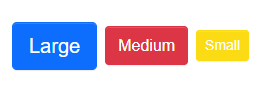

# Yolo UI
## 代码结构

## 样式解决方案
### 1. Inline CSS：快速写一些简单的样式
性能较差，不如直接使用CSS类名，再定义样式的性能好
```jsx
const divStyle = {
  color: 'blue',
};

function Hello() {
  return <div style={divStyle}>Hello</div>;
}
```
### 2. CSS in JS（styled Component）
不在是把css样式独立的写在css文件中，而是将css抽象到了js代码中。
不太喜欢在js中书写css样式，增加了成本和复杂度，强行把两者混在一起比较奇怪。
```js
const Button = styled.button`
color: red;
font-size: 1em;
`
```
### Less和Sass（预处理器）
提供了变量、函数、运算和继承等等，扩展性和复用性都有了很大的提升。
```
styles/
    _variables.less(各种预设变量以及可配置的设置，色彩、字体、字号)
    _mixins.less(全局的 mixins，任何预处理器的基础特性，重用各种css属性，比如添加
    box-shadow、transform)
    _functions.less(全局的 functions，用来计算，并且返回一个值，mixins没有返回。比如定义functions根据字体大小，返回它需要的margin、padding的值)
Button/
    style/
        index.less(组件单独的样式)
```
### 创建自己组件库的色彩体系
#### 系统色板
- 基础色板 + 中性色板
[中国色](http://zhongguose.com/)

#### 产品色板
- 品牌色板（primary） + 功能色板（成功success、失败danger、警告warning）
功能色彩尽量保持一致

#### Yolo组件库的色彩体系
#0069fe（primary）、#606a73（）、#15bd02（success）、#ffd300（warning）、#eb1e3d（danger）、#009bb0(info、辅助颜色)


#### 组件库样式变量分类
- 基础色彩系统
- 字体系统
font-family、font-size、line-height、font-weight、h1-h6、超链接样式、body大小。用户通过文本来理解工作，科学的字体系统将大大提升用户的阅读体验和工作效率
- 表单
- 按钮
- 边框和阴影
- 可配置开关
- normalize.css初始化默认样式
- babel-plugin-import 是一款babel插件，它会在编译过程中将import的写法自动转换为按需引入的方式
- classnames、@types/classnames 处理类名的一个工具

## 组件的需求分析和代码

### Button组件需求分析
padding的大小、lineHeight高度、颜色、文字居中、box-shadow，disabled时的特殊样式，鼠标的cursor的变化。Button Size的大小其实就是padding控制，font-size不同、border的不同。
Button Type是变化background-color，border-color、字体颜色，同时还有添加不同的状态、hover之后要颜色发生一定的变化，focus颜色变化，disabled颜色也发生变化
#### 不同的Button Type（颜色）


#### 不同的Button Size（padding的大小、lineHeight高度）
利用less的混合方法，传入不同的参数，实现样式的复用和切换。


#### Button的禁用状态


#### Button大致的使用方法
```js
<Button
  size="lg"
  type="primary"
  disabled
  href=""
  className=""
  autoFocus=""
  ...
>
primary
</Button>
```

## 组件测试用例分析和编码
代码的痛点，测试button组件好不好用，方式是创建大量的button，设置多个属性观察。
还有就是更新代码，添加新的功能的时候，需要把每一个类型的组件过一遍，看看新增的功能对原理的代码有没有影响，这无疑增加了工作量，效率太低了。
所以，组件的测试是非常有必要的。
- 测试保证代码能够运行，并且没有bug，产生高质量的代码。
- 更早的发现bug，减少成本，以免上线之后对公司造成损失。
- 让重构和升级变得更加容易和可靠。测试可以保证升级的版本是否有问题，是否可靠。
- 让开发流程更加敏捷。
### 测试金字塔
Unit -> Service -> UI -> Manual手动测试
- Unit test单元测试，是指把代码分成单独的、互相独立的部分，它们没有相互的依赖，测试每一个部分都可以良好的工作。单元测试是最多的，非常容易编写，改动比较小，容易维护，跑起来用时较短。
- Service test就是把几个unit test组合起来，可以测试它是否可以良好的工作。
- UI test（1 to 1 test），测试模拟用户真实场景，对整个应用进行测试，模拟用户的行为。
### React组件特别适合单元测试
- React是组件化开发，各个组件、单元互不影响。
- Function函数组件，纯函数最好写测试，因为它有固定的输入和输出。
- 单项数据流。
### 测试框架Jest
Jest是Facebook出品的框架

#### Jest笔记
```js
// 断言库
test('test common matcher', () => {
  // 2 + 2 = 4
  // toBe 是全等
  expect( 2 + 2 ).toBe(4)
  expect(2 + 2).not.toBe(5)
})

test('test to be true or false', () => {
  // true、false
  expect(1).toBeTruthy()
  expect(0).toBeFalsy()
})

test('test number', () => {
  // 4 超过 3
  expect(4).toBeGreaterThan(3)
  expect(2).toBeLessThan(3)
})

test('test object', () => {
  // toEqual 比较值是否相等
  expect({name: 'viking'}).toEqual({name: 'viking'})
})
```
### React官方推荐的测试工具(enzyme和@testing-library/react)
```npm install --save-dev @testing-library/react```
## 代码打包输出和发布

## CI/CD，文档的生成