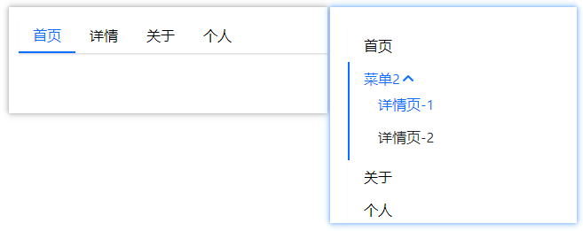
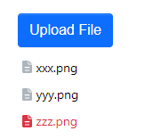
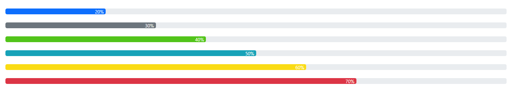

# 核心技术栈

React + TypeScript + Less + dumi
# 样式解决方案

## 1. Inline CSS：快速写一些简单的样式

性能较差，不如直接使用CSS类名，再定义样式的性能好

```jsx
const divStyle = {
  color: 'blue',
};

function Hello() {
  return <div style={divStyle}>Hello</div>;
}
```

## 2. CSS in JS（styled Component）

不在是把css样式独立的写在css文件中，而是将css抽象到了js代码中。
不太喜欢在js中书写css样式，增加了成本和复杂度，强行把两者混在一起比较奇怪。

```js
const Button = styled.button`
color: red;
font-size: 1em;
`
```

## Less和Sass（预处理器）

提供了变量、函数、运算和继承等等，扩展性和复用性都有了很大的提升。

## 创建自己组件库的色彩体系

### 系统色板

- 基础色板 + 中性色板
  [中国色](http://zhongguose.com/)

### 产品色板

- 品牌色板（primary） + 功能色板（成功success、失败danger、警告warning）
  功能色彩尽量保持一致

### Yolo组件库的色彩体系

#0069fe（primary）、#606a73（）、#15bd02（success）、#ffd300（warning）、#eb1e3d（danger）、#009bb0(info、辅助颜色)

### 组件库样式变量分类

- 基础色彩系统
- 字体系统
  font-family、font-size、line-height、font-weight、h1-h6、超链接样式、body大小。用户通过文本来理解工作，科学的字体系统将大大提升用户的阅读体验和工作效率
- 表单
- 按钮
- 边框和阴影
- 可配置开关
- normalize.less初始化默认样式
- babel-plugin-import 是一款babel插件，它会在编译过程中将import的写法自动转换为按需引入的方式
- classnames、@types/classnames 处理类名的一个工具

## 组件的需求分析和代码

### Button组件需求分析

需要考虑padding的大小、lineHeight高度、颜色、文字居中、box-shadow，disabled时的特殊样式，鼠标的cursor的变化。
- Button Size的大小其实就是padding控制，font-size不同、border的不同。
- Button Type是变化background-color，border-color、字体颜色。
- 同时还有添加不同的状态、hover之后要颜色发生一定的变化，focus颜色变化，disabled颜色也发生变化。

### 不同的Button Type（颜色）


### 不同的Button Size（padding的大小、lineHeight高度）

利用less的混合方法，传入不同的参数，实现样式的复用和切换。


### Button的禁用状态


### Button大致的使用方法

```js
<Button
  size="lg"
  type="primary"
  disabled
  href=""
  className=""
  autoFocus=""
  ...
>
primary
</Button>
```

## 组件测试用例分析和编码

代码的痛点，测试button组件好不好用，方式是创建大量的button，设置多个属性观察。
还有就是更新代码，添加新的功能的时候，需要把每一个类型的组件过一遍，看看新增的功能对原理的代码有没有影响，这无疑增加了工作量，效率太低了。
所以，组件的测试是非常有必要的。

- 测试保证代码能够运行，并且没有bug，产生高质量的代码。
- 更早的发现bug，减少成本，以免上线之后对公司造成损失。
- 让重构和升级变得更加容易和可靠。测试可以保证升级的版本是否有问题，是否可靠。
- 让开发流程更加敏捷。

### 测试金字塔

Unit -> Service -> UI -> Manual手动测试

- Unit test单元测试，是指把代码分成单独的、互相独立的部分，它们没有相互的依赖，测试每一个部分都可以良好的工作。单元测试是最多的，非常容易编写，改动比较小，容易维护，跑起来用时较短。
- Service test就是把几个unit test组合起来，可以测试它是否可以良好的工作。
- UI test（1 to 1 test），测试模拟用户真实场景，对整个应用进行测试，模拟用户的行为。

### React组件特别适合单元测试

- React是组件化开发，各个组件、单元互不影响。
- Function函数组件，纯函数最好写测试，因为它有固定的输入和输出。
- 单项数据流。

### 测试框架Jest

Jest是Facebook出品的框架
[Jest中文文档](https://www.jestjs.cn/)

#### Jest笔记

```js
// 断言库
test('test common matcher', () => {
  // 2 + 2 = 4
  // toBe 是全等
  expect( 2 + 2 ).toBe(4)
  expect(2 + 2).not.toBe(5)
})

test('test to be true or false', () => {
  // true、false
  expect(1).toBeTruthy()
  expect(0).toBeFalsy()
})

test('test number', () => {
  // 4 超过 3
  expect(4).toBeGreaterThan(3)
  expect(2).toBeLessThan(3)
})

test('test object', () => {
  // toEqual 比较值是否相等
  expect({name: 'viking'}).toEqual({name: 'viking'})
})
```

### React官方推荐的测试工具(enzyme和@testing-library/react)

``npm install --save-dev @testing-library/react``
``npm install --save-dev @testing-library/jest-dom``

@testing-library/jest-dom添加了一些针对dom的一些断言
[@testing-library/jest-dom](https://github.com/testing-library/jest-dom)

#### Filename Conventions

Jest 将查找具有以下任何流行命名约定的测试文件：

- __tests__ 文件夹中带有 `.js`或者 `.ts` 后缀的文件。
- 带有 .test.js 后缀的文件。
- 带有 .spec.js 后缀的文件。

.test.js / .spec.js 文件（或 __tests__ 文件夹）可以位于 src 顶级文件夹下的任何目录。
建议将测试文件（或 __tests__ 文件夹）放在他们正在测试的代码旁边，以便相对导入看起来更短。例如，如果 App.test.js 和 App.js 在同一个文件夹中，则测试只需要从 './App' 导入 App，而不是长的相对路径。搭配还有助于在大型项目中更快地找到测试。

### Menu组件需求分析

Menu组件需要使用useState和useContext这两个hooks实现，用户依赖导航在各个页面中进行跳转。一般分为顶部导航和侧边导航，顶部导航提供全局性的类目和功能，侧边导航提供多级结构来收纳和排列网站架构。


#### Menu最基本样式分为横向和纵向

1. 横向
   一类没有下拉菜单的基本类型，一类是有下拉菜单的类型，menu上有两个重要的属性，一个是active（菜单项高亮），菜单项是可以被disabled的，disabled后有特殊样式，并且点击没有响应。
   有下拉选项的菜单，可以展示更多的导航。
2. 纵向
   和横向差不多，只是左右展示

#### Menu需要的基本属性值

defaultIndex表示默认选中的，onSelect选中后执行的回调，mode分为横向和纵向，
activeIndex表示哪个高亮，className自定义类名。

Menu.Item提取出来做单独的组件，任何属性都可以加到Item上，并且Menu.Item的children可以是任何元素，如string类型，jsx。Menu.Item上可以有index属性、disabled禁用，className等属性

#### Menu的实现

采用FlexBox

## 图标Icon的解决方案

图标的历史演化，上古时期的雪碧图（不能缩放），Font Icon（用字体文件的字符编码，代表图标，然后通过特定的class加伪类，加入到浏览器中），
SVG（可以用任何的css控制）

## Transition

## 表单

### input输入框

基本的样式、支持不同的大小、disabled状态、带图标的样式、带前缀、后缀，自动补全（在iuput的基础上扩展，多了一个下拉菜单，继承了input的所有属性）

```js
<Input 
    disabled
    size="lg|md|sm"
    icon="图标"
    prepand="input的前缀，string或者ReactElement类型"
    qppend="input的后缀，string或者ReactElement类型"
    {...restProps} // 支持其他所有的HTMLInput属性、用户自定义的属性
/>
组件正确的开发流程：组件属性的分析 -> 组件开发 -> 组件测试 -> 组件的使用说明文档
```

### auto-complete

要考虑是同步的、还是异步的关键词匹配

### Upload上传

点击上传按钮，选择想要上传的文件，然后开始自动上传，之后会显示上传进度（progress），当进度满了就会显示上传成功，反之上传失败。鼠标悬浮到上传的文件，会显示叉号，可以取消上传的文件。
支持用户自定义请求头headers，文件名称，上传额外的 `data（{key：vale}）`，支持input本身file的属性，如multiple（多选）、accept（限制文件类型）、是否默认携带cookie。自定义触发的元素（在Upload设置按钮、文本。。。）、支持拖动上传文件、用户点击文件执行的自定义的回调等等。




## Progress

根据传入的百分比，来显示一个进度条。最外面有一个灰色progress-outer，它的高度可以配置，prosition为相对定位。progress-outer之上会有一个进度条，颜色可以配置，prosition为absolute，垂直居中，悬浮到progress-outer上，top和left都为0，则表示在最左边（0%），同时百分比也支持显示和隐藏


## 代码打包输出和发布

## CI/CD，文档的生成
