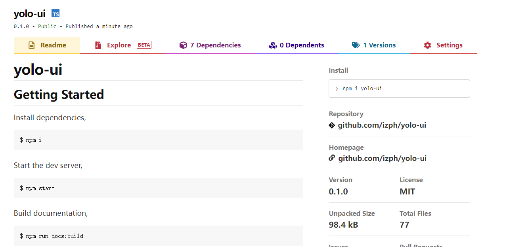

# 核心技术栈

React + TypeScript + Less + dumi
# 样式解决方案

## 1. Inline CSS：快速写一些简单的样式

性能较差，不如直接使用CSS类名，再定义样式的性能好

```jsx
const divStyle = {
  color: 'blue',
};

function Hello() {
  return <div style={divStyle}>Hello</div>;
}
```

## 2. CSS in JS（styled Component）

不在是把css样式独立的写在css文件中，而是将css抽象到了js代码中。
不太喜欢在js中书写css样式，增加了成本和复杂度，强行把两者混在一起比较奇怪。

```js
const Button = styled.button`
color: red;
font-size: 1em;
`
```

## Less和Sass（预处理器）

提供了变量、函数、运算和继承等等，扩展性和复用性都有了很大的提升。

## 创建自己组件库的色彩体系

### Yolo 组件库的色彩体系

primary（#0d6efd）、default（#ffffff）、success（#15bd02）、warning（#ffd300）、danger（#eb1e3d）、info(#009bb0)

### 组件库样式变量分类

- 基础色彩系统
- 字体系统
  font-family、font-size、line-height、font-weight、h1-h6、超链接样式、body大小。用户通过文本来理解工作，科学的字体系统将大大提升用户的阅读体验和工作效率
- 表单
- 按钮
- 边框和阴影
- 可配置开关
- normalize.less初始化默认样式
- babel-plugin-import 是一款babel插件，它会在编译过程中将import的写法自动转换为按需引入的方式
- classnames、@types/classnames 处理类名的一个工具

### Button组件需求分析

需要考虑padding的大小、lineHeight高度、颜色、文字居中、box-shadow，disabled时的特殊样式，鼠标的cursor的变化。
- Button Size的大小其实就是padding控制，font-size不同、border的不同。
- Button Type是变化background-color，border-color、字体颜色。
- 同时还有添加不同的状态、hover之后要颜色发生一定的变化，focus颜色变化，disabled颜色也发生变化。

### 不同的Button Type（颜色）


### 不同的Button Size（padding的大小、lineHeight高度）

利用less的混合方法，传入不同的参数，实现样式的复用和切换。


### Button的禁用状态


### Button大致的使用方法

```js
<Button
  size="lg"
  type="primary"
  disabled
  href=""
  className=""
  ...{restProps}
>
  primary
</Button>
```

### Menu组件需求分析

Menu组件需要使用useState和useContext这两个hooks实现，用户依赖导航在各个页面中进行跳转。一般分为顶部导航和侧边导航，顶部导航提供全局性的类目和功能，侧边导航提供多级结构来收纳和排列网站架构。


### Menu最基本样式分为横向和纵向

1. 横向
   一类没有下拉菜单的基本类型，一类是有下拉菜单的类型，menu上有两个重要的属性，一个是active（菜单项高亮），菜单项是可以被disabled的，disabled后有特殊样式，并且点击没有响应。
   有下拉选项的菜单，可以展示更多的导航。
2. 纵向
   和横向差不多，只是左右展示

### Menu需要的基本属性值

defaultIndex表示默认选中的，onSelect选中后执行的回调，mode分为横向和纵向，
activeIndex表示哪个高亮，className自定义类名。

Menu.Item提取出来做单独的组件，任何属性都可以加到Item上，并且Menu.Item的children可以是任何元素，如string类型，jsx。Menu.Item上可以有index属性、disabled禁用，className等属性

### Menu的实现

采用FlexBox

## 图标Icon的解决方案

图标的历史演化，上古时期的雪碧图（不能缩放），Font Icon（用字体文件的字符编码，代表图标，然后通过特定的class加伪类，加入到浏览器中），SVG（可以用任何的css控制）

### Icon
Icon 基于 Font Awesome 封装

## Transition
封装一个Transition过渡动画，以便其他组件的使用。

## input输入框

基本的样式、支持不同的大小、disabled状态、带图标的样式、带前缀、后缀，自动补全（在iuput的基础上扩展，多了一个下拉菜单，继承了input的所有属性）

```js
<Input 
    disabled
    size="lg|md|sm"
    icon="图标"
    prepand="input的前缀，string或者ReactElement类型"
    qppend="input的后缀，string或者ReactElement类型"
    {...restProps} // 支持其他所有的HTMLInput属性、用户自定义的属性
/>
组件正确的开发流程：组件属性的分析 -> 组件开发 -> 组件测试 -> 组件的使用说明文档
```

### auto-complete

要考虑是同步的、还是异步的关键词匹配

### Upload上传

点击上传按钮，选择想要上传的文件，然后开始自动上传，之后会显示上传进度（progress），当进度满了就会显示上传成功，反之上传失败。鼠标悬浮到上传的文件，会显示叉号，可以取消上传的文件。
支持用户自定义请求头headers，文件名称，上传额外的 `data（{key：vale}）`，支持input本身file的属性，如multiple（多选）、accept（限制文件类型）、是否默认携带cookie。自定义触发的元素（在Upload设置按钮、文本。。。）、支持拖动上传文件、用户点击文件执行的自定义的回调等等。


## Progress

根据传入的百分比，来显示一个进度条。最外面有一个灰色progress-outer，它的高度可以配置，prosition为相对定位。progress-outer之上会有一个进度条，颜色可以配置，prosition为absolute，垂直居中，悬浮到progress-outer上，top和left都为0，则表示在最左边（0%），同时百分比也支持显示和隐藏


## 组件测试用例分析和编码
[组件测试](02-yolo-test-notes.md)

## 代码打包输出和发布

### 1. 组件库的入口文件

- 组件库的入口文件为```src/index.ts```

- 组件库的全局样式文件为```src/style/index.less```或者```src/global.less```，两者都可以用来全局样式的提取。

### 2. 组件的打包

#### 在根目录新建tsconfig.build.json文件
```json
{
  "compilerOptions": {
    "outDir": "dist", // 编译之后的存放路径
    "module": "ESNext",
    "target": "ES5", // 指定编译之后的目标版本
    "declaration": true, // 为每一个js文件生成 .d.ts类型声明文件
    "jsx": "react",
    "moduleResolution": "node", // classic 和 Node
    "allowSyntheticDefaultImports": true //  true 支持 defalut 引入的方式
  },
  "include": ["src/"],
  "exclude": ["src/**/style", "src/**/*.md"]
}
```

#### 在package.json文件中添加命令

- 分别安装lessc和rimraf依赖，lessc将less转化为css，rimraf用来删除dist目录。

```json
{ 
  "scripts": {
    "clean": "rimraf ./dist",
    "build:lib": "npm run clean && npm run build-ts && npm run build-css",
    "build-ts": "tsc -p tsconfig.build.json",
    "build-css": "lessc ./src/style/index.less ./dist/index.css",
  }
}
```

- 在执行build-ts发生了很多个报错如下，经过在[stackoverflow](https://stackoverflow.com/)上查找相关资料得知，是```@types/react-router-dom```和```@types/react-router```的版本太低了导致了，把这两个依赖升级到最新版本后，就可以正常打包了。
```js
xxx/node_modules/@types/react-router-dom/index.d.ts(59,34): error TS2694: Namespace '"/node_modules/history/index"' has no exported member 'LocationState'.
```
### 本地测试(npm link)

- 在yolo-ui的根目录下执行npm link命令，npm link的作用是可以让未发布的npm包，做本地测试，映射脚本吧。

- 在yolo-ui-test（create-react-app生成的测试项目）工程下执行npm link yolo-ui。

- 在yolo-ui-test的package.json中加入yolo-ui依赖

```json
{ 
  "dependencies": {
    "yolo-ui": "^0.1.0"
  },
}
```
- 分别在```App.tsx```和```index.tsx```引入组件和组件的样式
```tsx
// App.tsx
import { Button } from 'yolo-ui';

function App() {
  return (
    <div className="App">
      <Button type="primary">Hello Yolo</Button>
    </div>
  );
}

export default App;
```
```tsx
// index.tsx
import "yolo-ui/dist/index.css";
```
- 测试结果如下，本地测试没问题。


### 将yolo-ui发布到npm

- 切换npm的源镜像为npm的原生源
- 在命令行工具执行npm adduser，填写username、password and email 登录(sign in)
- 在package.json添加一些必要信息
```json
{ 
  "files": [
    "dist"
  ], // 发布哪些文件到npm
  // 添加prepublish命令
  "scripts": {
    "clean": "rimraf ./dist",
    "build:lib": "npm run clean && npm run build-ts && npm run build-css",
    "build-ts": "tsc -p tsconfig.build.json",
    "build-css": "lessc ./src/style/index.less ./dist/index.css",
    "prepublish": "npm run build:lib"
  },
}
```
- 执行npm publish即可发布到npm


- 此外，还可以在peerDependencies中告诉用户，要使用某某依赖需要安装什么依赖，如下：
要使用yolo-ui库，需要安装react和react-dom的16.8.0版本以上。当npm i yolo-ui的，peerDependencies里面的依赖不会被安装，会有一个日志输出，npm warning会提示用户需要安装react和react-dom的依赖。
```json
// package.json
{ 
  "peerDependencies": {
    "react": "≥16.8.0",
    "react-dom": "≥16.8.0"
  },
}
```

## CI/CD，文档的生成
### CI-持续集成

- 频繁的奖代码集成到主干（master）
- 快速发现错误
- 防止分支大幅偏离主干
- 持续集成的目的，让产品快速迭代，同时保证比较高的质量
- 集成到主干master之前，必须通过自动化测试，只要有一个测试用例失败，就不能集成

### CD-持续交付和持续部署
- 持续交付：频繁的将软件的新版本，交付给质量团队或者用户，以供评审，然后由QA进行测试，通过之后，就进入生产阶段
- 持续部署：代码通过评审以后，自动部署到生产环境，持续部署的前提是能够自动化完成测试，构建部署等等步骤

## Travis CI（自动化平台）


## yolo-ui静态文档上传至阿里云服务器
[yolo-ui静态文档上传至阿里云服务器](03-yolo-upload-aliyun.md)


