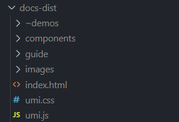

## 一、购买服务器
本人买的是阿里云服务器

## 二、远程登录服务器桌面(windows)

- 在window桌面上按`win + R`，输入`mstsc`，进入远程桌面连接
- 如果没有添加windows凭据的，先在`控制面板->凭据管理器->windows凭据里添加服务器的凭据`
- 输入账号和密码即可登录服务器远程桌面

## 三、安装node环境

- 将node的安装包上传到云服务器，并安装，`node -v`可以查看版本和是否安装成功

## 四、启动静态服务器

- 在根目录下`npm init -y`，初始化`package.json`文件，新建index.js文件
- 上传静态文件docs-dist（dumi 打包的产物）到根目录，docs-dist文件内容如下：

- 安装`koa`和`koa-static`，用来启动一个静态资源服务器。
- 在index.js写入代码：
```js
const Koa = require('koa');
const path = require('path');
const static = require('koa-static');
const app = new Koa();

// 静态资源目录对于相对入口文件index.js的路径
const staticPath = './docs-dist';

app.use(static(
    path.join(__dirname, staticPath)
))

app.listen(80, () => {
    console.log('server is running, port is 80');
})
```
- 在根目录下执行`node index.js`，开启服务器成功
- 最后在浏览器地址输入云服务器ip地址即可访问

## 五、域名的注册和备案

